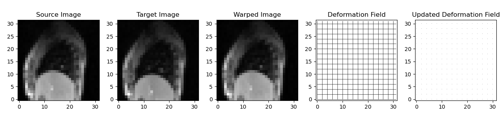
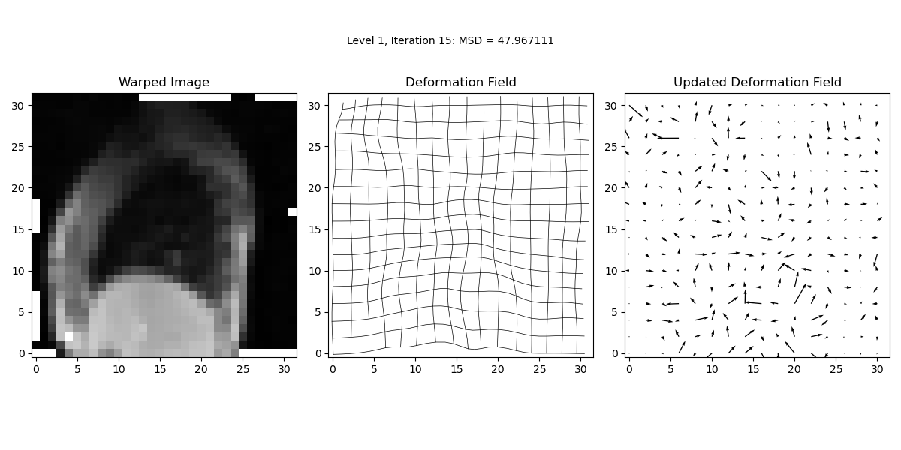
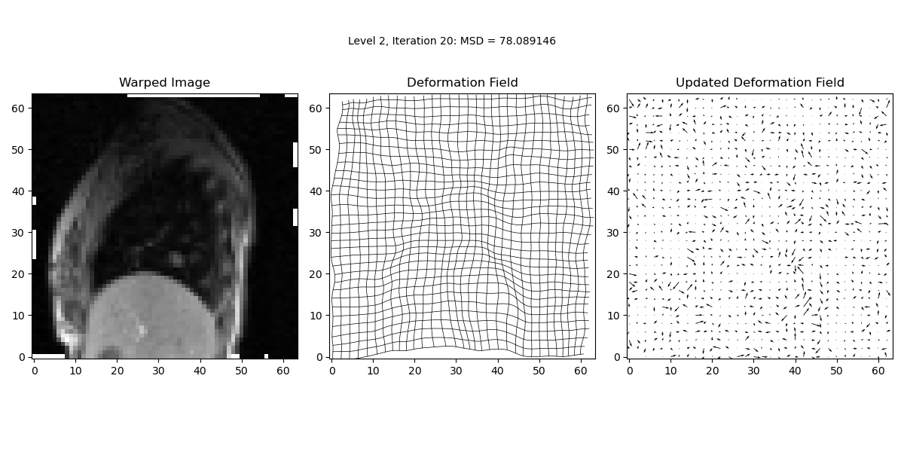
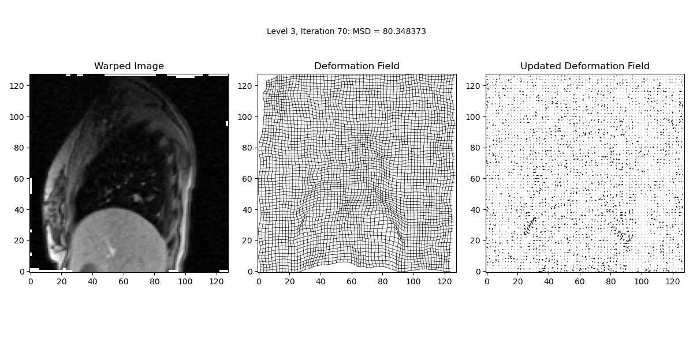
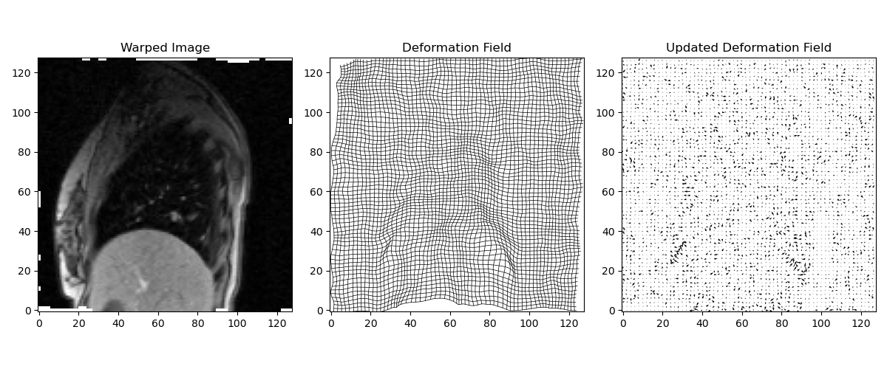

:::::::::::::::::::::::::::::::::::::: questions 

- How to understand and visualise three image in one pane for demons image registration algorithm?

::::::::::::::::::::::::::::::::::::::::::::::::

::::::::::::::::::::::::::::::::::::: objectives

- Understanding Demons Image Registration code for 3 images viewing pane

::::::::::::::::::::::::::::::::::::::::::::::::

# Demons Image Registration Algorithm with Multi-Pane Display

This document explains the implementation of a 2D image registration algorithm using the Demons algorithm. The implementation includes visualisation updates within a single window containing three panes for easier comparison of source, target, and warped images.

## 1. Importing Libraries

First, we import the necessary libraries for image processing, transformation, and visualisation. The utils3 module is another Python file containing utility functions used for tasks such as displaying images and handling deformed and updated fields.

```python
import matplotlib
matplotlib.use('TkAgg')  # Set the backend for matplotlib
import matplotlib.pyplot as plt  # Import matplotlib for plotting

import numpy as np  # Import numpy for numerical operations
from skimage.transform import rescale, resize  # Import functions for image transformation from scikit-image
from scipy.ndimage import gaussian_filter  # Import gaussian_filter function from scipy's ndimage module
from utils3 import dispImage, resampImageWithDefField, calcMSD, dispDefField  # Import specific functions from a custom module
```

## 2. Function Definition

The `demonsReg` function is designed for registering two 2D images using the Demons algorithm, transforming the source image to match the target. It offers flexibility through various optional parameters to customize the registration process:

```python
def demonsReg(source, target, sigma_elastic=1, sigma_fluid=1, num_lev=3, use_composition=False,
              use_target_grad=False, max_it=1000, check_MSD=True, disp_freq=5, disp_spacing=2, 
              scale_update_for_display=10, disp_method_df='grid', disp_method_up='arrows'):
    """
    Perform a registration between the 2D source image and the 2D target
    image using the demons algorithm. The source image is warped (resampled)
    into the space of the target image.
    
    Parameters:
    - source: 2D numpy array, the source image to be registered.
    - target: 2D numpy array, the target image for registration.
    - sigma_elastic: float, standard deviation for elastic regularisation.
    - sigma_fluid: float, standard deviation for fluid regularisation.
    - num_lev: int, number of levels in the multi-resolution scheme.
    - use_composition: bool, whether to use composition in the update step.
    - use_target_grad: bool, whether to use the target image gradient.
    - max_it: int, maximum number of iterations for the registration.
    - check_MSD: bool, whether to check Mean Squared Difference for improvements.
    - disp_freq: int, frequency of display updates during registration.
    - disp_spacing: int, spacing between grid lines or arrows in display.
    - scale_update_for_display: int, scale factor for displaying the update field.
    - disp_method_df: str, method for displaying the deformation field ('grid' or 'arrows').
    - disp_method_up: str, method for displaying the update field ('grid' or 'arrows').
    
    Returns:
    - warped_image: 2D numpy array, the source image warped into the target image space.
    - def_field: 3D numpy array, the deformation field used to warp the source image.
    """
```


## 3. Preparing Images for demons image registration algorithm

We start by making copies of the full-resolution images.

```python
    # make copies of full resolution images
    source_full = source
    target_full = target
```


## 4. Multi-Resolution Scheme and Initialisation

In this step, we initialise variables and set up the multi-resolution scheme by looping over different resolution levels.

```python
# Loop over resolution levels
for lev in range(1, num_lev + 1):
    
    # Resample images if not at the final level
    if lev != num_lev:
        resamp_factor = np.power(2, num_lev - lev)
        target = rescale(target_full, 1.0 / resamp_factor, mode='edge', order=3, anti_aliasing=True)
        source = rescale(source_full, 1.0 / resamp_factor, mode='edge', order=3, anti_aliasing=True)
    else:
        target = target_full
        source = source_full
```


## 5. Deformation Field Initialisation
In this step, the code initialises the deformation field and related variables necessary for the registration process. The deformation field (def_field) is crucial as it defines the transformation that will be iteratively adjusted to align the source image with the target image. At the first resolution level (lev == 1), the initial deformation field is set up using the grid coordinates derived from the target image dimensions. Additionally, placeholders for the displacement field components (disp_field_x and disp_field_y) are created to track incremental changes in the deformation over iterations.

```python
    # If first level, initialise deformation and displacement fields
    if lev == 1:
        X, Y = np.mgrid[0:target.shape[0], 0:target.shape[1]]
        def_field = np.zeros((X.shape[0], X.shape[1], 2))
        def_field[:, :, 0] = X
        def_field[:, :, 1] = Y
        disp_field_x = np.zeros(target.shape)
        disp_field_y = np.zeros(target.shape)
    else:
        # Otherwise, upsample displacement field from previous level
        disp_field_x = 2 * resize(disp_field_x, (target.shape[0], target.shape[1]), mode='edge', order=3)
        disp_field_y = 2 * resize(disp_field_y, (target.shape[0], target.shape[1]), mode='edge', order=3)
        # Recalculate deformation field for this level from displacement field
        X, Y = np.mgrid[0:target.shape[0], 0:target.shape[1]]
        def_field = np.zeros((X.shape[0], X.shape[1], 2))  # Clear def_field from previous level
        def_field[:, :, 0] = X + disp_field_x
        def_field[:, :, 1] = Y + disp_field_y
```


## 6. Update Initialisation
In this step, the code initialises the update fields and computes the initial warped image for the current resolution level. These updates are essential for applying iterative transformations to align the source image with the target image.


```python
    # Initialise updates
    update_x = np.zeros(target.shape)
    update_y = np.zeros(target.shape)
    update_def_field = np.zeros(def_field.shape)
    
    # Calculate the transformed image at the start of this level
    warped_image = resampImageWithDefField(source, def_field)
    
    # Store the current def_field and MSD value to check for improvements at the end of iteration 
    def_field_prev = def_field.copy()
    prev_MSD = calcMSD(target, warped_image)
    
    # If target image gradient is being used, this can be calculated now as it will not change during the registration
    if use_target_grad:
        img_grad_x, img_grad_y = np.gradient(target)
```


## 7. Initial Transformation and Preparation

In this step, the code performs the initial transformation of the source image using the current deformation field, calculates and stores the initial Mean Squared Difference (MSD), and optionally computes the gradient of the target image. This sets the stage for the iterative registration process.


```python
# calculate the transformed image at the start of this level
warped_image = resampImageWithDefField(source, def_field)

# store the current def_field and MSD value to check for improvements at 
# end of iteration 
def_field_prev = def_field.copy()
prev_MSD = calcMSD(target, warped_image)
        
# if target image gradient is being used this can be calculated now as it will
# not change during the registration
if use_target_grad:
  [img_grad_x, img_grad_y] = np.gradient(target)
```


## 8. Display Initial Results
This step sets up the initial visualization of the registration process. Five subplots are created to show the source image, target image, the warped source image, the deformation field, and the update field. This helps in monitoring the progress of the registration process visually.


```python
# DISPLAY RESULTS
# figure 1 - source image (does not change during registration)
# figure 2 - target image (does not change during registration)
# figure 3 - source image transformed by current deformation field
# figure 4 - deformation field
# figure 5 - update

# Create a single figure with 5 subplots in one row
fig, axs = plt.subplots(1, 5, figsize=(12, 5))

plt.sca(axs[0])
dispImage(source, title='Source Image')

plt.sca(axs[1])
dispImage(target, title='Target Image')

plt.sca(axs[2])
dispImage(warped_image, title='Warped Image')
x_lims = plt.xlim()
y_lims = plt.ylim()

# Plotting the deformation field in the second subplot
plt.sca(axs[3])
dispDefField(def_field, spacing=disp_spacing, plot_type=disp_method_df)
plt.xlim(x_lims)
plt.ylim(y_lims)
plt.title('Deformation Field')

# Plotting the updated deformation field in the third subplot
plt.sca(axs[4])
up_field_to_display = scale_update_for_display * np.dstack((update_x, update_y))
up_field_to_display += np.dstack((X, Y))
dispDefField(up_field_to_display, spacing=disp_spacing, plot_type=disp_method_up)
plt.xlim(x_lims)
plt.ylim(y_lims)
plt.title('Updated Deformation Field')

# Adjust layout for better spacing
plt.tight_layout()
plt.subplots_adjust(top=0.95)

# Display the figure
plt.show()

# if first level pause so user can position figure
if lev == 1:
  input('position the figures as desired and then push enter to run the registration')
```

In this step, the code initialises the display of results before starting the iterative process. This includes displaying the source image, target image, warped image, deformation field, and update field. The dispImage and dispDefField functions are used to visualise these images and fields. The function pauses after the initial display to allow the user to position the figures as desired before continuing with the registration process.




## 9. Main Iterative Loop for Image Registration
In this step, we perform the main iterative loop where the actual image registration occurs. The loop continues until the maximum number of iterations is reached or until convergence criteria are met. The loop updates the deformation field iteratively to minimize the Mean Squared Difference (MSD) between the target and warped images.

```python
    # main iterative loop - repeat until max number of iterations reached
    for it in range(max_it):
      
      # calculate update from demons forces
      #
      # if the warped image gradient is used (instead of the target image gradient)
      # this needs to be calculated 
      if not use_target_grad:
        [img_grad_x, img_grad_y] = np.gradient(warped_image)
        
      # calculate difference image
      diff = target - warped_image
      # calculate denominator of demons forces
      denom = np.power(img_grad_x, 2) + np.power(img_grad_y, 2) + np.power(diff, 2)
      # calculate x and y components of numerator of demons forces
      numer_x = diff * img_grad_x
      numer_y = diff * img_grad_y
      # calculate the x and y components of the update
      #denom[denom < 0.01] = np.nan
      update_x = numer_x / denom
      update_y = numer_y / denom
      
      # set nan values to 0
      update_x[np.isnan(update_x)] = 0
      update_y[np.isnan(update_y)] = 0
            
      # if fluid like regularisation used smooth the update
      if sigma_fluid > 0:
        update_x = gaussian_filter(update_x, sigma_fluid, mode='nearest')
        update_y = gaussian_filter(update_y, sigma_fluid, mode='nearest')
      
      # update displacement field using addition (original demons) or
      # composition (diffeomorphic demons)
      if use_composition:
        # compose update with current transformation - this is done by
        # transforming (resampling) the current transformation using the
        # update. we can use the same function as used for resampling
        # images, and treat each component of the current deformation
        # field as an image
        # the update is a displacement field, but to resample an image
        # we need a deformation field, so need to calculate deformation
        # field corresponding to update.
        update_def_field[:, :, 0] = update_x + X
        update_def_field[:, :, 1] = update_y + Y
        # use this to resample the current deformation field, storing
        # the result in the same variable, i.e. we overwrite/update the
        # current deformation field with the composed transformation
        def_field = resampImageWithDefField(def_field, update_def_field)
        # calculate the displacement field from the composed deformation field
        disp_field_x = def_field[:, :, 0] - X
        disp_field_y = def_field[:, :, 1] - Y
        # replace nans in disp field with 0s
        disp_field_x[np.isnan(disp_field_x)] = 0
        disp_field_y[np.isnan(disp_field_y)] = 0
      else:
        # add the update to the current displacement field
        disp_field_x = disp_field_x + update_x
        disp_field_y = disp_field_y + update_y
      
      
      # if elastic like regularisation used smooth the displacement field
      if sigma_elastic > 0:
        disp_field_x = gaussian_filter(disp_field_x, sigma_elastic, mode='nearest')
        disp_field_y = gaussian_filter(disp_field_y, sigma_elastic, mode='nearest')
      
      # update deformation field from disp field
      def_field[:, :, 0] = disp_field_x + X
      def_field[:, :, 1] = disp_field_y + Y
            
      # transform the image using the updated deformation field
      warped_image = resampImageWithDefField(source, def_field)

      # update images if required for this iteration
      if disp_freq > 0 and it % disp_freq == 0:
        # Create a single figure with 3 subplots in one row and three columns
        fig, axs = plt.subplots(1, 3, figsize=(12, 6))

        # Plotting the warped image in the first subplot
        plt.sca(axs[0])
        dispImage(warped_image, title='Warped Image')
        plt.pause(0.05)

        # Plotting the deformation field in the second subplot
        plt.sca(axs[1])
        dispDefField(def_field, spacing=disp_spacing, plot_type=disp_method_df)
        plt.xlim(x_lims)
        plt.ylim(y_lims)
        plt.title('Deformation Field')
        plt.pause(0.05)

        # Plotting the updated deformation field in the third subplot
        plt.sca(axs[2])
        up_field_to_display = scale_update_for_display * np.dstack((update_x, update_y))
        up_field_to_display += np.dstack((X, Y))
        dispDefField(up_field_to_display, spacing=disp_spacing, plot_type=disp_method_up)
        plt.xlim(x_lims)
        plt.ylim(y_lims)
        plt.title('Updated Deformation Field')
        plt.pause(0.1)
        
        plt.figtext(0.5, 0.92, 'Level {0:d}, Iteration {1:d}: MSD = {2:.6f}'.format(lev, it, prev_MSD), ha='center', va='top', fontsize=10, color='black')
        
        # Adjust layout for better spacing
        plt.tight_layout()

        # Display the figure
        plt.show()
      
      # calculate MSD between target and warped image
      MSD = calcMSD(target, warped_image)

      # display numerical results
      print('Level {0:d}, Iteration {1:d}: MSD = {2:f}\n'.format(lev, it, MSD))
      
      # check for improvement in MSD if required
      if check_MSD and MSD >= prev_MSD:
        # restore previous results and finish level
        def_field = def_field_prev
        warped_image = resampImageWithDefField(source, def_field)
        print('No improvement in MSD')
        break
      
      # update previous values of def_field and MSD
      def_field_prev = def_field.copy()
      prev_MSD = MSD.copy()
```

### 9.1. Results after Level 1 iterations:


### 9.2. Results after Level 2 iterations:


### 9.3. Results after Level 3 iterations:



## 10. Displaying Final Results

In this step, we visualize the final results of the image registration process. This includes displaying the warped image, the deformation field, and the updated deformation field using subplots.


```python
# display the final results
    # Create a single figure with 3 subplots in one row
    fig, axs = plt.subplots(1, 3, figsize=(12, 5))

    # Plotting the warped image in the first subplot
    plt.sca(axs[0])
    dispImage(warped_image, title='Warped Image')

    # Plotting the deformation field in the second subplot
    plt.sca(axs[1])
    dispDefField(def_field, spacing=disp_spacing, plot_type=disp_method_df)
    plt.xlim(x_lims)
    plt.ylim(y_lims)
    plt.title('Deformation Field')

    # Plotting the updated deformation field in the third subplot
    plt.sca(axs[2])
    up_field_to_display = scale_update_for_display * np.dstack((update_x, update_y))
    up_field_to_display += np.dstack((X, Y))
    dispDefField(up_field_to_display, spacing=disp_spacing, plot_type=disp_method_up)
    plt.xlim(x_lims)
    plt.ylim(y_lims)
    plt.title('Updated Deformation Field')

    # Adjust layout for better spacing
    plt.tight_layout()

    # Display the figure
    plt.show()
```




## 11. Preparing Images for calling the demonsReg function

Follow `exampleSolution3.py` for running the function. Below, we describe how we prepare images: `cine_MR_img_1.png`, `cine_MR_img_2.png`, and `cine_MR_img_3.png`. These images will be available in Data folder. 


```python
import skimage.io
cine_MR_img_1 = skimage.io.imread('.../cine_MR_1.png') 
cine_MR_img_2 = skimage.io.imread('.../cine_MR_2.png')
cine_MR_img_3 = skimage.io.imread('.../cine_MR_3.png')
```


```python
import numpy as np
# ***************
# ADD CODE HERE TO CONVERT ALL THE IMAGES TO DOUBLE DATA TYPE AND TO REORIENTATE THEM
# INTO 'STANDARD ORIENTATION'
cine_MR_img_1 = np.double(cine_MR_img_1)
cine_MR_img_2 = np.double(cine_MR_img_2)
cine_MR_img_3 = np.double(cine_MR_img_3)

cine_MR_img_1 = np.flip(cine_MR_img_1.T, 1)
cine_MR_img_2 = np.flip(cine_MR_img_2.T, 1)
cine_MR_img_3 = np.flip(cine_MR_img_3.T, 1)
```


Calling the function:

```python
demonsReg(cine_MR_img_1, cine_MR_img_2)
```