:::::::::::::::::::::::::::::::::::::: questions 

- How can we visualize volumetric data?
- How do locations in an image get mapped to real-world coordinates?
- How can we register different types of images together using ITK-SNAP?

::::::::::::::::::::::::::::::::::::::::::::::::

::::::::::::::::::::::::::::::::::::: objectives

- Describe the structure of medical imaging data and popular formats (DICOM and NifTi)
- Discover and display medical imaging data in ITK-SNAP
- Demonstrate how to convert between different medical image formats
- Inspecting the NifTi header with `nibabel`
- Manipulate image data (cropping images) with `nibabel` and learn how it is displayed on screen with ITK-SNAP

::::::::::::::::::::::::::::::::::::::::::::::::

## Medical Imaging Data 

### The Cancer Imaging Archive (TCIA)
In these exercises we will be working with real-world medical imaging data from the Cancer Imaging Archive [(TCIA)](https://www.cancerimagingarchive.net/collection/ct-vs-pet-ventilation-imaging/).
TCIA is a resource of public datasets hosts a large archive of medical images of cancer accessible for public download.   
We are using CT Ventilation as a Functional Imaging Modality for Lung Cancer Radiotherapy (also known as `CT-vs-PET-Ventilation-Imaging dataset`) from TCIA.
The CT-vs-PET-Ventilation-Imaging collection is distributed under the Creative Commons Attribution 4.0 International License (https://creativecommons.org/licenses/by/4.0/). 
The `CT-vs-PET-Ventilation-Imaging` dataset contains 20 lung cancer patients underwent exhale/inhale breath hold CT (BHCT), free-breathing four-dimensional CT (4DCT) and Galligas PET ventilation scans in a single session on a combined 4DPET/CT scanner.    

We recommend using the BHCT scans for participants `CT-PET-VI-02` and `CT-PET-VI-03` showing very little motion between inhale and exhale (for PET scan and accompanying CT scan), and BHCT scans for participants `CT-PET-VI-05` and `CT-PET-VI-07` (the inhale and exhale CT scans), where 05 has a different number of slices between the inhale and exhale.

Data paths contain:  (A) `inhale_BH_CT` and `exhale_BH_CT` contain CT scans acquired during an inhalation breath hold and exhalation breath hold respectively,
(B) `PET` contains a PET scan that measures the local lung function,  and (C) `CT_for_PET` contains a CT scan acquired at the same time as the PET scan for attenuation correction of the PET scan and to provide anatomical reference for the PET data.  


* CT-PET-VI-02
```bash
├── CT-PET-VI-02
│   ├── CT_for_PET
│   ├── exhale_BH_CT
│   ├── inhale_BH_CT
│   └── PET
```

* CT-PET-VI-03
```bash
/CT-PET-VI-03$ tree -d
├── CT-PET-VI-03
│   ├── CT_for_PET
│   └── PET
```

* CT-PET-VI-05

```bash
CT-PET-VI-05$ tree -d
.
├── CT-PET-VI-05
│   ├── CT_for_PET
│   ├── exhale_BH_CT
│   ├── inhale_BH_CT
│   └── PET
```

* CT-PET-VI-07
```bash
/CT-PET-VI-07$ tree -d
.
└── CT-PET-VI-07
    ├── exhale_BH_CT
    ├── inhale_BH_CT
    └── PET
```

For example, datasets in ITK-SNAP are illustrated in the following figures.
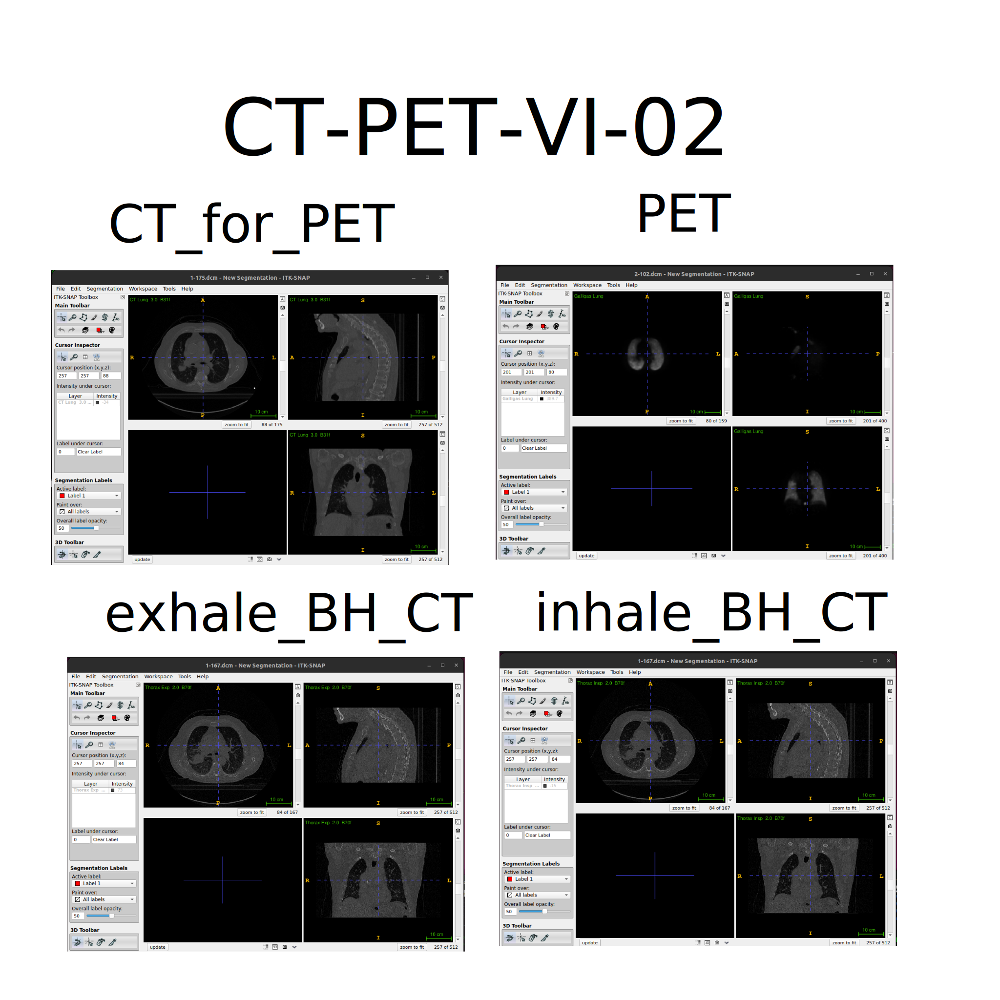

Refer to [`Summary and Setup`](https://healthbioscienceideas.github.io/Medical-Image-Registration-Short-Course/#data-sets) section for further details on CT-vs-PET-Ventilation-Imaging dataset.


Notes 
```callout
1. Data may require extensive cleaning and pre-processing 
   before it is suitable to be used.
2. When using open datasets that contain images of humans, 
   such as those from TCIA, for your own research, 
   you will still need to get ethical approval 
   as you do for any non-open datasets you use).
   This can usually be obtained from the local ethics 
   committee (both Medical Physics and Computer Science have 
   their own local ethics committee) or from 
   UCL central ethics if your department does not have one.
3. Although there are many formats that medical imaging 
   data can come in, we are going to focus on DICOM and NifTi 
   as they are two of the most common formats.
   Most data that comes from a hospital will be in 
   DICOM format, whereas NifTi is a very popular format 
   in the medical image analysis community.
```

### DICOM format
Digital Imaging and Communications in Medicine (DICOM) is a technical standard for the digital storage and transmission of medical images and related information.
While DICOM images typically have a separate file for every slice, more modern DICOM images can come with all slices in a single file.

If you look at the data `CT-PET-VI-02/CT_for_PET` you will see there are 175 individual files corresponding to 175 slices in the volume. 
In addition to the image data for each slice, each file contains a header which can contain an extensive amount of extra information relating to the scan and subject. 

In a clinical setting this will include patient identifiable information such as their name, address, and other relevant details. 
Such information should be removed before the data is transferred from the clinical network for use in research. 
If you ever discover patient identifiable information in the header of data you are using you should immediately alert your supervisor, manager or collaborator

The majority of the information in the DICOM header is not directly useful for typical image processing and analysis tasks. 
Furthermore, there are complicated ‘links’ (provided by unique identifiers, UIDs) between the DICOM headers of different files belonging to the same scan or subject. Together with DICOM routinely storing each slice as a separate files, it makes processing an entire imaging volume stored as DICOM format rather cumbersome, and the extra housekeeping required could lead to a greater chance of an error being made.
Therefore, a common first step of any image processing pipeline is to convert the DICOM image to a more suitable format such as `NifTi`. 
Generally, most conversions go from DICOM to NIfTI. There are scenarios when you might want to convert from NIfTI **back** to DICOM, for example, if you need to import them into a clinical system that only works with DICOM.

Notes
```callout
Converting images back to DICOM such that 
they are correctly interpreted by a clinical system 
can be very tricky and requires a good understanding 
of the DICOM standard. 
More information on the DICOM standard 
can be found here: https://www.dicomstandard.org
```

### NifTi format
The Neuroimaging Informatics Technology Initiative (NIfTI) image format are usually stored as a single file containing the imaging data and header information.
While the NifTI file format was originally developed by the neuroimaging community it is not specific to neuroimaging and is now widely used for many different medical imaging applications outside of the brain.
During these exercises you will learn about some of the key information stored in the NifTi header.

NifTI files can also store the header and image data in separate files but this is not very common. 
For more information, please see Anderson Winkler's blog on the [NIfTI-1]( https://brainder.org/2012/09/23/the-nifti-file-format/) and[NIfTI-2]( https://brainder.org/2015/04/03/the-nifti-2-file-format/) formats.

## Visualisation of volumetric data with ITK-SNAP

### Getting Started with ITK-SNAP
#### Introduction
ITK-SNAP started in 1999 with SNAP (SNake Automatic Partitioning) and developed by Paul Yushkevich with the guidance of Guido Gerig. 
ITK-SNAP is open-source software distributed under the GNU General Public License. 
ITK-SNAP is written in C++ and it leverages the Insight Segmentation and Registration Toolkit (ITK) library. 
See `Summary and Setup` section for requirements and installation of ITK-SNAP

### ITK-SNAP application
ITK-SNAP application shows three orthogonal slices and a fourth window for three-dimensional view segmentation. 

 for plane and 3D views.](fig/itk-snap-main-window.svg)


## Viewing and understanding DICOM data
We are using CT Lung DICOM dataset from `CT-PET-VI-02/CT_for_PET`, containing 175 dicom items and totalling 92.4 MB.

### Opening and Viewing DICOM images
* **Open ITK-SNAP application**
* **Load inhale scan using file browser**
	- Open the itk-snap application. If you have used it before it will display recent images when you open it, and you can select one of these to open it. 

	If the image you want to open is not listed under recent images, you can open it either by clicking the 'Open Image...' button at the bottom right of the window, or File->Open Main Image. 
	When you do this a small window opens where you can enter the path of the file you want to open, or click Browse in your file explorer (exFinder in Mac and nautilus in Ubuntu) to open a file browser (for instance, "CT-PET-VI-02/CT_for_PET").
	Do this and select the first slice from the Inhale_BH_CT folder, which is called 1-001.dcm. The set the File Format to DICOM Image Series and then click `Next`.
	You will then be asked to Select DICOM series to open, but as this folder only includes one series you can just click `Next`.
	Click `Finish`

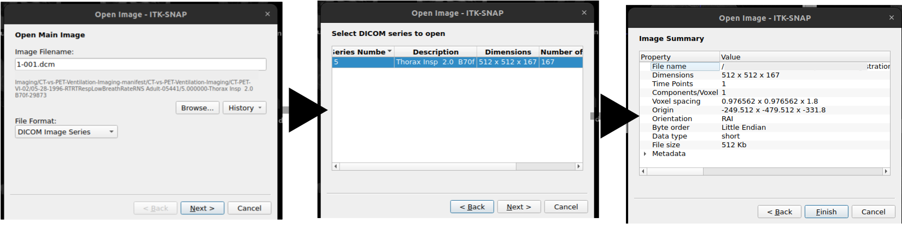


### Navigating DICOM images
* Navigate around image, see intensity value, and adjust intensity window
* To navigate around the image, i.e. change the displayed slices, you can left clicking in the displayed slices, using the mouse wheel, or the slider next to the displayed slices.
* To zoom, you can use the right mouse button (or control + button 1), and pan using the centre mouse button (or alt + button 1).

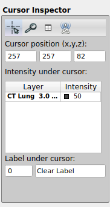

### Handling multiple DICOM images
We provide instructions for handling multiple DICOM images, applying overlays, viewing image information, and using color maps in ITK-SNAP.
For this exmaple, we are using `CT-PET-VI-02/inhale_BH_CT` and `CT-PET-VI-02/exhale_BH_CT` dicoms.

#### Load additional image using `exhale_BH_CT` scan by drag and drop
- Images can also be opened by simply dragging them on to the ITK-SNAP window. 
In a file explorer (Finder in Mac) go to the `exhale_BH_CT` folder and drag any of the dicom files on to the itksnap window. 
A small window will pop up asking What should itksnap do with this image? 
If you select Load as Main Image it will replace the current image. 
Instead select Load as Additional Image - this will enable easy comparison of the two images.

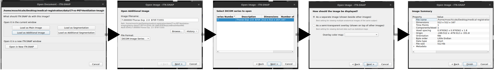

#### Using thumbnails to see image differences
* Once the second image is loaded you will see two thumbnails in the top corner of each slice display
* Click on these to swap the displayed slices from one image to the other - this will enable you to easily see the similarities and differences between the images.
* You will also see that both images now appear in the Cursor Inspector, where you can see the intensity value at the cursor for both images. 
* You can also change the displayed image by clicking on it in the Cursor Inspector


#### Colour overlay
In some cases you may want to display an image as a colour overlay on top of another image, e.g. displaying a PET image overlaid on the corresponding CT.

##### Colour overlay as a separate image (shown besides other images)
* **Load Primary Image**:
   - Open your primary DICOM series of the `CT-PET-VI-02/CT_for_PET` image either using the drag and drop method or `File->Open Image` as described above.
	- Make sure File Format is DICOM Image Series.
	- This time select Load as Main Image. This will load in the new image replacing the two that were previously loaded.
* **Load Overlay Image**:
   - Load the `CT-PET-VI-02/PET` image either using the drag and drop method or `File->Open Image`

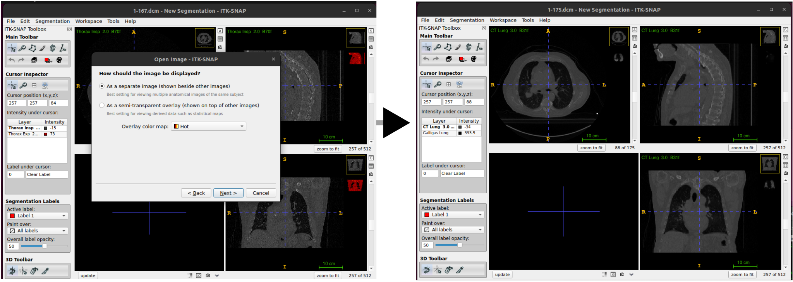

##### Colour overlay as a semi-transparent overlay (shown on the top of other images)
* **Load Primary Image**:
   - Open your primary DICOM series of the `CT-PET-VI-02/CT_for_PET` image either using the drag and drop method or `File->Open Image` as described above.
	- Make sure File Format is DICOM Image Series.
	- Select Load as Main Image.
* **Load Overlay Image**:
   - Load the `CT-PET-VI-02/PET` image either using the drag and drop method or `File->Open Image`
   - When the image has loaded select As a semi-transparent overlay. You can also set the overlay color map here - select `Hot` from the drop-down menu and click Next. 
   - The image summary will then be displayed, along with a warning about possible loss of precision (which can be ignored). Click Finish

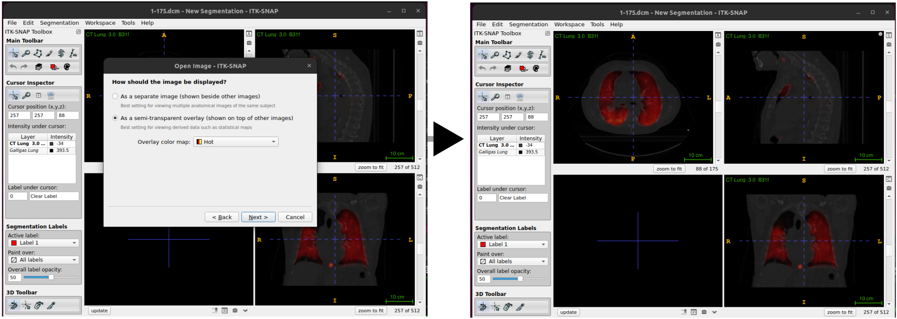


### Layer inspector tools
* Load `CT-PET-VI-02/CT_for_PET` and `CT-PET-VI-02/PET` scan datasets, using hot semi-transparency (as shown above).
* Go to `Tools->Layer Inspector`. This opens the Image Layer Inspector window. you will see the two images on the left, and five tabs along the top of the window.
* PET image appears in Cursor Inspector (called Galligas Lung) in italic and CT image as CT Lung in bold. 

* **The General tab** displays the filename and the nickname for the selected image. 
	* The Nickname can be edited. For the PET image the general tab also displays a slider to set the opacity, and the option to display it as a separate image or semi-transparent overlay. 

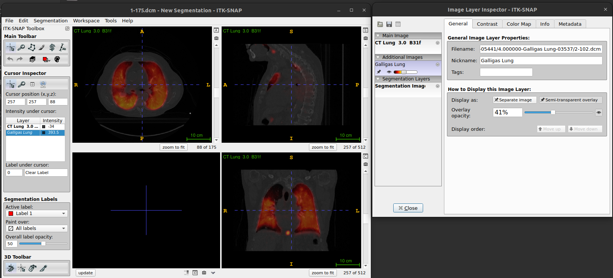

* **The Contrast tab** enables you to adjust how the image intensities are displayed for the different images. e.g. Select the lung image and set the maximum value to 1000 (push enter after typing the number) and this will make the structures in the lung easier to see.

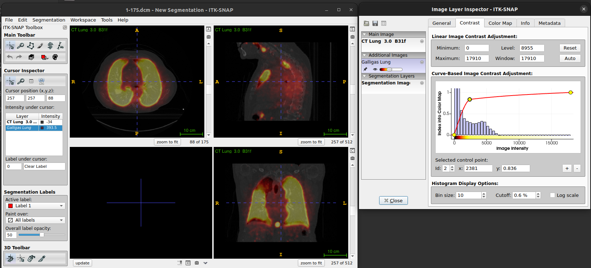

* **The color map tab** can be used to select and manipulate the colour map
	* One of the key elements of an imaging viewer is to provide different means to map those values into grey scales or different colors. 
	* We will show you how to apply different color maps or lookup tables to your data and how this affects how the images are presented to the user. 

	1. **Load the Image**:
		- Open the desired DICOM series.

	2. **Open Color Map Settings**:
		- Go to `Tools` > `Color Maps Editor`.

	3. **Apply and Adjust Color Map**:
		- Choose a predefined color map from the list. You might also create a customised map.
		- Adjust the intensity and transparency settings as needed to enhance the visualisation of the images.

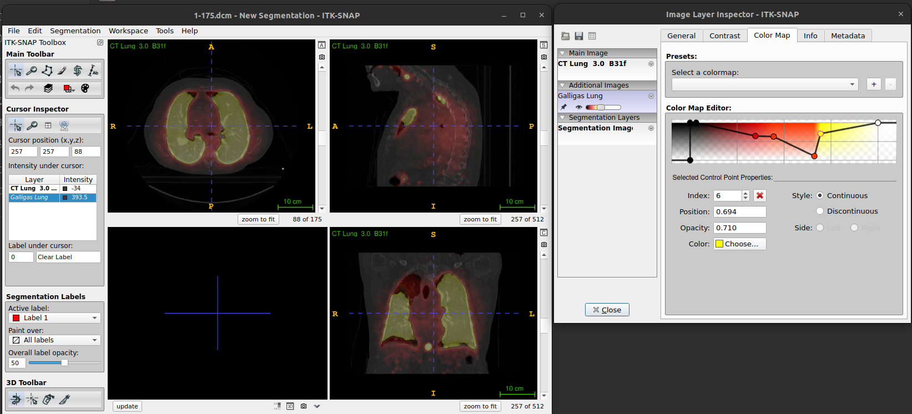

* **The info tab** displays the Image Header information for the images and also gives the Cursor Coordinates in both Voxel and World units.
	* A dialog box will appear displaying metadata and other relevant information about the loaded DICOM images (e.g. values for image header and cursor coordinates).
	* If you look at the info tab for both the CT image and PET image you will see that the header information for the images is different, and the cursor coordinates in voxel units for the PET image are not whole numbers.
	* This is because the displayed slices are from the main (CT) image, and the overlaid (PET) image slices are interpolated at the corresponding locations.

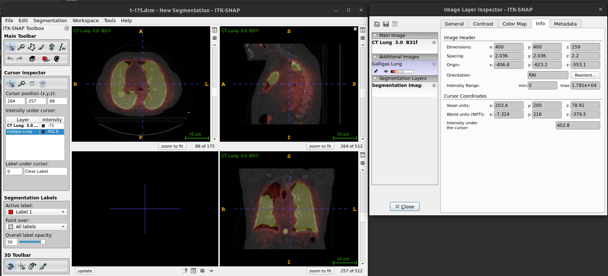

* **The metadata tab** contains (some of) the information from the DICOM header of the images

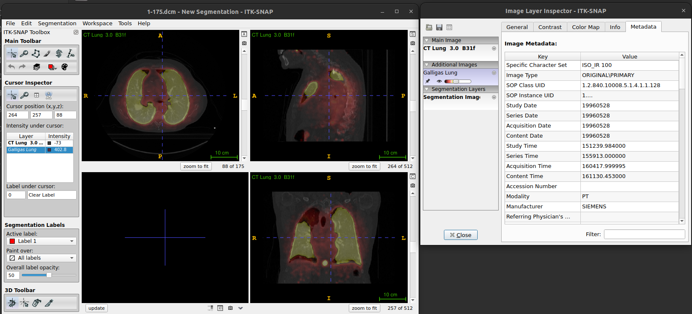


### Converting DICOM images to NifTi
As mentioned earlier in the exercise, the NIfTI image format tends to be much easier to work with when processing and analysing medical image data.
We will now work on converting DICOM images to a NIfTI image volume. 

#### Using ITK-SNAP
In the ITK-SNAP application, save the file by clicking 'File' --> 'Save image' --> rename image and choose format as 'NiFTI'.

Notes.
```callout
For Linux users. You might get this error `Error: exception occurred during image IO. Exception: std::expedition` to which he suggest using dicom2nifti library.
```

#### Using [dicom2nifti](https://github.com/icometrix/dicom2nifti)
```python
from pathlib import Path 
import dicom2nifti 
dicoms = Path("~/3_000000-CT_Lung_30_B31f-61322")
dicom2nifti.convert_directory(dicoms, ".", compression=True, reorient=True)
```
#### Using others packages
You might also be interested to look other packages: 
* https://github.com/rordenlab/dcm2niix
* https://nipy.org/nibabel/dicom/dicom.html#dicom
* https://neuroimaging-cookbook.github.io/recipes/dcm2nii_recipe/

## Viewing and understanding the NifTi header with NiBabel
We are going to use the python package [NiBabel](https://nipy.org/nibabel/) to upload `NifTI` images and learn some basic properties of the image using Nibabel.
[`nibabel` api](https://nipy.org/nibabel/api.html#api) provides various image utilities, conversions methods, helpers.
We recommend to checking [documentation](https://nipy.org/nibabel/#documentation) for further deatils on using nibabel library.
Please see [instructions](https://github.com/HealthBioscienceIDEAS/Medical-Image-Registration-Short-Course/tree/main/_dependencies) to install `NiBabel` package and other dependecies.

### Loading images
1. Open terminal, activate `mirVE` environment and run python
```bash
conda activate mirVE
python
```

2. Importing python packages under `*/episodes` path

A NifTi image with extension `*.nii.gz` can be read using `nibabel`’s `load` function. 
```python
import numpy as np
import nibabel as nib
import matplotlib.pyplot as plt
nii3ct = nib.load("data/3_ct_lung__30__b31f.nii.gz")
```

```callout
`NiBabel`'s `load` function does not actually read the image data itself from disk, but
does read and interpret the header, and provides functions for accessing the image data.
Calling these functions reads the data from disk (unless it has already been read, in which
case it may be cached in memory already.
```

2. `NifTI` object type, shape/size 
The Nifti1Image object allows us to see the size/shape of the image and its data type.
```python
print(type(nii3ct))
# <class 'nibabel.nifti1.Nifti1Image'>
```

```python
print(nii3ct.get_data_dtype())
#int16
```

```python
nii3ct.shape
# (512, 512, 175)
```

3. Affine transform, mapping from voxel space to world space
```callout
There are two common ways of specifying the affine transformation mapping from voxel coordinates
to world coordinates in the nifti header, called the `sform` and the `qform'.
Another transformation is that neither the sform or qform is used the mapping is performed based just on the voxel dimensions.
The **sform** directly stores the affine transformation in the header
whereas the **qform** stores the affine transformation using [quaternions](https://en.wikipedia.org/wiki/Quaternion). 
```

```callout
We strongly advise always using the `sform` over the `qform`, as:
* It is easier to understand (at least for instructors).
* It can contain shears which cannot be represented using the `qform`.
```

```python
nii3ct.affine
## dicom2nifti.convert_directory(dicoms, ".", compression=True, reorient=True) # nii.gz
#array([[  -0.9765625 ,   -0.        ,    0.        ,  249.51171875],
#       [  -0.        ,   -0.9765625 ,    0.        ,  466.01171875],
#       [   0.        ,    0.        ,    2.        , -553.5       ],
#       [   0.        ,    0.        ,    0.        ,    1.        ]])
## dicom2nifti.convert_directory(dicoms, ".", compression=True, reorient=False) # nii.gz
#array([[  -0.9765625 ,    0.        ,    0.        ,  249.51171875],
#       [  -0.        ,    0.9765625 ,    0.        ,  -33.01171875],
#       [   0.        ,   -0.        ,    2.        , -553.5       ],
#       [   0.        ,    0.        ,    0.        ,    1.        ]])
```

### Header features 
1. Printing `nii3ct.header` outputs
```python
print(nii3ct.header)

#<class 'nibabel.nifti1.Nifti1Header'> object, endian='<'
#sizeof_hdr      : 348
#data_type       : b''
#db_name         : b''
#extents         : 0
#session_error   : 0
#regular         : b''
#dim_info        : 0
#dim             : [  3 512 512 175   1   1   1   1]
#intent_p1       : 0.0
#intent_p2       : 0.0
#intent_p3       : 0.0
#intent_code     : none
#datatype        : int16
#bitpix          : 16
#slice_start     : 0
#pixdim          : [-1.         0.9765625  0.9765625  2.         1.         1.
#  1.         1.       ]
#vox_offset      : 0.0
#scl_slope       : nan
#scl_inter       : nan
#slice_end       : 0
#slice_code      : unknown
#xyzt_units      : 2
#cal_max         : 0.0
#cal_min         : 0.0
#slice_duration  : 0.0
#toffset         : 0.0
#glmax           : 0
#glmin           : 0
#descrip         : b''
#aux_file        : b''
#qform_code      : unknown
#sform_code      : aligned
#quatern_b       : 0.0
#quatern_c       : 1.0
#quatern_d       : 0.0
#qoffset_x       : 249.51172
#qoffset_y       : -33.01172
#qoffset_z       : -553.5
#srow_x          : [ -0.9765625   0.          0.        249.51172  ]
#srow_y          : [ -0.          0.9765625   0.        -33.01172  ]
#srow_z          : [   0.    -0.     2.  -553.5]
#intent_name     : b''
#magic           : b'n+1'
```
* `sform` transformation matrix
You can see that the `sform` is stored in the `srow_x`, `srow_y`, and `srow_z` fields of the header. 
These specify the top three rows of a 4x4 matrix representing an affine transformation using homogenous coordinates. 
The fourth row is not stored as it is always `[0 0 0 1]`. 
You will notice that the sform matrix matches the affine transform in the `Nifti1Image` object.

* `sform_code` and `qform_code`
It can also be seen from the `sform_code` and `qform_code` that both the sform and qform are set for this image. 
There are 5 different sform/qform codes defined:

| Code | Label | Meaning |
| --- | --- | --- |
| 0  | unknown | sform not definted | 
| 1  | scanner | RAS+ is scanner coordinates | 
| 2  | aligned | RAS+ aligned to some other scan | 
| 3  | talairach | RAS+ in Talairach atlas space | 
| 4  | mni | RAS+ in MNI atlas space | 

```callout
But for most purposes all that matters is whether the code is unknown (numerical value 0) or one of the other valid values. 
If the code is unknown then the sform/qform is not specified (and any values provided in the sform/qform fields of the header will be ignored).
For any other valid values the sform/qform is specified and the affine transform will be determined from the corresponding header values.
```

### `qform` transform 
You can also see `qform` transform using the `get_qform` function, which returns the affine matrix represented by the qform:
```python
print(nii3ct.get_qform())
## dicom2nifti.convert_directory(dicoms, ".", compression=True, reorient=True) # nii.gz
#[[  -0.9765625     0.            0.          249.51171875]
# [   0.            0.9765625     0.          -33.01171875]
# [   0.            0.            2.         -553.5       ]
# [   0.            0.            0.            1.        ]]
## dicom2nifti.convert_directory(dicoms, ".", compression=True, reorient=False) # nii.gz
#[[  -0.9765625     0.            0.          249.51171875]
# [   0.           -0.9765625     0.          466.01171875]
# [   0.            0.            2.         -553.5       ]
# [   0.            0.            0.            1.        ]]
```

```callout
However, the nifti format does not require that the sform and qform specify the same
matrix, and it is not well defined what should be done when they are both provided and are
different from each other. 
Often the `qform` is simply ignored and the `sform` is used, so the general advice is to only use the `sform` and set the `qform` to unknown to avoid any confusion.
```

### Coordinate system  
#### LPS   
The original DICOM images assume the world coordinate system is LPS (i.e. values increase when moving to the left, posterior, and superior).
See this helpful information on [DICOM orientations](https://nipy.org/nibabel/dicom/dicom_orientation.html), and determine if you obtained a similar affine transform from the DICOM headers.
The values in the first two rows corresponding to the x and y dimensions would be the negative of those in the NifTi header.

#### RAS   
You will notice that the diagonal elements of the affine matrix match the voxel dimensions
(as the affine matrix does not contain any rotations), but the values for the x and y
dimensions are negative. This is because the voxel indices increase as you move to the left
and posterior of the image/patient, but the nifti format assumes a RAS world coordinate
system (i.e. the values increase as you move to the right and anterior of the patient).
Therefore, the world coordinates decrease as the voxel indices increase.

#### ITK-SNAP visualistaion coordinate system
TOADD 

## Modifying `NifTi` images and headers with Nibabel

### Obtaining image pixel data
The image data for a Nifti1Image object can be accessed using the `get_fdata` function.
This will load the data from disk and cast it to float64 type before returning the data as a `numpy` array.
```python
image_data=nii3ct.get_fdata()
print(type(image_data))
#<class 'numpy.ndarray'>

print(pixel_data.dtype, pixel_data.shape)
#float64 (512, 512, 175)
```

You can also plot a particular slide, (e.g. 140) for such data.
```python
plt.imshow(pixel_data[:,:,140], cmap="gray"); plt.show()
#launch plot window
```

### Using float64 data type
Casting image data to float64 prevents any integer-related errors and problems in downstream processing when using the data read by NiBabel. 
However, this does not change the type of the image stored on disk, which as we have seen is int16 for this image, and this could still lead to downstream errors or unexpected behaviour for any processing that works directly on the images stored on disk. 
We are going to convert the image saved on disk to a floating point image, using the `set_data_dtype` function to set the data type to float32. 
Esentially, we are going to use 32 bit rather than 64 bit floating point, as this is usually sufficiently accurate. 

```python
print(nii3ct.get_data_dtype())
#int16
```

```python
nii3ct.set_data_dtype(np.float32)
print(nii3ct.get_data_dtype())
#float32
```

We are also going to set the `qform` to `unknown`, updating the corresponding fields in the header. 
We use the `set_qform` function to set the `qform` code. 
To just set the code and not modify the other `qform` values in the header, the first input should be `None`. 
It is not necessary to modify the other `qform` values as they should be ignored when the code is set to unknown.

```python
nii3ct.set_qform(None, code = 'unknown')
print(nii3ct.header)
...
qform_code      : unknown
...

```

The floating point image can now be written to disk using the save function. 

Notes.
```callout
We do not need to manually modify the type of the image data – setting the data type for the Nifti1Image object tells it which type to use when writing the image data to disk.
```

```python
nib.save(nii3ct, 'data/3_ct_lung__30__b31f_float32.nii.gz')
```

### 16-bit integers vs 32 bit floats

The file size of `3_ct_lung__30__b31f_float32.nii.gz` is larger than  `3_ct_lung__30__b31f.nii.gz` (60 MB, 46 MB, respectively) because of the conversion from 16 bit integers to 32 bit floats. 
Both images are compressed, but the compression is more efficient for the floating point image: while a 32-bit floating point variable is twice the size of a 16-bit integer, the floating image is less than double the size of the original integer image.

* int16
```python
nii3ct_int16 = nib.load("data/3_ct_lung__30__b31f.nii.gz")
```

```python
print(nii3ct_int16.get_data_dtype())
#int16
```

```python
print(nii3ct_int16.header)
#<class 'nibabel.nifti1.Nifti1Header'> object, endian='<'
#sizeof_hdr      : 348
#data_type       : b''
#db_name         : b''
#extents         : 0
#session_error   : 0
#regular         : b''
#dim_info        : 0
#dim             : [  3 512 512 175   1   1   1   1]
#intent_p1       : 0.0
#intent_p2       : 0.0
#intent_p3       : 0.0
#intent_code     : none
#datatype        : int16
#bitpix          : 16
#...
```

* float32
```python
nii3ct_float32 = nib.load("data/3_ct_lung__30__b31f_float32.nii.gz")
```

```python
print(nii3ct_float32.get_data_dtype())
#float32
```

```python
print(nii3ct_float32.header)
#<class 'nibabel.nifti1.Nifti1Header'> object, endian='<'
#sizeof_hdr      : 348
#data_type       : b''
#db_name         : b''
#extents         : 0
#session_error   : 0
#regular         : b''
#dim_info        : 0
#dim             : [  3 512 512 175   1   1   1   1]
#intent_p1       : 0.0
#intent_p2       : 0.0
#intent_p3       : 0.0
#intent_code     : none
#datatype        : float32
#bitpix          : 32
#slice_start     : 0
#...
```


#### ITK-SNAP visualistaion of 16-bit integers vs 32 bit floats
TOADD

### Cropping data
Cropping data might often contain background voxels which can be useful in some instances but might take up valuable RAM memory, especially for large images.

* Read the image data from disk using `get_fdata`  and then create a new array containing a copy of the desired slices:
```python
nii3ct_float32 = nib.load("data/3_ct_lung__30__b31f_float32.nii.gz")
nii3ct_float32.set_data_dtype(np.float32)
print(nii3ct_float32.get_data_dtype())
#float32
```

```python
image_data=nii3ct_float32.get_fdata()
print(image_data.dtype, image_data.shape)
#float64 (512, 512, 175)
```

```python
plt.imshow(image_data[:,:,100], cmap="gray"); plt.show()
#launch plot window
```

```python
image_data_cropped = image_data[103:381,160:340,:].copy()
#x[sagittal], y[coronal], z[axial] #voxel units
```

```python
nii3ct_float32_cropped = nib.nifti1.Nifti1Image(image_data_cropped, nii3ct_float32.get_sform(), nii3ct_float32.header)
nii3ct_float32_cropped.shape
#(278, 180, 175)
```

```python
print(nii3ct_float32_cropped.header)
#<class 'nibabel.nifti1.Nifti1Header'> object, endian='<'
#sizeof_hdr      : 348
#data_type       : b''
#db_name         : b''
#extents         : 0
#session_error   : 0
#regular         : b''
#dim_info        : 0
#dim             : [  3 278 180 175   1   1   1   1]
#intent_p1       : 0.0
#intent_p2       : 0.0
#intent_p3       : 0.0
#intent_code     : none
#datatype        : float32
#bitpix          : 32
#slice_start     : 0
#pixdim          : [1.        0.9765625 0.9765625 2.        1.        1.        1.
# 1.       ]
#vox_offset      : 0.0
#scl_slope       : nan
#scl_inter       : nan
#slice_end       : 0
#slice_code      : unknown
#xyzt_units      : 2
#cal_max         : 0.0
#cal_min         : 0.0
#slice_duration  : 0.0
#toffset         : 0.0
#glmax           : 0
#glmin           : 0
#descrip         : b''
#aux_file        : b''
#qform_code      : unknown
#sform_code      : aligned
#quatern_b       : 0.0
#quatern_c       : 0.0
#quatern_d       : 1.0
#qoffset_x       : 249.51172
#qoffset_y       : 466.01172
#qoffset_z       : -553.5
#srow_x          : [ -0.9765625  -0.          0.        249.51172  ]
#srow_y          : [ -0.         -0.9765625   0.        466.01172  ]
#srow_z          : [   0.     0.     2.  -553.5]
#intent_name     : b''
#magic           : b'n+1'
```

```python
nib.save(nii3ct_float32_cropped, "data/3_ct_lung__30__b31f_float32_cropped.nii.gz")
```

* Setting world coordinates of voxel (103, 160, 0) in the uncropped image.
```python
cropped_origin = nii3ct_float32.affine@np.array([103,160,0,1])
cropped_origin
#array([ 148.92578125,  309.76171875, -553.5       ,    1.        ])
```

```python
aff_mat_cropped = nii3ct_float32_cropped.get_sform()
print(aff_mat_cropped)
#array([[  -0.9765625 ,   -0.        ,    0.        ,  249.51171875],
#       [  -0.        ,   -0.9765625 ,    0.        ,  466.01171875],
#       [   0.        ,    0.        ,    2.        , -553.5       ],
#       [   0.        ,    0.        ,    0.        ,    1.        ]])
```

```python
aff_mat_cropped[:, 3] = cropped_origin
print(aff_mat_cropped)
#[[  -0.9765625    -0.            0.          148.92578125]
# [  -0.           -0.9765625     0.          309.76171875]
# [   0.            0.            2.         -553.5       ]
# [   0.            0.            0.            1.        ]]
```


```python
nii3ct_float32_cropped.set_sform(aff_mat_cropped)
nii3ct_float32_cropped.affine
#array([[  -0.9765625 ,   -0.        ,    0.        ,  148.92578125],
#       [  -0.        ,   -0.9765625 ,    0.        ,  309.76171875],
#       [   0.        ,    0.        ,    2.        , -553.5       ],
#       [   0.        ,    0.        ,    0.        ,    1.        ]])
```

```python
nib.save(nii3ct_float32_cropped, "data/3_ct_lung__30__b31f_float32_cropped_affine.nii.gz")
```

* updating the affine transforms with `nibabel.slicer`
```python
nii3ct_float32_cropped_with_nibabel_slicer = nii3ct_float32.slicer[103:381,160:340,:]
nii3ct_float32_cropped_with_nibabel_slicer.affine
#array([[  -0.9765625 ,    0.        ,    0.        ,  148.92578125],
#       [   0.        ,   -0.9765625 ,    0.        ,  309.76171875],
#       [   0.        ,    0.        ,    2.        , -553.5       ],
#       [   0.        ,    0.        ,    0.        ,    1.        ]])
```

### Cropped and aligned image
Automated image registrations can be prone to be failure if there are very large initial differences between the images. A manual alignment is subjective, but can provide a good enough starting guess that keeps the objective, automated registration more reliable.  
* Manually aligning images
For manual image registration in ITK-SNAP go to Tools > image registration


* Automatic registration (affine)
You can use [niftyreg](https://nipype.readthedocs.io/en/latest/api/generated/nipype.interfaces.niftyreg.reg.html), [Reg_aladin](http://cmictig.cs.ucl.ac.uk/wiki/index.php/Reg_aladin) or [DL methods](https://github.com/Project-MONAI/tutorials/tree/main/3d_registration).

## References 
* NiBabel: "The NiBabel documentation also contains some useful information and tutorials for working with NifTi images and understanding world coordinate systems and radiological vs neurological view."
	* https://nipy.org/nibabel/nifti_images.html  
	* https://nipy.org/nibabel/coordinate_systems.html  
	* https://nipy.org/nibabel/neuro_radio_conventions.html  
* ITK-SNAP:
	* [Tutorial: Getting Started with ITK-SnAP](http://www.itksnap.org/docs/viewtutorial.php)
	* [ITK-SNAP 3.x Training Class Final Program](http://itksnap.org/files/handout_201409.pdf)


