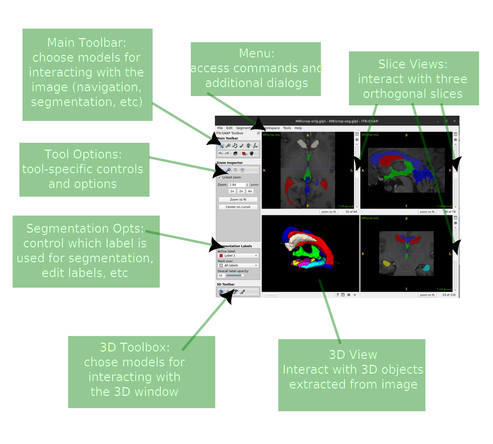
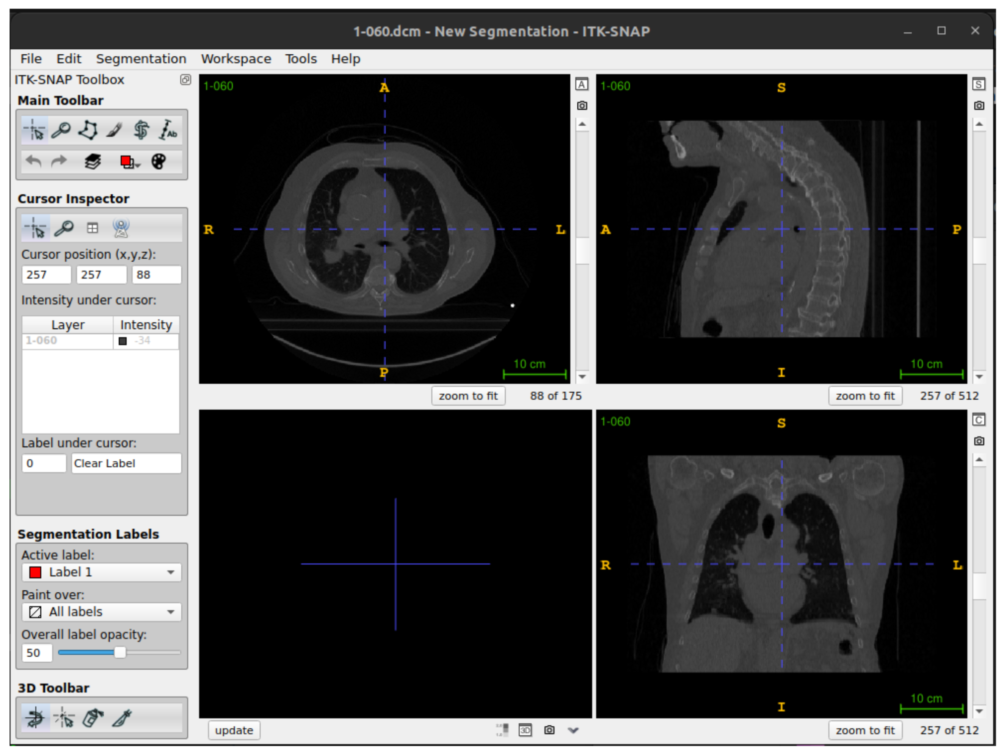
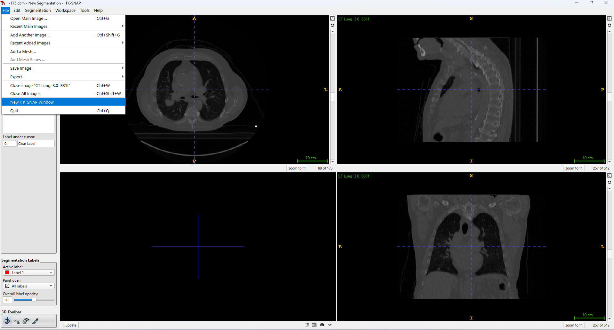
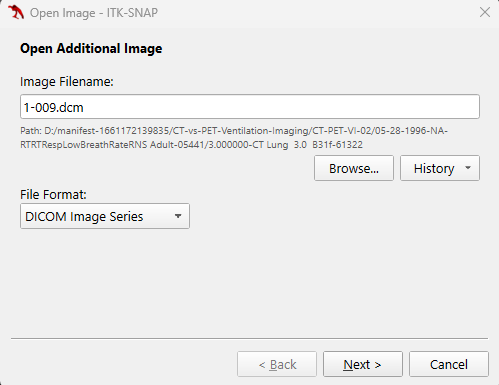
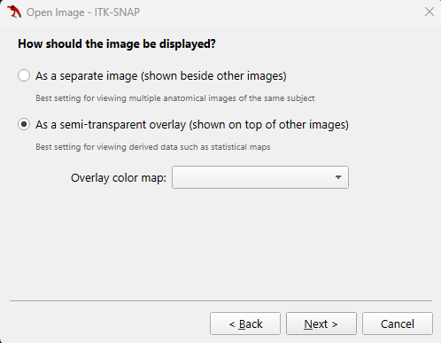
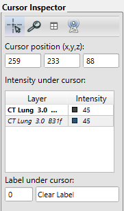
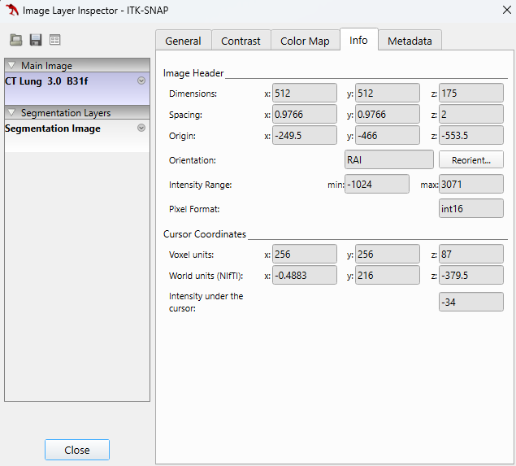
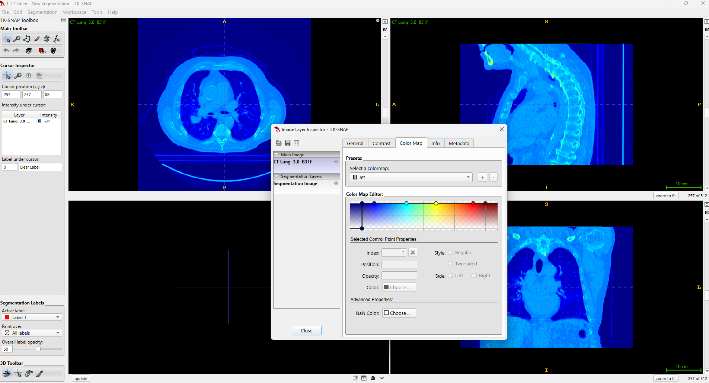
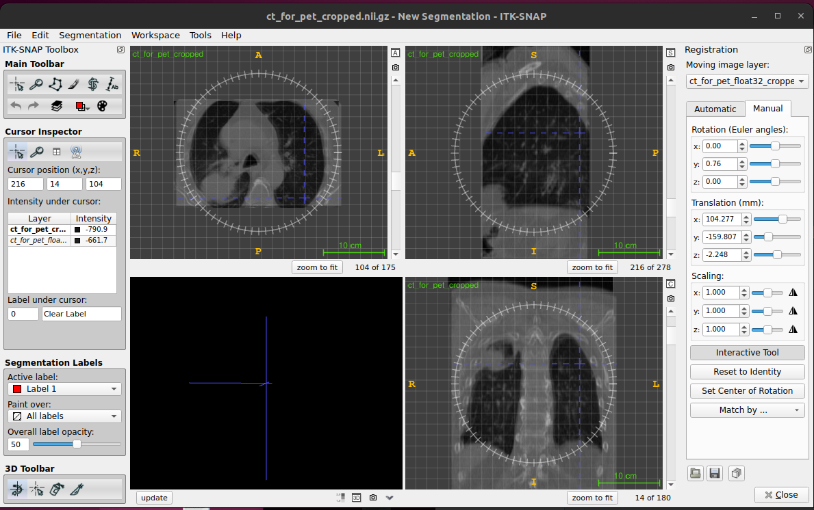

:::::::::::::::::::::::::::::::::::::: questions 

- How can we visualize volumetric data?
- How do locations in an image get mapped to real-world coordinates?
- How can we register different types of images together using ITK-SNAP?

::::::::::::::::::::::::::::::::::::::::::::::::

::::::::::::::::::::::::::::::::::::: objectives

- Describe the structure of medical imaging data and popular formats (DICOM and NifTi)
- Discover and display medical imaging data in ITK-SNAP
- Demonstrate how to convert between different medical image formats
- Inspecting the NifTi header with `nibabel`
- Manipulate image data (cropping images) with `nibabel` and learn how it is displayed on screen with ITK-SNAP

::::::::::::::::::::::::::::::::::::::::::::::::

## Medical Imaging Data 
In these exercises we will be working with real-world medical imaging data from the Cancer Imaging Archive (TCIA).

### Data resources

#### CT-vs-PET-Ventilation-Imaging 
CT Ventilation as a Functional Imaging Modality for Lung Cancer Radiotherapy from [TCIA](https://www.cancerimagingarchive.net/collection/ct-vs-pet-ventilation-imaging/).
We recomend to focus on exhale/inhale breath hold CT (BHCT) Dicoms which belog to: 
* The BHCT scans for CT-PET-VI-02 & CT-PET-VI-03 show very little motion between inhale and exhale
* The BHCT scans for CT-PET-VI-05 have a different number of slices between the inhale and exhale

Data paths look like these:
```
/CT-PET-VI-02$ tree -d 
.
├── 1000.000000-PET SUV Factors-26496 [1 item, with size 42.1 kB]
├── 3.000000-CT Lung  3.0  B31f-61322  [175 items, totalling 92.4 MB]
├── 4.000000-Galligas Lung-03537 [159 items, totalling 51.5 MB]
├── 5.000000-Thorax Insp  2.0  B70f-29873 [167 items, totalling 88.1 MB]
├── 7.000000-Thorax Exp  2.0  B70f-73355 [167 items, totalling 88.1 MB]
└── 8.000000-RespLow  2.0  B30s  80  Ex - 100  In-44317 [810 items, totalling 426.9 MB]

/CT-PET-VI-03$ tree -d
.
├── 06-25-1996-RTRTRespLowBreathRateRNS Adult-43080
│   ├── 1000.000000-PET SUV Factors-06580
│   ├── 3.000000-CT Lung  3.0  B31f-08354
│   └── 4.000000-Galligas Lung-15379
└── 06-25-1996-RTRTRespLowBreathRateRNS Adult-87093
    ├── 5.000000-Thorax Insp  2.0  B70f-42000
    ├── 7.000000-Thorax Exp  2.0  B70f-45310
    └── 8.000000-RespLow  2.0  B30s  80  Ex - 100  In-54790

/CT-PET-VI-05$ tree -d
└── 12-10-1996-RTRTRespLowBreathRateRNS Adult-37585
    ├── 1000.000000-PET SUV Factors-63910
    ├── 3.000000-CT Lung  3.0  B31f-90638
    ├── 4.000000-Galligas Lung-26361
    ├── 5.000000-Thorax Insp  2.0  B70f-45546
    ├── 7.000000-Thorax Exp  2.0  B70f-31579
    └── 8.000000-RespLow  2.0  B30s  80  Ex - 100  In-16454
```

#### the HNSCC collection on The Cancer Imaging Archive
The data we are using comes from the HNSCC collection on [The Cancer Imaging Archive](https://wiki.cancerimagingarchive.net/display/Public/HNSCC).
This is a collection of data from several hundred subjects who underwent radiotherapy for
head and neck cancer and includes the CT scans used to plan their radiotherapy as well as
other radiotherapy and imaging data. The scans we are using have been defaced (had the
facial details blurred) prior to sharing them with you for these exercises to help ensure the
individuals cannot be reidentified. 

#### The Cancer Imaging Archive (TCIA)
The Cancer Imaging Archive (TCIA) is a resource of public datasets hosts a large archive of medical images of cancer accessible for public download. 
Data may require extensive cleaning and pre-processing before it is suitable to be used.

Notes 
```callout
1. When using open datasets that contain images of humans, such as those from TCIA, for your
own research, you will still need to get ethical approval (as you do for any non-open
datasets you use) – this can usually be obtained from the local ethics committee (both
Medical Physics and Computer Science have their own local ethics committee) or from UCL
central ethics if your department does not have one.
2. Although there are many formats that medical imaging data can come
in, we are going to focus on DICOM and NifTi as they are two of the most common formats.
Most data that comes from a hospital will be in DICOM format, whereas NifTi is a very
popular format in the medical image analysis community.
```

### DICOM format
Digital Imaging and Communications in Medicine (DICOM) is a technical standard for the digital storage and transmission of medical images and related information.
While DICOM images typically have a separate file for every slice, more modern DICOM images can come with all slices in a single file.

If you look at the data `3.000000-CT Lung  3.0  B31f-61322` you will see there are 175 individual files corresponding to 175 slices in the volume. 
In addition to the image data for each slice, each file contains a header which can contain an extensive amount of extra information relating to the scan and subject. 

In a clinical setting this will include patient identifiable information such as their name, address, and other relevant details. 
Such information should be removed before the data is transferred from the clinical network for use in research. 
If you ever discover patient identifiable information in the header of data you are using you should immediately alert your supervisor, manager or collaborator

The majority of the information in the DICOM header is not directly useful for typical image processing and analysis tasks. 
Furthermore, there are complicated ‘links’ (provided by unique identifiers, UIDs) between the DICOM headers of different files belonging to the same scan or subject. Together with DICOM routinely storing each slice as a separate files, it makes processing an entire imaging volume stored as DICOM format rather cumbersome, and the extra housekeeping required could lead to a greater chance of an error being made.
Therefore, a common first step of any image processing pipeline is to convert the DICOM image to a more suitable format such as `NifTi`. 
Generally, most conversions go from DICOM to NIfTI. There are scenarios when you might want to convert from NIfTI **back** to DICOM, for example, if you need to import them into a clinical system that only works with DICOM.

Notes
```callout
Converting images back to DICOM such that they are correctly interpreted by a clinical system can be very tricky and requires a good understanding of the DICOM standard. 
More information on the DICOM standard can be found here: https://www.dicomstandard.org
```

### NifTi format
The Neuroimaging Informatics Technology Initiative (NIfTI) image format are usually stored as a single file containing the imaging data and header information.
While the NifTI file format was originally developed by the neuroimaging community it is not specific to neuroimaging and is now widely used for many different medical imaging applications outside of the brain.
During these exercises you will learn about some of the key information stored in the NifTi header.

NifTI files can also store the header and image data in separate files but this is not very common. 
For more information, please see Anderson Winkler's blog on the [NIfTI-1]( https://brainder.org/2012/09/23/the-nifti-file-format/) and[NIfTI-2]( https://brainder.org/2015/04/03/the-nifti-2-file-format/) formats.

## Visualisation of volumetric data with ITK-SNAP

### Getting Started with ITK-SNAP
#### Introduction
ITK-SNAP started in 1999 with SNAP (SNake Automatic Partitioning) and developed by Paul Yushkevich with the guidance of Guido Gerig. 
ITK-SNAP is open-source software distributed under the GNU General Public License. 
ITK-SNAP is written in C++ and it leverages the Insight Segmentation and Registration Toolkit (ITK) library. 
See `Summary and Setup` section for requirements and installation of ITK-SNAP

### ITK-SNAP application
ITK-SNAP application shows three orthogonal slices and a fourth window for three-dimensional view segmentation. 




## Viewing and understanding DICOM data

We are using DICOM data from "3.000000-CT Lung  3.0  B31f-61322  [175 items, totalling 92.4 MB]".

### Opening and Viewing DICOM images

* Open DICOM images  

Open the ITK-SNAP application. 
Then in your file explorer (exFinder in Mac and nautilus in Ubuntu), go to the directory called "3.000000-CT Lung  3.0  B31f-61322". 
It will contain numerous files that being with `1-`, followed by a large number of digits and end with a `.dcm` file extension. 
Take this directory and drop it into ITK-SNAP application,  select File format to `DICOM Image Series`. 
Then click `Next`, followed by `Finish` 



### Navigating DICOM images

Here, we provide instructions for handling multiple DICOM images, applying overlays, viewing image information, and using color maps in ITK-SNAP.

#### 1. Loading Multiple DICOM Images as Separate Images

1. **Open the First DICOM Series**:
   - Follow the steps above to load and view the first DICOM series.

2. **Open the Second DICOM image in a New Window**:
   - Go to `File` > `New itksnap Window`.
   - Select `Open DICOM Series` and choose the second DICOM series.
   - This will open the second series in a separate ITK-SNAP window.
   - This can be repeated for multiple DICOM series.



#### 2. Applying Overlays (shown in top of other images)

1. **Load Primary Image**:
   - Open your primary DICOM series as described above.

2. **Load Overlay Image**:
   - Go to `File` > `Add Another Image ...`.
   - Select the image you want to use as an overlay. This could be another DICOM series or a previously saved segmentation.





3. **Adjust Overlay Settings**:
   - Go to the `Layers` panel.
   - Right click on the second DICOM Series and adjust the opacity and blending settings to properly visualise the overlay on the primary image.




#### 4. Viewing Image Information

1. **Access Image Information**:
   - Go to `Tools` > `Image Information`.
   - A dialog box will appear displaying metadata and other relevant information about the loaded DICOM images (e.g. values for image header and cursor coordinates).




#### 5. Applying Color Maps
Images contain numerical voxels at each image. 
One of the key elements of an imaging viewer is to provide different means to map those values into grey scales or different colors. 
We will show you how to apply different color maps or lookup tables to your data and how this affects how the images are presented to the user. 

1. **Load the Image**:
   - Open the desired DICOM series.

2. **Open Color Map Settings**:
   - Go to `Tools` > `Color Maps Editor`.

3. **Apply and Adjust Color Map**:
   - Choose a predefined color map from the list. You might also create a customised map.
   - Adjust the intensity and transparency settings as needed to enhance the visualisation of the images.




### Converting DICOM images to NifTi
As mentioned earlier in the exercise, the NIfTI image format tends to be much easier to work with when processing and analysing medical image data.
We will now work on converting DICOM images to a NIfTI image volume. 

#### Using ITK-SNAP
In the ITK-SNAP application, save the file by clicking 'File' --> 'Save image' --> rename image and choose format as 'NiFTI'.

#### Using [dicom2nifti](https://github.com/icometrix/dicom2nifti)
```python
from pathlib import Path 
import dicom2nifti 
dicoms = Path("~/3_000000-CT_Lung_30_B31f-61322")
dicom2nifti.convert_directory(dicoms, ".", compression=True, reorient=True)
```

## Viewing and understanding the NifTi header with NiBabel
We are going to use the python package [NiBabel](https://nipy.org/nibabel/) to work with `NifTI` images. 
We recommend to check [documentation](https://nipy.org/nibabel/#documentation) for further deatils on using nibabel library.
Please see [instructions](../_dependencies) to install such dependecies.

### Loading images
1. Open terminal, activate `mirVE` environment and run python
```bash
conda activate mirVE
python
```

2. Run python commands under `*/episodes` path:
```python
import numpy as np
import nibabel as nib
import matplotlib.pyplot as plt
nii3ct = nib.load("data/3_ct_lung__30__b31f.nii.gz")
```

2. `NifTI` file properties:
```python
print(type(nii3ct))
# <class 'nibabel.nifti1.Nifti1Image'>
```

```python
print(nii3ct.get_data_dtype())
#int16
```

```python
nii3ct.shape
# (512, 512, 175)
```

```python
nii3ct.affine
## dicom2nifti.convert_directory(dicoms, ".", compression=True, reorient=True) # nii.gz
#array([[  -0.9765625 ,   -0.        ,    0.        ,  249.51171875],
#       [  -0.        ,   -0.9765625 ,    0.        ,  466.01171875],
#       [   0.        ,    0.        ,    2.        , -553.5       ],
#       [   0.        ,    0.        ,    0.        ,    1.        ]])
## dicom2nifti.convert_directory(dicoms, ".", compression=True, reorient=False) # nii.gz
#array([[  -0.9765625 ,    0.        ,    0.        ,  249.51171875],
#       [  -0.        ,    0.9765625 ,    0.        ,  -33.01171875],
#       [   0.        ,   -0.        ,    2.        , -553.5       ],
#       [   0.        ,    0.        ,    0.        ,    1.        ]])
```

### Header features 
```python
print(nii3ct.header)

#<class 'nibabel.nifti1.Nifti1Header'> object, endian='<'
#sizeof_hdr      : 348
#data_type       : b''
#db_name         : b''
#extents         : 0
#session_error   : 0
#regular         : b''
#dim_info        : 0
#dim             : [  3 512 512 175   1   1   1   1]
#intent_p1       : 0.0
#intent_p2       : 0.0
#intent_p3       : 0.0
#intent_code     : none
#datatype        : int16
#bitpix          : 16
#slice_start     : 0
#pixdim          : [-1.         0.9765625  0.9765625  2.         1.         1.
#  1.         1.       ]
#vox_offset      : 0.0
#scl_slope       : nan
#scl_inter       : nan
#slice_end       : 0
#slice_code      : unknown
#xyzt_units      : 2
#cal_max         : 0.0
#cal_min         : 0.0
#slice_duration  : 0.0
#toffset         : 0.0
#glmax           : 0
#glmin           : 0
#descrip         : b''
#aux_file        : b''
#qform_code      : unknown
#sform_code      : aligned
#quatern_b       : 0.0
#quatern_c       : 1.0
#quatern_d       : 0.0
#qoffset_x       : 249.51172
#qoffset_y       : -33.01172
#qoffset_z       : -553.5
#srow_x          : [ -0.9765625   0.          0.        249.51172  ]
#srow_y          : [ -0.          0.9765625   0.        -33.01172  ]
#srow_z          : [   0.    -0.     2.  -553.5]
#intent_name     : b''
#magic           : b'n+1'
```

### qform   
```python
print(nii3ct.get_qform())
## dicom2nifti.convert_directory(dicoms, ".", compression=True, reorient=True) # nii.gz
#[[  -0.9765625     0.            0.          249.51171875]
# [   0.            0.9765625     0.          -33.01171875]
# [   0.            0.            2.         -553.5       ]
# [   0.            0.            0.            1.        ]]
## dicom2nifti.convert_directory(dicoms, ".", compression=True, reorient=False) # nii.gz
#[[  -0.9765625     0.            0.          249.51171875]
# [   0.           -0.9765625     0.          466.01171875]
# [   0.            0.            2.         -553.5       ]
# [   0.            0.            0.            1.        ]]

```

### coordinate system  
The original DICOM images assume the world coordinate system is LPS (i.e. values increase when moving to the left, posterior, and superior).
See this helpful information on [DICOM orientations](https://nipy.org/nibabel/dicom/dicom_orientation.html), and determine if you obtained a similar affine transform from the DICOM headers.
The values in the first two rows corresponding to the x and y dimensions would be the negative of those in the NifTi header.

### Obtaining image pixel data
```python
pixel_data=nii3ct.get_fdata()
print(pixel_data.dtype, pixel_data.shape)
#float64 (512, 512, 175)
```

```python
plt.imshow(pixel_data[:,:,140], cmap="gray"); plt.show()
#launch plot window
```

## Modifying `NifTi` images and headers with Nibabel

### Using float64 data type
* The image data for a Nifti1Image object can be accessed using the `get_fdata` function.
Loading the data from disk and cast it to float64 type before returning the data as a numpy array.
```python
image_data=nii3ct.get_fdata()
print(type(image_data))
#<class 'numpy.ndarray'>
```

```python
print(image_data.dtype)
#float64
```

```python
print(image_data.shape)
#(512, 512, 175)
```

* Use the `set_data_dtype` function to set the data type to float32. 

Casting it to float64 prevents any integer-related errors and problems in downstream processing when using the data read by Nibabel. 
However, this does not change the type of the image stored on disk, which as we have seen is int16 for this image, and this could still lead to downstream errors or unexpected behaviour for any processing that works directly on the images stored on disk. 
Therefore, we are going to convert the image saved on disk to a floating point image. 
We are going to use 32 bit rather than 64 bit floating point, as this is usually sufficiently accurate. 
```python
print(nii3ct.get_data_dtype())
#int16
```

```python
nii3ct.set_data_dtype(np.float32)
print(nii3ct.get_data_dtype())
#float32
```

We are also going to set the qform to unknown as suggested above.
This also updates the corresponding fields in the header. 
Use the `set_qform` function to set the `qform` code. 
To just set the code and not modify the other `qform` values in the header, the first input should be None. 
It is not necessary to modify the other `qform` values as they should be ignored when the code is set to unknown.

```python
nii3ct.set_qform(None, code = 'unknown')
print(nii3ct.header)
...
qform_code      : unknown
...

```

The floating point image can now be written to disk using the save function. 

Notes.
```callout
We do not need to manually modify the type of the image data – setting the data type for the Nifti1Image object tells it which type to use when writing the image data to disk.
```

```python
nib.save(nii3ct, 'data/3_ct_lung__30__b31f_float32.nii.gz')
```

### 16-bit integers vs 32 bit floats

The file size of `3_ct_lung__30__b31f_float32.nii.gz` is larger than  `3_ct_lung__30__b31f.nii.gz` (60 MB, 46 MB, respectively) because of the conversion from 16 bit integers to 32 bit floats. 
Both images are compressed, but the compression is more efficient for the floating point image: while a 32-bit floating point variable is twice the size of a 16-bit integer, the floating image is less than double the size of the original integer image.

* int16
```python
nii3ct_int16 = nib.load("data/3_ct_lung__30__b31f.nii.gz")
```

```python
print(nii3ct_int16.get_data_dtype())
#int16
```

```python
print(nii3ct_int16.header)
#<class 'nibabel.nifti1.Nifti1Header'> object, endian='<'
#sizeof_hdr      : 348
#data_type       : b''
#db_name         : b''
#extents         : 0
#session_error   : 0
#regular         : b''
#dim_info        : 0
#dim             : [  3 512 512 175   1   1   1   1]
#intent_p1       : 0.0
#intent_p2       : 0.0
#intent_p3       : 0.0
#intent_code     : none
#datatype        : int16
#bitpix          : 16
#...
```

* float32
```python
nii3ct_float32 = nib.load("data/3_ct_lung__30__b31f_float32.nii.gz")
```

```python
print(nii3ct_float32.get_data_dtype())
#float32
```

```python
print(nii3ct_float32.header)
#<class 'nibabel.nifti1.Nifti1Header'> object, endian='<'
#sizeof_hdr      : 348
#data_type       : b''
#db_name         : b''
#extents         : 0
#session_error   : 0
#regular         : b''
#dim_info        : 0
#dim             : [  3 512 512 175   1   1   1   1]
#intent_p1       : 0.0
#intent_p2       : 0.0
#intent_p3       : 0.0
#intent_code     : none
#datatype        : float32
#bitpix          : 32
#slice_start     : 0
#...
```

### Cropping data
Cropping data might offen contain background voxels which can be useful in some instances but might take up valuable RAM memory, especially for large images.

* Read the image data from disk using `get_fdata`  and then create a new array containing a copy of the desired slices:
```python
nii3ct_float32 = nib.load("data/3_ct_lung__30__b31f_float32.nii.gz")
nii3ct_float32.set_data_dtype(np.float32)
print(nii3ct_float32.get_data_dtype())
#float32
```

```python
image_data=nii3ct_float32.get_fdata()
print(image_data.dtype, image_data.shape)
#float64 (512, 512, 175)
```

```python
plt.imshow(image_data[:,:,100], cmap="gray"); plt.show()
#launch plot window
```

```python
image_data_cropped = image_data[103:381,160:340,:].copy()
#x[sagittal], y[coronal], z[axial] #voxel units
```

```python
nii3ct_float32_cropped = nib.nifti1.Nifti1Image(image_data_cropped, nii3ct_float32.get_sform(), nii3ct_float32.header)
nii3ct_float32_cropped.shape
#(278, 180, 175)
```

```python
print(nii3ct_float32_cropped.header)
#<class 'nibabel.nifti1.Nifti1Header'> object, endian='<'
#sizeof_hdr      : 348
#data_type       : b''
#db_name         : b''
#extents         : 0
#session_error   : 0
#regular         : b''
#dim_info        : 0
#dim             : [  3 278 180 175   1   1   1   1]
#intent_p1       : 0.0
#intent_p2       : 0.0
#intent_p3       : 0.0
#intent_code     : none
#datatype        : float32
#bitpix          : 32
#slice_start     : 0
#pixdim          : [1.        0.9765625 0.9765625 2.        1.        1.        1.
# 1.       ]
#vox_offset      : 0.0
#scl_slope       : nan
#scl_inter       : nan
#slice_end       : 0
#slice_code      : unknown
#xyzt_units      : 2
#cal_max         : 0.0
#cal_min         : 0.0
#slice_duration  : 0.0
#toffset         : 0.0
#glmax           : 0
#glmin           : 0
#descrip         : b''
#aux_file        : b''
#qform_code      : unknown
#sform_code      : aligned
#quatern_b       : 0.0
#quatern_c       : 0.0
#quatern_d       : 1.0
#qoffset_x       : 249.51172
#qoffset_y       : 466.01172
#qoffset_z       : -553.5
#srow_x          : [ -0.9765625  -0.          0.        249.51172  ]
#srow_y          : [ -0.         -0.9765625   0.        466.01172  ]
#srow_z          : [   0.     0.     2.  -553.5]
#intent_name     : b''
#magic           : b'n+1'
```

```python
nib.save(nii3ct_float32_cropped, "data/3_ct_lung__30__b31f_float32_cropped.nii.gz")
```

* Setting world coordinates of voxel (103, 160, 0) in the uncropped image.
```python
cropped_origin = nii3ct_float32.affine@np.array([103,160,0,1])
cropped_origin
#array([ 148.92578125,  309.76171875, -553.5       ,    1.        ])
```

```python
aff_mat_cropped = nii3ct_float32_cropped.get_sform()
print(aff_mat_cropped)
#array([[  -0.9765625 ,   -0.        ,    0.        ,  249.51171875],
#       [  -0.        ,   -0.9765625 ,    0.        ,  466.01171875],
#       [   0.        ,    0.        ,    2.        , -553.5       ],
#       [   0.        ,    0.        ,    0.        ,    1.        ]])
```

```python
aff_mat_cropped[:, 3] = cropped_origin
print(aff_mat_cropped)
#[[  -0.9765625    -0.            0.          148.92578125]
# [  -0.           -0.9765625     0.          309.76171875]
# [   0.            0.            2.         -553.5       ]
# [   0.            0.            0.            1.        ]]
```


```python
nii3ct_float32_cropped.set_sform(aff_mat_cropped)
nii3ct_float32_cropped.affine
#array([[  -0.9765625 ,   -0.        ,    0.        ,  148.92578125],
#       [  -0.        ,   -0.9765625 ,    0.        ,  309.76171875],
#       [   0.        ,    0.        ,    2.        , -553.5       ],
#       [   0.        ,    0.        ,    0.        ,    1.        ]])
```

```python
nib.save(nii3ct_float32_cropped, "data/3_ct_lung__30__b31f_float32_cropped_affine.nii.gz")
```

* updating the affine transforms with `nibabel.slicer`
```python
nii3ct_float32_cropped_with_nibabel_slicer = nii3ct_float32.slicer[103:381,160:340,:]
nii3ct_float32_cropped_with_nibabel_slicer.affine
#array([[  -0.9765625 ,    0.        ,    0.        ,  148.92578125],
#       [   0.        ,   -0.9765625 ,    0.        ,  309.76171875],
#       [   0.        ,    0.        ,    2.        , -553.5       ],
#       [   0.        ,    0.        ,    0.        ,    1.        ]])
```

### Cropped and aligned image
Automated image registrations can be prone to be failure if there are very large initial differences between the images. A manual alignment is subjective, but can provide a good enough starting guess that keeps the objective, automated registration more reliable.  
* Manually aligning images
For manaual image registration in ITK-SNAP go to Tools > image registration



* Automatic registration (affine)
You can use [niftyreg](https://nipype.readthedocs.io/en/latest/api/generated/nipype.interfaces.niftyreg.reg.html), [Reg_aladin](http://cmictig.cs.ucl.ac.uk/wiki/index.php/Reg_aladin) or [DL methods](https://github.com/Project-MONAI/tutorials/tree/main/3d_registration).

## References 
* NiBabel: "The NiBabel documentation also contains some useful information and tutorials for working with NifTi images and understanding world coordinate systems and radiological vs neurological view."
	* https://nipy.org/nibabel/nifti_images.html  
	* https://nipy.org/nibabel/coordinate_systems.html  
	* https://nipy.org/nibabel/neuro_radio_conventions.html  
* ITK-SNAP:
	* [Tutorial: Getting Started with ITK-SnAP](http://www.itksnap.org/docs/viewtutorial.php)
	* [ITK-SNAP 3.x Training Class Final Program](http://itksnap.org/files/handout_201409.pdf)


