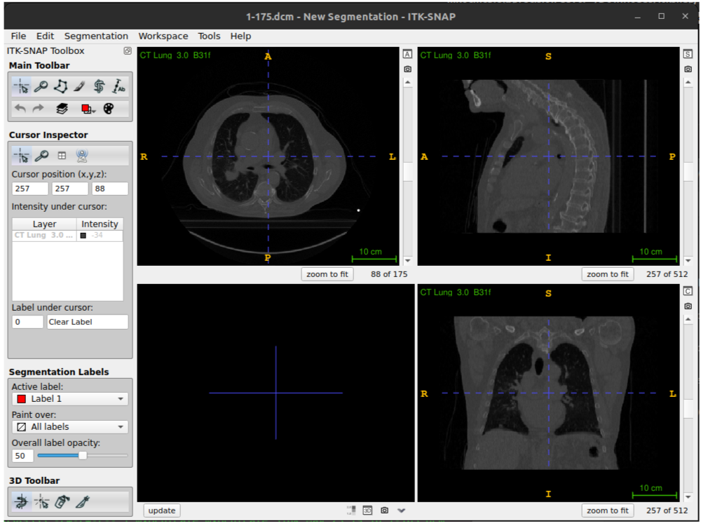

:::::::::::::::::::::::::::::::::::::: questions 

- How to understand and visualise volumetric medical data in ITK-SNAP?

::::::::::::::::::::::::::::::::::::::::::::::::

::::::::::::::::::::::::::::::::::::: objectives

- Medical imaging data in DICOM and nifti formats
- Getting started with ITK-SNAP
- Viewing data
- Converting data
- Modifyiing data

::::::::::::::::::::::::::::::::::::::::::::::::

## Medical Imaging Data 
In these exercises we will be working with real-world medical imaging data from the HNSCC collection on The Cancer Imaging Archive and the Cancer Imaging Archive (TCIA).

### Data resources

#### the HNSCC collection on The Cancer Imaging Archive
The data we are using comes from the HNSCC collection on The Cancer Imaging Archive [:link:](https://wiki.cancerimagingarchive.net/display/Public/HNSCC).
This is a collection of data from several hundred subjects who underwent radiotherapy for
head and neck cancer and includes the CT scans used to plan their radiotherapy as well as
other radiotherapy and imaging data. The scans we are using have been defaced (had the
facial details blurred) prior to sharing them with you for these exercises to help ensure the
individuals cannot be reidentified. 

#### The Cancer Imaging Archive (TCIA)
The Cancer Imaging Archive (TCIA) is a resource of public datasets hosts a large archive of medical images of cancer accessible for public download. 
Data may require extensive cleaning and pre-processing before it is suitable to be used.

#### CT-vs-PET-Ventilation-Imaging 
CT Ventilation as a Functional Imaging Modality for Lung Cancer Radiotherapy [:link:](https://www.cancerimagingarchive.net/collection/ct-vs-pet-ventilation-imaging/)
We recomend to focus on exhale/inhale breath hold CT (BHCT) Dicoms which belog to: 
* The BHCT scans for CT-PET-VI-02 & CT-PET-VI-03 show very little motion between inhale and exhale
* The BHCT scans for CT-PET-VI-05 have a different number of slices between the inhale and exhale

Data paths look like these:
```
/CT-PET-VI-02$ tree -d 
.
├── 1000.000000-PET SUV Factors-26496 [1 item, with size 42.1 kB]
├── 3.000000-CT Lung  3.0  B31f-61322  [175 items, totalling 92.4 MB]
├── 4.000000-Galligas Lung-03537 [159 items, totalling 51.5 MB]
├── 5.000000-Thorax Insp  2.0  B70f-29873 [167 items, totalling 88.1 MB]
├── 7.000000-Thorax Exp  2.0  B70f-73355 [167 items, totalling 88.1 MB]
└── 8.000000-RespLow  2.0  B30s  80  Ex - 100  In-44317 [810 items, totalling 426.9 MB]

/CT-PET-VI-03$ tree -d
.
├── 06-25-1996-RTRTRespLowBreathRateRNS Adult-43080
│   ├── 1000.000000-PET SUV Factors-06580
│   ├── 3.000000-CT Lung  3.0  B31f-08354
│   └── 4.000000-Galligas Lung-15379
└── 06-25-1996-RTRTRespLowBreathRateRNS Adult-87093
    ├── 5.000000-Thorax Insp  2.0  B70f-42000
    ├── 7.000000-Thorax Exp  2.0  B70f-45310
    └── 8.000000-RespLow  2.0  B30s  80  Ex - 100  In-54790

/CT-PET-VI-05$ tree -d
└── 12-10-1996-RTRTRespLowBreathRateRNS Adult-37585
    ├── 1000.000000-PET SUV Factors-63910
    ├── 3.000000-CT Lung  3.0  B31f-90638
    ├── 4.000000-Galligas Lung-26361
    ├── 5.000000-Thorax Insp  2.0  B70f-45546
    ├── 7.000000-Thorax Exp  2.0  B70f-31579
    └── 8.000000-RespLow  2.0  B30s  80  Ex - 100  In-16454
```


#### Notes 
1. When using open datasets that contain images of humans, such as those from TCIA, for your
own research, you will still need to get ethical approval (as you do for any non-open
datasets you use) – this can usually be obtained from the local ethics committee (both
Medical Physics and Computer Science have their own local ethics committee) or from UCL
central ethics if your department does not have one.
2. Although there are many formats that medical imaging data can come
in, we are going to focus on DICOM and nifti as they are two of the most common formats.
Most data that comes from a hospital will be in DICOM format, whereas nifti is a very
popular format in the medical image analysis community.


### DICOM format
The data is available on moodle as a zip file, `data_for_reg_exercises_4.zip`. 
This contains data from two subjects, with a CT scan in DICOM format for subject 1 and a CT scan in nifti format for subject 2. 

DICOM images typically have a separate file for every slice. If you look at the data for subject
1 you will see there are 123 individual files corresponding to 123 slices in the volume. 
In addition to the image data for each slice, each file contains a header which can contain an
extensive amount of extra information relating to the scan and subject. 
In a clinical setting this will include patient identifiable information such as their name, address, and other relevant details. 
Such information should be removed before the data is transferred from the clinical network for use in research. 
If you ever discover patient identifiable information in the header of data you are using you should immediately alert your supervisor, manager or collaborator

The majority of the information in the DICOM header is not directly useful for typical image processing and analysis tasks. 
Furthermore, there are complicated ‘links’ (provided by unique identifiers, UIDs) between the DICOM headers of different files belonging to thesame scan or subject, which together with storing separate slices as separate files, makes working directly with DICOM rather cumbersome (at least if you want to do it correctly!).
Therefore, a common first step of any image processing pipeline is to convert the DICOM image to a more suitable format such as nifti. 
Generally, you will only convert images back to DICOM if you need to import them into a clinical system that only works with DICOM.

Notes.
1. Converting images back to DICOM such that they are correctly interpreted by a clinical system can be very tricky and requires a good understanding of the DICOM standard. More information on the DICOM standard can be found here: https://www.dicomstandard.org

### NifTi format
The Neuroimaging Informatics Technology Initiative (NIfTI) image format are usually stored as a single file containing the imaging data and header information.
It also is possible to store the header and image data in separate files but this is not very common.

There are actually two formats for nifti files, nifti-1 and nifti-2, with the later allowing for very large images. 
However, the formats are very similar, and the header contains the same info (but some of it stored slightly differently). 
They can be worked with and manipulated in the same way, and it is only when loading and saving the files (which is handled by NiBabel’s functions) that a distinction really needs to be made. 
The nifti header contains much less information than DICOM, but does include all the key information required for interpreting, manipulating, and processing the image. 

During these exercises you will learn about some of the key information stored in the nifti header, but for more information see: https://brainder.org/2012/09/23/the-nifti-file-format/ and https://brainder.org/2015/04/03/the-nifti-2-file-format/.

## ITK-SNAP

### Getting Started with ITK-SNAP
#### History
ITK-SNAP started in 1999 with SNAP (SNake Automatic Partitioning) and then developed by Paul Yushkevich with the guidance of Guido Gerig.

#### Hardware Requirements
* Memory: "Overall 2Gb of memory should be enough for most users; 4Gb should suffice for users with large images." [:link:](http://www.itksnap.org/pmwiki/pmwiki.php?n=Documentation.HardwareRequirements#:~:text=Memory%20usage%20in%20SNAP%20is,for%20a%20512%20cubed%20image.)
* Operating System: ITK-SNAP binaries are distributed for Linux (32 and 64 bit, [itksnap-4.0.2-20230925-Linux-gcc64 (701MB)]), Windows ([itksnap-4.2.0-20240422-win64-AMD64]), and MacOS Leopard (32 bit).

#### Installation
* In Ubuntu 22.04 x64 GNU/Linux
```
FILENAME=itksnap-nightly-rel_4.0-Linux-gcc64.tar.gz  #Length: 200943059 (192M) [application/x-gzip]
cd ~/Downloads/
mkdir -p itksnap && cd itksnap
wget https://sourceforge.net/projects/itk-snap/files/itk-snap/Nightly/$FILENAME/download -O $FILENAME
tar -xvzf $FILENAME
```

### ITK-SNAP application
ITK-SNAP application shows three orthogonal slices and a fourth window for three-dimensional view segmentation. 


## Viewing and understanding DICOM data

We are using DICOM data from "3.000000-CT Lung  3.0  B31f-61322  [175 items, totalling 92.4 MB]".

### Opening and Viewing DICOM images

* Open DICOM images  

Open ITK-SNAP application and the directory where you see "3.000000-CT Lung  3.0  B31f-61322" where you see `1-*.dcm` files, drag directory and drop it into ITK application,  select File format to `DICOM Image Series`, and clid `Next` and `Finish`


### Navigating DICOM images
  * Two or N DICOMS as separate image(s)
  * Overlays
  * Info
  * Color Map

### * Converting DICOM images to nifti


* Using [dicom2nifti](https://github.com/icometrix/dicom2nifti)
```
from pathlib import Path 
import dicom2nifti 
dicoms = Path("~/3_000000-CT_Lung_30_B31f-61322")
dicom2nifti.convert_directory(dicoms, ".", compression=True, reorient=True)
```

## Viewing and understanding the nifti header with NiBabel
We are going to use the python package [NiBabel](https://nipy.org/nibabel/) to work with `NifTI` images. 
We recommend to check [documentation](https://nipy.org/nibabel/#documentation) for further deatils on using nibabel library.

### Installing Dependencies
Installing python virtual environment with dependencies (e.g., nibabel, etc).
See further instructions [here](https://github.com/HealthBioscienceIDEAS/Medical-Image-Registration-Short-Course/tree/main/_dependencies). 

* Using conda
```
conda create -n "mirVE" python=3.11 pip -c conda-forge
conda activate mirVE
cd ~/_dependencies
pip install -r requirements.txt
```
* Using python virtual environment
```
# Installing dependencies in Ubuntu 22.04
sudo apt-get install -y python3-pip
sudo apt-get install -y python3-venv
# Create path for venv
cd $HOME
mkdir mirVE
cd mirVE
# Create virtual environment
python3 -m venv mirVE
source mirVE/bin/activate
cd ~/_dependencies
python3 -m pip install -r requirements.txt
```

### Loading images
1. Activate `mirVE` environment and open a python terminal under episodes path to run:
```
#conda activate mirVE
#python

import numpy as np
import nibabel as nib
import matplotlib.pyplot as plt
nii3ct = nib.load("data/3_ct_lung__30__b31f.nii.gz")
```

2. `NifTI` file properties:
```
print(type(nii3ct))

# <class 'nibabel.nifti1.Nifti1Image'>
print(nii3ct.get_data_dtype())
#int16
nii3ct.shape
# (512, 512, 175)
nii3ct.affine
## dicom2nifti.convert_directory(dicoms, ".", compression=True, reorient=True) # nii.gz
#array([[  -0.9765625 ,   -0.        ,    0.        ,  249.51171875],
#       [  -0.        ,   -0.9765625 ,    0.        ,  466.01171875],
#       [   0.        ,    0.        ,    2.        , -553.5       ],
#       [   0.        ,    0.        ,    0.        ,    1.        ]])
## dicom2nifti.convert_directory(dicoms, ".", compression=True, reorient=False) # nii.gz
#array([[  -0.9765625 ,    0.        ,    0.        ,  249.51171875],
#       [  -0.        ,    0.9765625 ,    0.        ,  -33.01171875],
#       [   0.        ,   -0.        ,    2.        , -553.5       ],
#       [   0.        ,    0.        ,    0.        ,    1.        ]])
```

### Header features 
```
print(nii3ct.header)

#<class 'nibabel.nifti1.Nifti1Header'> object, endian='<'
#sizeof_hdr      : 348
#data_type       : b''
#db_name         : b''
#extents         : 0
#session_error   : 0
#regular         : b''
#dim_info        : 0
#dim             : [  3 512 512 175   1   1   1   1]
#intent_p1       : 0.0
#intent_p2       : 0.0
#intent_p3       : 0.0
#intent_code     : none
#datatype        : int16
#bitpix          : 16
#slice_start     : 0
#pixdim          : [-1.         0.9765625  0.9765625  2.         1.         1.
#  1.         1.       ]
#vox_offset      : 0.0
#scl_slope       : nan
#scl_inter       : nan
#slice_end       : 0
#slice_code      : unknown
#xyzt_units      : 2
#cal_max         : 0.0
#cal_min         : 0.0
#slice_duration  : 0.0
#toffset         : 0.0
#glmax           : 0
#glmin           : 0
#descrip         : b''
#aux_file        : b''
#qform_code      : unknown
#sform_code      : aligned
#quatern_b       : 0.0
#quatern_c       : 1.0
#quatern_d       : 0.0
#qoffset_x       : 249.51172
#qoffset_y       : -33.01172
#qoffset_z       : -553.5
#srow_x          : [ -0.9765625   0.          0.        249.51172  ]
#srow_y          : [ -0.          0.9765625   0.        -33.01172  ]
#srow_z          : [   0.    -0.     2.  -553.5]
#intent_name     : b''
#magic           : b'n+1'
```

### qform   
```
print(nii3ct.get_qform())
## dicom2nifti.convert_directory(dicoms, ".", compression=True, reorient=True) # nii.gz
#[[  -0.9765625     0.            0.          249.51171875]
# [   0.            0.9765625     0.          -33.01171875]
# [   0.            0.            2.         -553.5       ]
# [   0.            0.            0.            1.        ]]
## dicom2nifti.convert_directory(dicoms, ".", compression=True, reorient=False) # nii.gz
#[[  -0.9765625     0.            0.          249.51171875]
# [   0.           -0.9765625     0.          466.01171875]
# [   0.            0.            2.         -553.5       ]
# [   0.            0.            0.            1.        ]]

```

### coordinate system  
The original DICOM images assume the world coordinate system is LPS (i.e. values increase when moving to the left, posterior, and superior).
See [here](https://nipy.org/nibabel/dicom/dicom_orientation.html), if you obtained a similar affine transform from the DICOM headers.
The values in the first two rows corresponding to the x and y dimensions would be the negative of those in the nifti header.


### Obtaining image pixel data
```
pixel_data=nii3ct.get_fdata()

print(pixel_data.dtype, pixel_data.shape)
#float64 (512, 512, 175)

plt.imshow(pixel_data[:,:,140], cmap="gray"); plt.show()
#launch plot window
```


## Modifying nifti images and headers with Nibabel

### * Using float64 data type

### * 16-bit integers vs 32 bit floats

### * cropping data

### * updating the affine transforms

### * cropped and aligned image

### * affine registration

### Write NIfTI files

```
processed_nifti = nib.Nifti1Image(X_processed, nifti.affine)
nib.save(processed_nifti, 'X_processed.nii.gz')
```


## References 

http://www.itksnap.org/docs/viewtutorial.php 

The NiBabel documentation also contains some useful information and tutorials for working with nifti images and understanding world coordinate systems and radiological vs neurological view.
https://nipy.org/nibabel/nifti_images.html
https://nipy.org/nibabel/coordinate_systems.html
https://nipy.org/nibabel/neuro_radio_conventions.html


