:::::::::::::::::::::::::::::::::::::: questions 

- How is medical imaging data typically stored?
- What tools and methods can be used to visualise medical imaging data?
- How can medical imaging data be manipulated and modified effectively?

::::::::::::::::::::::::::::::::::::::::::::::::

::::::::::::::::::::::::::::::::::::: objectives

- Explore medical imaging data formats, focusing on DICOM and NIfTI.
- Learn to use ITK-SNAP software to display medical imaging data.
- Convert medical images from DICOM to NIfTI format using Python.
- Understand the structure and content of the NIfTI header.
- Modify and manipulate NIfTI images and headers using Python.

::::::::::::::::::::::::::::::::::::::::::::::::

In these exercises, we will be working with real-world medical imaging data from the Cancer Imaging Archive [(TCIA)](https://www.cancerimagingarchive.net/collection/ct-vs-pet-ventilation-imaging/).
TCIA is a resource of public datasets that hosts a large archive of medical images of cancer accessible for public download.
We are going to use data from the CT Ventilation as a Functional Imaging Modality for Lung Cancer Radiotherapy dataset (also known as `CT-vs-PET-Ventilation-Imaging dataset`).
It contains 20 lung cancer patients who underwent exhale/inhale breath-hold CT (BHCT), free-breathing four-dimensional CT (4DCT) and Galligas PET ventilation scans in a single session on a combined 4DPET/CT scanner. We won't make use of the 4DCT.

We used the scans from the patient `CT-PET-VI-02`. In the zipped data folder, you can find it under `practical1`. You should see four folders: 

* `inhale_BH_CT` and `exhale_BH_CT`: CT scans acquired during an inhalation breath hold and exhalation breath hold, respectively.
* `PET`: PET scan measuring local lung function.
* `CT_for_PET`: CT scan acquired at the same time as the PET scan for attenuation correction of the PET scan and to provide anatomical reference for the PET data.  

These images are shown below in ITK-SNAP.
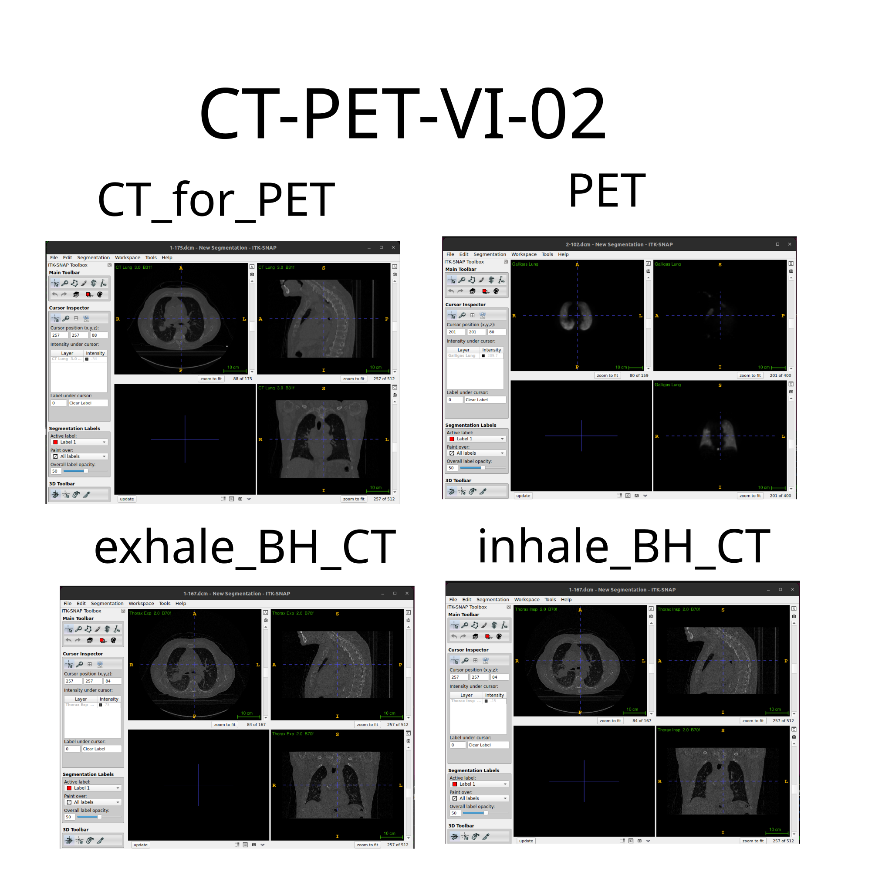

:::::::::::::::::::::::::::::::::::::: spoiler

### Data sharing ethics and policies
When using open datasets that contain images of humans, such as those from TCIA, for your research, you will still need to get ethical approval as you do for any non-open datasets you use. This is usually obtained from the local ethics committee, but tends to be a less involved process for secondary data analysis then it does for original data collection.

::::::::::::::::::::::::::::::::::::::

The first part of this tutorial makes use of the ITK-SNAP software. Make sure you have installed it following the instructions from the Summary and Setup page. The second part is based in Python, and you should use the template Jupyter notebook `practical1-exercises.ipynb`. 

## 1. Medical imaging formats

Although there are many different file formats used in medical imaging, we will focus on two of the most common formats:
* [DICOM](https://www.dicomstandard.org/) (Digital Imaging and Communications in Medicine)
* [NIfTI](https://nifti.nimh.nih.gov/) (Neuroimaging Informatics Technology Initiative)

Most data from a hospital will be in DICOM format, whereas NIfTI is a very popular format in the medical image analysis community. The files from the TCIA are in DICOM format.

### 1.1. DICOM format
DICOM is a widely used technical standard for digitally storing and transmitting medical images and related information.
DICOM images typically have a separate file for every slice.
If you look at the data `CT-PET-VI-02/CT_for_PET`, you will see that there are 175 individual files corresponding to 175 slices in the volume. More modern DICOM images can come with all slices in a single file.

In addition to the image data for each slice, each file contains a header which can include extensive information relating to the scan and subject. 
In a clinical setting, this will include identifiable information such as the patient's name, address, and other relevant details.
Such information should be removed before the data is transferred from the clinical network for use in research. 
If you discover patient-identifiable information in the header of the data you are using, you should immediately alert your supervisor, manager or collaborator.

Most of the information in the DICOM header is not directly useful for typical image processing and analysis tasks. 
Furthermore, there are complicated ‘links’ (provided by unique identifiers, UIDs) between the DICOM headers of different files belonging to the same scan or subject. With DICOM routinely storing each slice as a separate file, it makes processing an entire imaging volume stored in DICOM format rather cumbersome, and the extra housekeeping required could lead to a greater chance of an error being made.
Therefore, a common first step of any image processing pipeline is to convert the DICOM image to a more suitable format, such as NIfTI. 
Generally, most conversions go from DICOM to NIfTI. There are scenarios when you might want to convert from NIfTI back to DICOM, for example, if you need to import them into a clinical system that only works with DICOM.


:::::::::::::::::::::::::::::::::::::: spoiler

### Warning on converting images back to DICOM 
Converting images back to DICOM such that they are correctly interpreted by a clinical system can be very tricky and requires a good understanding of the DICOM standard. 
More information on the DICOM standard can be found here: https://www.dicomstandard.org.

::::::::::::::::::::::::::::::::::::::

### 1.2. NIfTI format
The NIfTI image format usually stores all of the imaging data and header information within a single file.
While the neuroimaging community originally developed the NIfTI file format, it is not specific to neuroimaging. It is now widely used for many medical imaging applications outside the brain.
The NIfTI header contains much less information than DICOM, but it includes all the key information required to interpret, manipulate, and process the image.
During these exercises, you will learn about some of the key information stored in the NIfTI header.

There are actually two formats of NIfTI files, NIfTI-1 and NIfTI-2, but these are very similar. 
For more information, please see Anderson Winkler's blog on the [NIfTI-1]( https://brainder.org/2012/09/23/the-nifti-file-format/) and [NIfTI-2]( https://brainder.org/2015/04/03/the-nifti-2-file-format/) formats.


## 2. Visualisation of data with ITK-SNAP

### 2.1. Getting Started with ITK-SNAP
The ITK-SNAP application shows three orthogonal slices and a fourth window for three-dimensional view segmentation. 

 for plane and 3D views.](fig/itk-snap-main-window.svg)

### 2.2. Opening and viewing DICOM images
* Open the ITK-SNAP application. 
  * If you have used it before, it will display recent images which you can select to open.
* Load the inhale scan `CT-PET-VI-02/inhale_BH_CT`.
  * If the image you want to open is not listed under recent images, you can open it by clicking the 'Open Image...' button at the bottom right of the window or by clicking on File in the top ribbon, then Open Main Image. When you do this, a small window opens where you can enter the path of the file you want to open or click Browse to search your file explorer.
  * Select the first slice from the inhale_BH_CT folder, which is called 1-001.dcm. Leave the default file format and click `Next`. You will then be asked to select the DICOM series to open, but as this folder only includes one series, you can click `Next`.
  * Check the image summary and click `Finish`.
  * You can also drag and drop a file from the File Explorer to the ITK-SNAP app to open it.

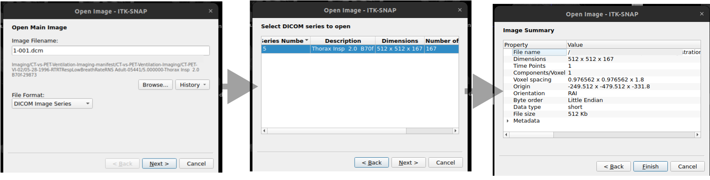
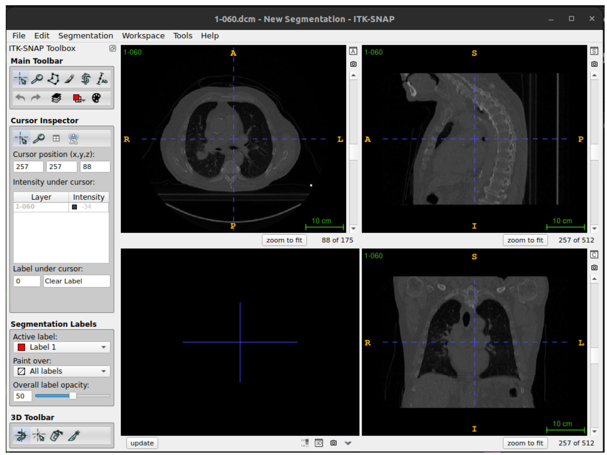

### 2.3. Coordinate system
Different versions of the ITK-SNAP app can have different default orientations for the images. We want our image to be in the RAS orientation. Click on `Tools --> Reorient image` and make sure the orientation is RAS. 

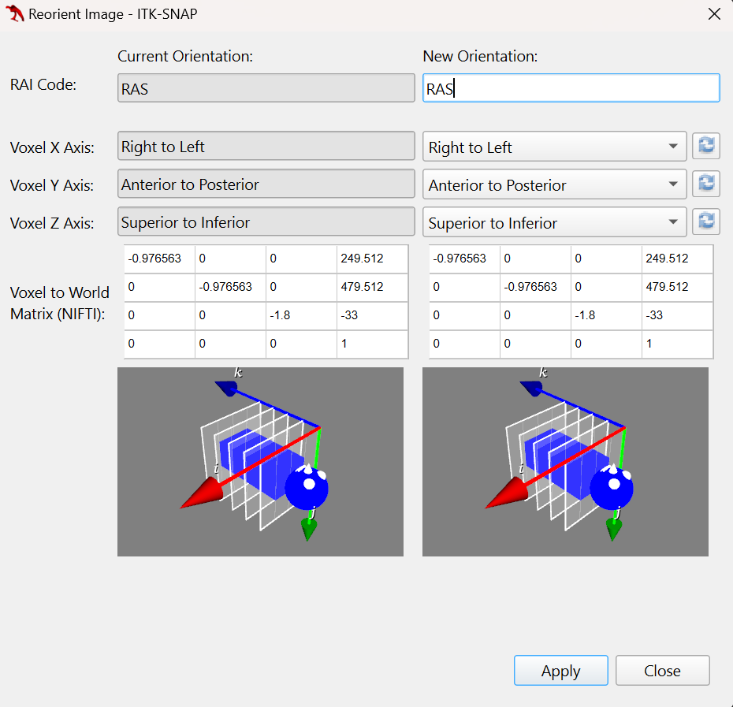

### 2.4. Navigating DICOM images
* Navigate around the image and check the intensity value on the cursor inspector.
* To navigate around the image, you can left-click and drag the cursor around one of the three planes. To move through the displayed slices, you can use the mouse wheel (or two fingers on the touchpad) or use the slider next to the displayed slice.
* To zoom in , you can use the right click and drag the cursor upwards (to zoom out, drag the cursor downwards). You can pan, or move the entire image, by using the mouse centre button or alt + left click and drag (option key + left click for Mac OS).


### 2.5. Handling multiple DICOM images
We provide instructions for handling multiple DICOM images, applying overlays, viewing image information, and using colour maps in ITK-SNAP.
For this example, we use `CT-PET-VI-02/inhale_BH_CT` and `CT-PET-VI-02/exhale_BH_CT` DICOMs.

#### Load additional image
Go to the `exhale_BH_CT` folder in your File Explorer and drag any DICOM files onto the ITK-SNAP window. 
A small window will pop up asking what should ITK-SNAP do with this image. 
If you select `Load as Main Image`, the current image will be replaced. 
Instead, select `Load as Additional Image` - this will enable easy comparison of the two images.

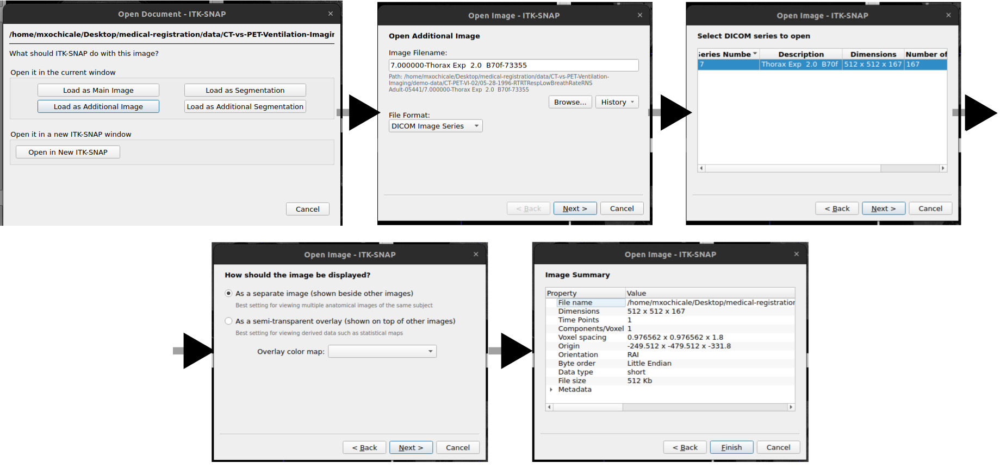

* Once the second image is loaded, you will see two thumbnails in the top corner of each slice display
* Click on these to swap the displayed slices from one image to the other, allowing you to easily see the similarities and differences between the images. You can also swap quickly by using the square bracket shortcut keys `[` and `]`
* You will also see that both images now appear in the Cursor Inspector, where you can see the intensity value at the cursor for both images. 
* You can also change the displayed image by clicking on it in the Cursor Inspector


#### Colour overlay
Sometimes, you may want to display an image as a colour overlay on top of another image, e.g., a PET image overlaid on the corresponding CT.

##### Colour overlay as a separate image (shown beside other images)
* **Load Primary Image**:
   - Open your primary DICOM series of the `CT-PET-VI-02/CT_for_PET` image either using the drag and drop method or `File -> Open Image` as described above.
	- Make sure the File Format is DICOM Image Series.
	- This time, select Load as Main Image. This will load in the new image, replacing the two that were previously loaded.
* **Load Overlay Image**:
   - Load the `CT-PET-VI-02/PET` image either using the drag and drop method or `File -> Open Image`

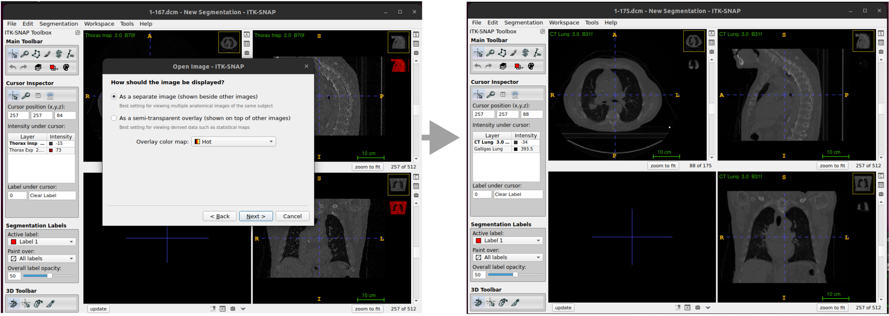

##### Colour overlay as a semi-transparent overlay (shown on the top of other images)
* **Load Primary Image**:
   - Open your primary DICOM series of the `CT-PET-VI-02/CT_for_PET` image either using the drag and drop method or `File -> Open Image` as described above.
	- Make sure the File Format is DICOM Image Series.
	- Select Load as Main Image.
* **Load Overlay Image**:
   - Load the `CT-PET-VI-02/PET` image either using the drag and drop method or `File -> Open Image`
   - When the image has loaded, select it as a semi-transparent overlay. You can also set the overlay colour map here - select `Hot` from the drop-down menu and click Next. 
   - The image summary will then be displayed, along with a warning about possible loss of precision (which can be ignored). Click Finish.

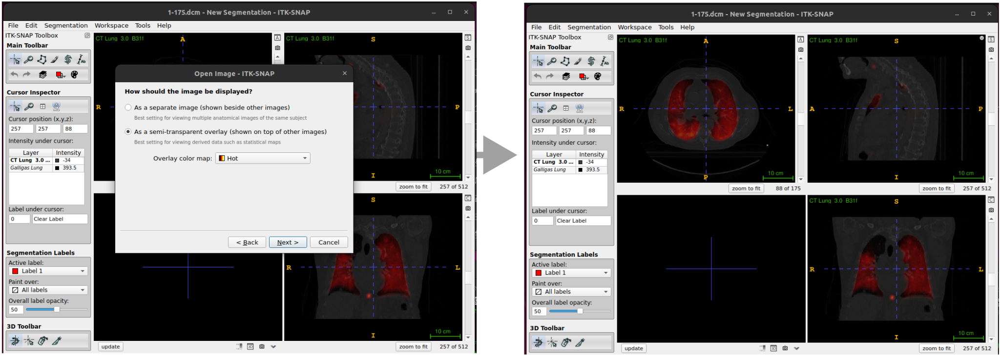

### Layer inspector tools
* Load `CT-PET-VI-02/CT_for_PET` and `CT-PET-VI-02/PET` scans using hot semi-transparency (as shown above).
* Go to `Tools -> Layer Inspector`. This opens the Image Layer Inspector window. You will see the two images on the left and five tabs at the window's top.
* The PET image appears in the Cursor Inspector (called Galligas Lung) in italics and the CT image in bold. 

#### General tab
The General tab displays the filename and the nickname for the selected image (click on either `Main Image` or `Additional Images` to display the corresponding information). 

* The nickname can be edited. 
* For the PET image, the General tab also displays a slider to set the opacity and the option to display it as a separate image or semi-transparent overlay. 

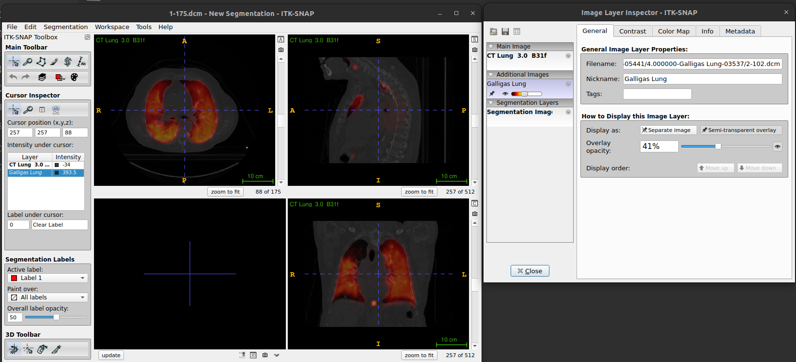

#### Contrast tab
The Contrast tab enables you to adjust how the image intensities are displayed for the different images.

* e.g. Select the lung image and set the maximum value to 1000 (push enter after typing the number). This will make the structures in the lungs easier to see.

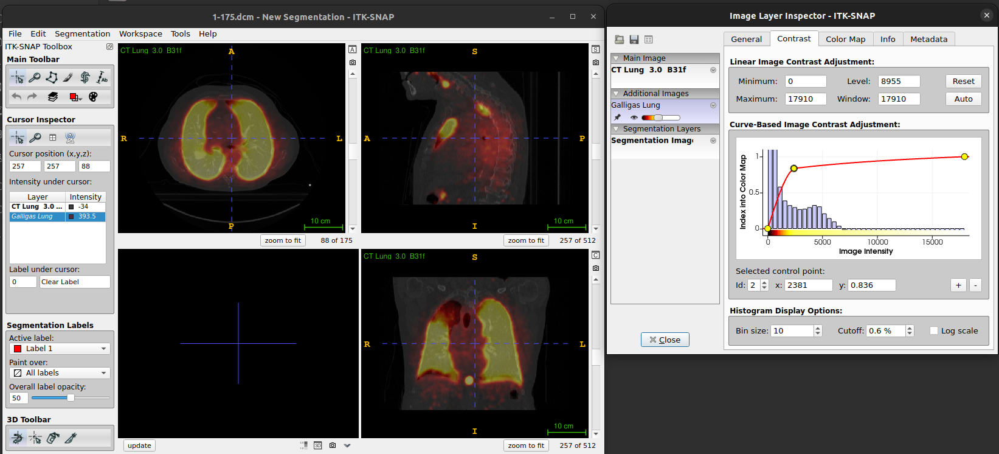

#### Colour map tab
The colour map tab can be used to select and manipulate the colour map.

* Choose a predefined colour map from the list. You might also create a customised map.
* Adjust the intensity and transparency settings as needed to enhance the visualisation of the images.

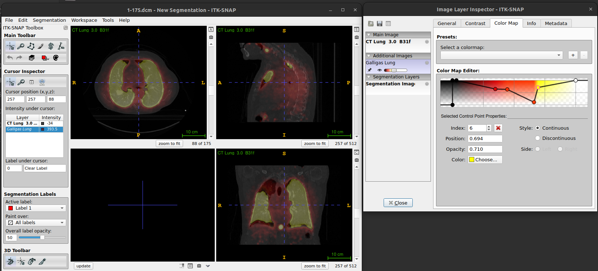

#### Info tab
The info tab displays the Image Header information for the images and also gives the cursor coordinates in both voxel and world units.

* A dialogue box will appear displaying metadata and other relevant information about the loaded DICOM images (e.g. values for image header and cursor coordinates).
* If you look at the info tab for both the CT image and PET image, you will see that the image header information is different, and the cursor coordinates in voxel units for the PET image are not whole numbers. The resolution of the images is different, with the PET image having a coarser grid than the CT. Therefore, ITK-SNAP first displays the CT image, and the overlaid PET image slices are interpolated at the corresponding location.

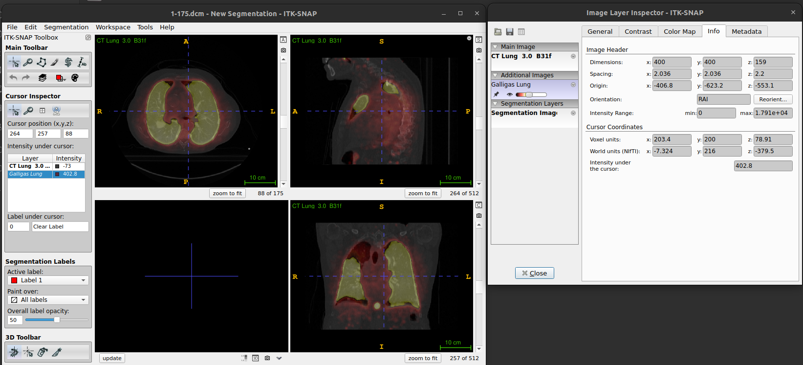

#### Metadata tab
The metadata tab contains some of the information from the DICOM header of the images.

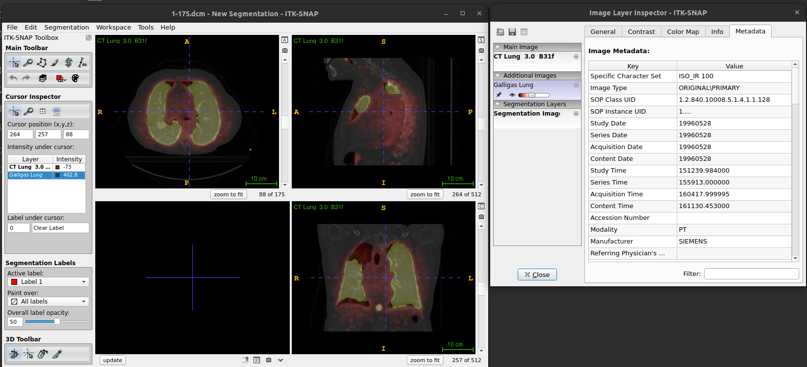

## 3. Converting DICOM images to NIfTI
As mentioned earlier, working in the NIfTI image format is easier when processing and analysing medical image data.
We will now work on converting DICOM images to a NIfTI image volume. 

### 3.1. Using [SimpleITK](https://simpleitk.org/)
Many Python packages allow you to convert images from DICOM to NIfTI format. Here, we chose to use the SimpleITK library. You can find the code for converting the images in the Jupyter notebook.

### 3.2. Using other packages
You might also be interested in looking at other packages: 

* https://pypi.org/project/dicom2nifti/
* https://pypi.org/project/scikit-rt/
* https://pypi.org/project/dcm2niix/


## 4. Viewing and understanding the NIfTI header with NiBabel
We will use the Python package [NiBabel](https://nipy.org/nibabel/) to open NIfTI images and learn some basic properties of the images.
We recommend checking [documentation](https://nipy.org/nibabel/#documentation) for further details on using the NiBabel library.

### 4.1. Loading images
A NIfTI image can be read using NiBabel’s `load` function. This creates a Nifti1Image object. We load the `ct_for_pet.nii.gz` file.
<!--
```python
import numpy as np
import nibabel as nib
import matplotlib.pyplot as plt
nii3ct = nib.load("data/ct_for_pet.nii.gz")
```
-->

The Nifti1Image object allows us to see the size/shape of the image, its data type, and the affine transform that maps from voxel space to world space. Its affine matrix is given below.
```python
[[  -0.9765625    -0.            0.          249.51171875]
 [  -0.           -0.9765625     0.          466.01171875]
 [   0.            0.            2.         -553.5       ]
 [   0.            0.            0.            1.        ]]
```

It also provides access to the complete header information stored in the NIfTI file.

There are two common ways of specifying the affine transformation mapping from voxel coordinates to world coordinates in the NIfTI header, called the `sform` and the `qform`. 
The `sform` directly stores the affine transformation in the header, whereas the `qform` stores the affine transformation using [quaternions](https://en.wikipedia.org/wiki/Quaternion). 

We recommend using the `sform` over the `qform` for various reasons:

* It is easier to conceptualise.
* It can contain shears that cannot be represented using the `qform`, which can be helpful when representing affine transformations.
* Common libraries (including NiBabel) tend to give precedence to the `sform` and use the `qform` only if the `sform` is not provided.

### 4.2. Header features 
We can look at the header of the Nifti1Image object.
```python
<class 'nibabel.nifti1.Nifti1Header'> object, endian='<'
sizeof_hdr      : 348
data_type       : np.bytes_(b'')
db_name         : np.bytes_(b'')
extents         : 0
session_error   : 0
regular         : np.bytes_(b'r')
dim_info        : 0
dim             : [  3 512 512 175   1   1   1   1]
intent_p1       : 0.0
intent_p2       : 0.0
intent_p3       : 0.0
intent_code     : none
datatype        : int16
bitpix          : 16
slice_start     : 0
pixdim          : [1.        0.9765625 0.9765625 2.        0.        0.        0.
 0.       ]
vox_offset      : 0.0
scl_slope       : nan
scl_inter       : nan
slice_end       : 0
slice_code      : unknown
xyzt_units      : 10
cal_max         : 0.0
cal_min         : 0.0
slice_duration  : 0.0
toffset         : 0.0
glmax           : 0
glmin           : 0
descrip         : np.bytes_(b'')
aux_file        : np.bytes_(b'')
qform_code      : scanner
sform_code      : scanner
quatern_b       : 0.0
quatern_c       : 0.0
quatern_d       : 1.0
qoffset_x       : 249.51172
qoffset_y       : 466.01172
qoffset_z       : -553.5
srow_x          : [ -0.9765625   0.          0.        249.51172  ]
srow_y          : [  0.         -0.9765625   0.        466.01172  ]
srow_z          : [   0.     0.     2.  -553.5]
intent_name     : np.bytes_(b'')
magic           : np.bytes_(b'n+1')
```

We can get information on this image's `sform` and `qform` from the `sform_code` and `qform_code` fields. These can be set to five different values:

| Code | Label | Meaning |
| --- | --- | --- |
| 0  | unknown | not defined | 
| 1  | scanner | RAS+ is defined according to the scanner coordinate system | 
| 2  | aligned | RAS+ aligned to some other scan | 
| 3  | talairach | RAS+ in Talairach atlas space | 
| 4  | mni | RAS+ in MNI atlas space | 

We can see in the above header that both `sform` and `qform` are set to scanner. We can check this using the functions `get_sform()` and `get_qform()` which should output the same matrix.
However, the NIfTI format does not require that the `sform` and `qform` specify the same matrix, and depending on the software, it may cause issues if both are provided with the same code but have different matrices. While Nibabel gives `sform` precedence, we are still going to explicitly ignore the `qform` by setting its code to unknown using the `set_qform()` function.

If we look closer at the `sform`, you can see that it is stored in the `srow_x`, `srow_y`, and `srow_z` fields of the header. 
These specify the top three rows of a 4x4 matrix representing an affine transformation using homogeneous coordinates. 
The fourth row is not stored as it is always `[0 0 0 1]`. This is true because it makes a lot of mathematical operations involved in mapping coordinates to the right location much easier and quicker
You will notice that the `sform` matrix matches the affine transform in the `Nifti1Image` object (`nii3ct.affine`).

### 4.3. Coordinate systems
#### RAS  
In the above `sform` matrix, you will notice that the diagonal elements of the affine matrix match the voxel dimensions (as the affine matrix does not contain any rotations), but the values for the x and y dimensions are negative. This is because the voxel indices increase as you move to the left and posterior of the image/patient, but the NIfTI format assumes a RAS world coordinate system (i.e. the values increase as you move to the **Right**,  **Anterior**, and **Superior** of the patient). Therefore, the world coordinates decrease as the voxel indices increase.

#### LPS   
On the other hand, the original DICOM images assume the world coordinate system is LPS (i.e. values increase when moving to the **Left**, **Posterior**, and **Superior**). We can calculate the affine transform from the DICOM headers, instructions are given [here](https://nipy.org/nibabel/dicom/dicom_orientation.html)). 

We obtain the following affine matrix:
```python
[[   0.9765625     0.            0.         -249.51171875]
 [   0.            0.9765625     0.         -466.01171875]
 [   0.            0.            3.         -205.5       ]
 [   0.            0.            0.            1.        ]]
```
As you can see, the values in the first two rows corresponding to the `x` and `y` dimensions are the opposite of those in the NIfTI header.

Note: this is an optional exercise! Come back to it at the end if you have extra time.


<!--
We removed the section where we save an image using ITK-SNAP.
#### ITK-SNAP coordinate system
We saved a NIfTI image in ITK-SNAP earlier. Let's check its affine matrix.
```python
nii_itksnap = nib.load("data/ct_for_pet_itksnap.nii.gz")
print(nii_itksnap.affine)
#[[  -0.9765625     0.           -0.          249.51171875]
# [   0.           -0.9765625    -0.          466.01171875]
# [   0.            0.           -2.         -205.5       ]
# [   0.            0.            0.            1.        ]]
```
This time, all three rows have negative values on the diagonal (the third row was positive before). This means the coordinate system is now RAI: rows run towards Inferior.
-->

## 5. Modifying NIfTI images and headers with NiBabel

### 5.1. Modifying the data type
The image data for a Nifti1Image object can be accessed using the `get_fdata` function.
This will load the data from the disk and cast it to float64 type before returning it as a `numpy` array.
Casting it to float64 prevents any integer-related errors and problems in downstream processing when using the data read by NiBabel. 
However, this does not change the type of the image stored on disk, which we have previously seen is int16 for this image, and this could still lead to downstream errors or unexpected behaviour for any processing that works directly on the images stored on disk. 
Therefore, we are going to save a new image on disk where the image is saved as a floating point image (we are going to use 32-bit rather than 64-bit floating point, as this is usually sufficiently accurate). We use the `set_data_dtype` function to set the data type to float32. This also updates the corresponding fields in the header.

The new file `ct_for_pet_float32.nii.gz` is larger than `ct_for_pet.nii.gz` (61 MB and 47 MB, respectively) because of the conversion from 16-bit integers to 32-bit floats. 
Both images are compressed, but the compression is more efficient for the floating point image: while a 32-bit floating point variable is twice the size of a 16-bit integer, the floating image is less than double that of the original integer image.

#### Check data types with NiBabel
If you load `ct_for_pet_float32.nii.gz`, you will see that the data type is `float32`, and if you reload `ct_for_pet.nii.gz`, you will see that the data type is still `int16`.

#### ITK-SNAP visualisation of 16-bit integers vs 32-bit floats
Load the `ct_for_pet.nii.gz` image. If you open the `Image Layer Inspector` and go on `Metadata`, you will see that the `bitpix` field is 16. If you now open `ct_for_pet_float32.nii.gz`, `bitpix` is 32.

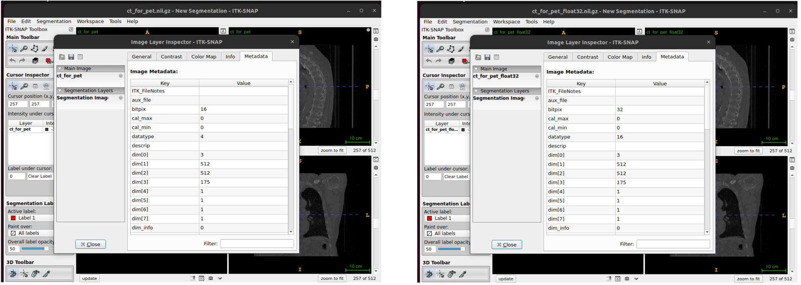

### 5.2. Cropping data
We are going to crop the image to remove slices that do not contain the patient (background pixels). These background pixels can take up a large amount of memory and are not usually useful for further data processing tasks. However, there are a few considerations to pay careful attention to when cropping in order to preserve the mapping of the data to world coordinates. 

We are going to crop the image from slice 103 to slice 381 in the x dimension (sagittal slices) and from slice 160 to 340 in the y dimension (coronal slices). Use ITK-SNAP to confirm that cropping the image to these slices will only remove slices that do not contain the patient.

Changing the image data in a Nifti1Image object is impossible, e.g., using a smaller array corresponding to a cropped image. 
Therefore, if you want to modify the image data, you need to create a new array with the modified data and then create a new Nifti1Image object using this new array, which is used to save the modified image to disk.
It is important to create a copy of the data, otherwise, the new image will reference the data in the original image, and if you make any changes to the values in the new image, they will also be changed in the original image.

When creating a new Nifti1Image object, you can provide an affine transform and/or a Nifti1Header object (e.g. nii_1.header). 
When you only provide an affine, a default header is created with the `sform` set according to the provided affine transform and the `qform` set to unknown. 
When you provide a header, the values will be copied into the header for the new image, except that the `dim` values will be updated based on the image data provided. 
If you provide an affine and a header, and the affine differs from the `sform` or `qform` in the header, they will be set to the provided affine and unknown, respectively. 
If the affine is not provided, it is not set from the header but left empty.
So, if any of your downstream processing will make use of the affine, make sure you manually set it from the header either when creating the Nifti1Image object or by calling the set_sform or set_qform functions for the object (which updates the affine as well as setting the `sform`/`qform`). 
Here, we will provide a Nifti1Header object as we want the header for the new image to be based on the uncropped image and will use the form from the header as the affine for the new Nifti1Image.

The cropped image is saved using NiBabel’s save function.

Make sure the original image `ct_for_pet_float32.nii.gz` is loaded in ITK-SNAP. Now load the cropped image as an additional image (separate image). 
You will see that the image has been cropped in the x and y dimensions as expected, but it is shifted relative to the uncropped image.

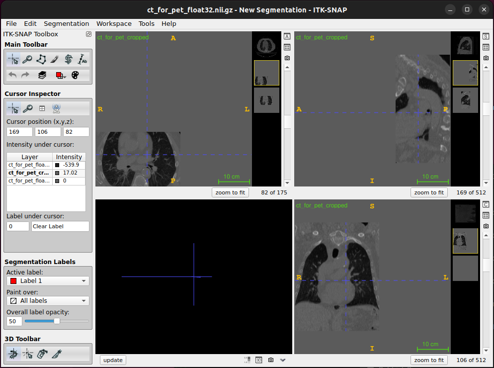

This is because we did not update the origin in the NIfTI header to account for the slices we removed. 
The origin gives the world coordinates of the voxel (0, 0, 0). 
So, if we want the images to remain aligned, we need to set the origin for the cropped image to be the same as the world coordinates of the voxel (103, 160, 0) in the uncropped image. 
This can be calculated using the affine from the uncropped image and used to create a new affine matrix with this as the origin (the origin is the top 3 values in the 4th column of the matrix). 
The new affine matrix can then be used to set the `sform` (which also sets the affine) for the cropped image, which can then be saved.

Note, NiBabel provides handy functionality for slicing NIfTI images and updating the affine transforms and header accordingly using the slicer attribute. The `nibabel.slicer` essentially does what we did above for us.

But you wouldn’t have learnt so much if we’d simply done that to start with :)

If you load the cropped and aligned image into ITK-SNAP using the overlay semi-transparent feature, you will see that it is now aligned with the original image but has fewer slices in the x and y dimensions. 

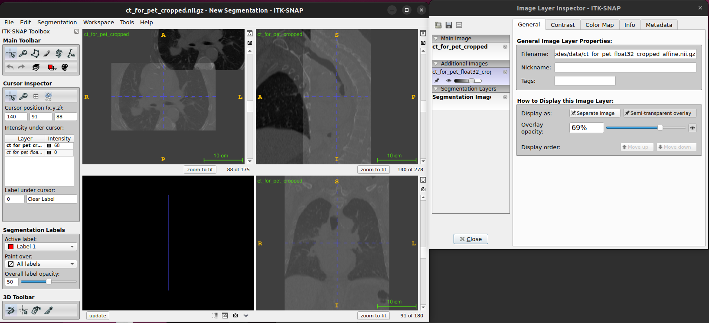


### 5.3. Aligning images
If you load `ct_for_pet.nii.gz` and `inhale_bh_ct.nii.gz` in ITK-SNAP as separate images, you can see that the anatomy in both images does not overlap and the field of view is different. 


If we perform a registration between these images as they are, it will likely have difficulties as the images are so far out of alignment to start with. One way to roughly align the images before performing a registration is to align the centres of the images by modifying the origin for the 2nd subject such that the image centres for both images have the same world coordinates. This can be done by following these steps:

* Calculate the centre of the image from subject 2 (`ct_for_pet.nii.gz`) in voxel coordinates.
* Calculate the centre of the image from subject 2 in world coordinates.
* Calculate the centre of the image from subject 1 (`inhale_bh_ct.nii.gz`) in voxel coordinates.
* Calculate the centre of the image from subject 1 in world coordinates.
* Calculate the translation (in world coordinates) required to align the images (centre subject 1 = centre subject 2 + translation).
* Add this translation to the origin for subject 2.
* Save the image for subject 2 using the header with the updated origin.

Try writing code to implement these steps yourself, based on what you have learned from this practical.

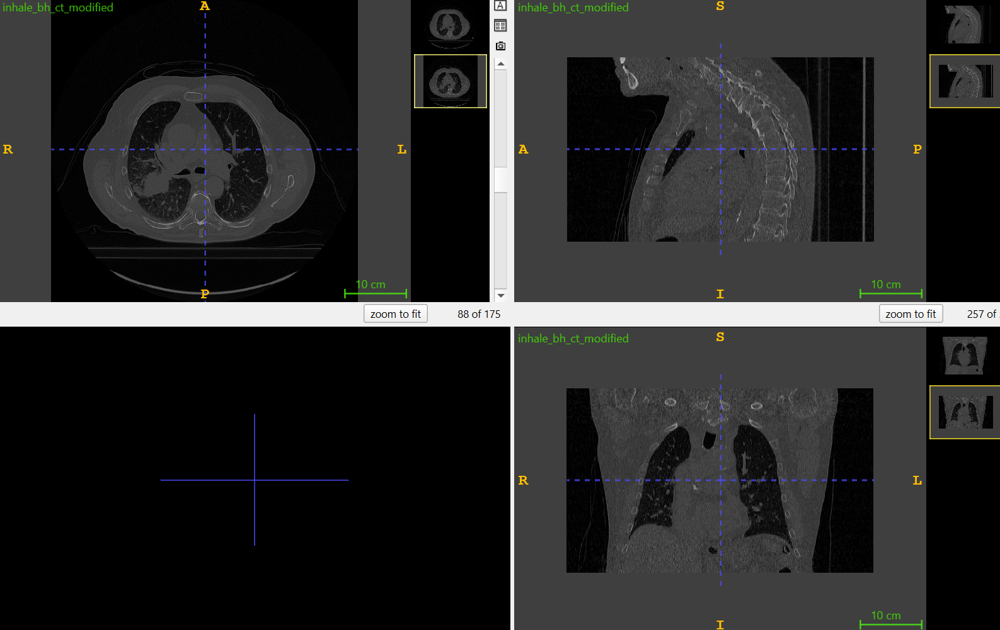

## 6. References 
* NiBabel: "The NiBabel documentation also contains some useful information and tutorials for working with NIfTI images and understanding world coordinate systems and radiological vs neurological view."
	* https://nipy.org/nibabel/nifti_images.html  
	* https://nipy.org/nibabel/coordinate_systems.html  
	* https://nipy.org/nibabel/neuro_radio_conventions.html  
* ITK-SNAP:
	* [Tutorial: Getting Started with ITK-SNAP](http://www.itksnap.org/docs/viewtutorial.php)
	* [ITK-SNAP 3.x Training Class Final Program](http://itksnap.org/files/handout_201409.pdf)


