:::::::::::::::::::::::::::::::::::::: questions 

* What file formats are commonly used to store medical image data?
* How can we view and compare medical images?
* How can we display and modify image header information?
* How can we modify the imaging data and the header data consistently?

::::::::::::::::::::::::::::::::::::::::::::::::

::::::::::::::::::::::::::::::::::::: objectives

* Understand some of the key differences between the DICOM and NIfTI file formats.
* Learn to use ITK-SNAP software to view and compare medical imaging data.
* Explore how the NiBabel library can be used to display and modify NIfTI header and image data.

::::::::::::::::::::::::::::::::::::::::::::::::

:::::::::::::::::::::::::::::::::::::: prereq

You should have followed the instructions from [the Setup page](../learners/setup.md) to access the data and Jupyter notebook for these exercises, setup Python and install ITK-SNAP.

::::::::::::::::::::::::::::::::::::::

The first part of this practical makes use of the ITK-SNAP software. The second part is based in Python, and uses this Jupyter notebook: [`practical1_notebook.ipynb`](files/practical1_notebook.ipynb).


### Data 

In these exercises, we will be working with real-world medical imaging data from The Cancer Imaging Archive [(TCIA)](https://www.cancerimagingarchive.net/collection/ct-vs-pet-ventilation-imaging/).
TCIA is a resource of public datasets that hosts a large archive of medical images of cancer accessible for public download.
We are going to use data from the CT Ventilation as a Functional Imaging Modality for Lung Cancer Radiotherapy dataset (also known as CT-vs-PET-Ventilation-Imaging dataset).
It contains 20 lung cancer patients who underwent exhale/inhale breath-hold CT (BHCT), free-breathing four-dimensional CT (4DCT) and Galligas PET ventilation scans in a single session on a combined 4DPET/CT scanner. We won't make use of the 4DCT in these exercises.

We used the scans from the patient CT-PET-VI-02. In the unzipped `data` folder, you can find them in the `practical1` folder. You should see four folders: 

* `inhale_BH_CT` and `exhale_BH_CT`: CT scans acquired during an inhalation breath hold and exhalation breath hold, respectively.
* `PET`: PET scan measuring local lung function.
* `CT_for_PET`: CT scan acquired at the same time as the PET scan for attenuation correction of the PET scan and to provide anatomical reference for the PET data.  


:::::::::::::::::::::::::::::::::::::: spoiler

#### Ethical approval for using open datasets
When using open datasets that contain images of humans, such as those from TCIA, for your own research, you will still need to get ethical approval as you do for any non-open datasets you use. You should contact your local Research Ethics Committee at your institution for details on how to obtain ethical approval for your research.

::::::::::::::::::::::::::::::::::::::

### Medical imaging formats

Although there are many different file formats used in medical imaging, we will focus on two of the most common formats:

* [DICOM](https://www.dicomstandard.org/) (Digital Imaging and Communications in Medicine)
* [NIfTI](https://nifti.nimh.nih.gov/) (Neuroimaging Informatics Technology Initiative)

Most data from a hospital will be in DICOM format, whereas NIfTI is a very popular format in the medical image analysis community. The files from the TCIA are in DICOM format.

:::::::::::::::::::::::::::::::::::::: callout

#### DICOM format
DICOM is a widely used technical standard for digitally storing and transmitting medical images and related information.
DICOM images typically have a separate file for every slice.
If you look in the `CT_for_PET` folder, you will see that there are 175 individual files corresponding to 175 slices in the volume. More modern DICOM images can come with all slices in a single file.

In addition to the image data for each slice, each file contains a header which can include extensive information relating to the scan and subject. 
In a clinical setting, this will include identifiable information such as the patient's name, address, and other relevant details.
Such information should be removed before the data is transferred from the clinical network for use in research. 
If you discover patient-identifiable information in the header of the data you are using, you should immediately alert your supervisor, manager or collaborator.

Most of the information in the DICOM header is not directly useful for typical image processing and analysis tasks. 
Furthermore, there are complicated ‘links’ (provided by unique identifiers, UIDs) between the DICOM headers of different files belonging to the same scan or subject. With DICOM routinely storing each slice as a separate file, it makes processing an entire imaging volume stored in DICOM format rather cumbersome, and the extra housekeeping required could lead to a greater chance of an error being made.
Therefore, a common first step of any image processing pipeline is to convert the DICOM image to a more suitable format, such as NIfTI. 
Generally, most conversions go from DICOM to NIfTI. There are scenarios when you might want to convert from NIfTI back to DICOM, for example, if you need to import them into a clinical system that only works with DICOM.


:::::::::::::::::::::::::::::::::::::::::: spoiler

#### Warning on converting images back to DICOM 
Converting images back to DICOM such that they are correctly interpreted by a clinical system can be very tricky and requires a good understanding of the DICOM standard. 
More information on the DICOM standard can be found here: https://www.dicomstandard.org.

::::::::::::::::::::::::::::::::::::::::::

#### NIfTI format
The NIfTI image format usually stores all of the imaging data and header information within a single file.
While the neuroimaging community originally developed the NIfTI file format, it is not specific to neuroimaging. It is now widely used for many medical imaging applications outside the brain.
The NIfTI header contains much less information than DICOM, but it includes all the key information required to interpret, manipulate, and process the image.
During these exercises, you will learn about some of the key information stored in the NIfTI header.
For more information, please see Anderson Winkler's blog on the [NIfTI file format]( https://brainder.org/2012/09/23/the-nifti-file-format/).

::::::::::::::::::::::::::::::::::::::


## 1. Viewing images with ITK-SNAP

### 1.1. Getting started with ITK-SNAP

:::::::::::::::::::::::::::::::::::::: callout

#### ITK-SNAP

ITK-SNAP is a free, open-source, multi-platform software application used to segment structures in 3D and 4D biomedical images. Although ITK-SNAP has been developed to segment structures, it can also be used to view 3D and 4D medical image data in a wide variety of formats. In this practical we will just be using ITK-SNAP to view 3D images and will not be exploring any of it's segmentation functionality. For more information on ITK-SNAP, including documentation and tutorial videos, see the [ITK-SNAP website](http://www.itksnap.org/pmwiki/pmwiki.php?n=Main.HomePage).

::::::::::::::::::::::::::::::::::::::

* Open the ITK-SNAP application.
    * When it opens it may display a 'Layout Preference Reminder' popout window:
    
    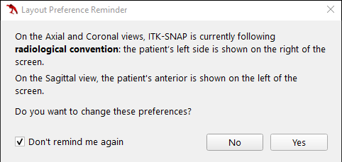
    
    * If this popout appears and you have not changed the settings in ITK-SNAP it should say the same as above, i.e. that radiological convention is used. In this case you can check 'Don't remind me again' and click 'No'.

* When ITK-SNAP opens you can select between the 'Getting Started' pane, the 'Recent Images' pane, or the 'Recent Workspaces' pane using the tabs near the top of the window. You should select the 'Recent Images' pane if it is not already showing.
    * If you have used ITK-SNAP before it will display recent images which you can select to open. Note, for DICOM images the name displayed is the name of the file containing the first DICOM slice. This can be confusing when the folder names rather than the file names specify which scan is which, as is the case in this practical.
    
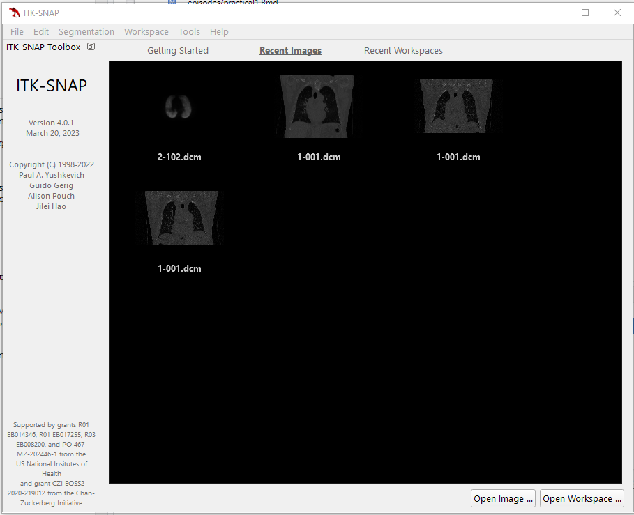

### 1.2. Opening and viewing DICOM images

* Load the inhale scan.
    * If the image you want to open is not listed under recent images (or you are not sure which one it is), you can open it by clicking the 'Open Image...' button at the bottom right of the window or by clicking on 'File -> Open Main Image...' in the top ribbon. When you do this, a small window opens where you can enter the path of the file you want to open or click 'Browse...' to search your file explorer.
    * Select the first slice from the `inhale_BH_CT` folder, which is called `1-001.dcm`. Make sure the 'File Format:' is set to 'DICOM Image Series' and click 'Next >'.
        * :warning: **Warning!** some versions of ITK-SNAP incorrectly set the 'File Format:' for the images used in this practical to '4D CTA DICOM Series'
        * If this happens use the drop-down menu to set the 'File Format:' to 'DICOM Image Series' instead before clicking 'Next >'
    
    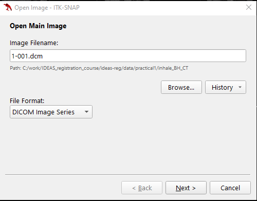
    
    * You will then be asked to select the DICOM series to open, but as this folder only includes one series, you can click 'Next >'.
    
    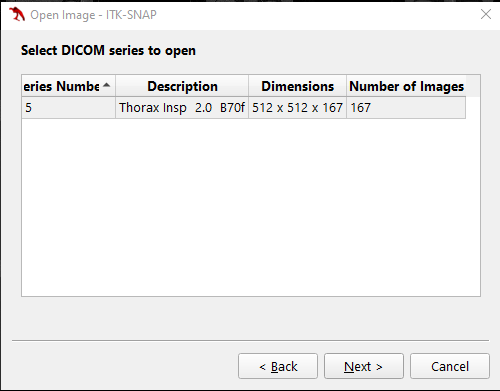
    
    * Once the image has loaded a small window will display some summary information about the image. This can be reviewed and then the window can be closed by clicking 'Finish'.
    
    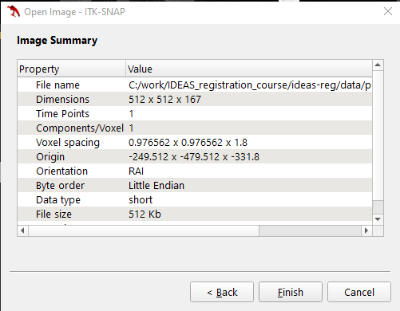
    
* The inhale scan will now be displayed in ITK-SNAP, as shown below. On the left you will see the 'Main Toolbar', 'Cursor Inspector', 'Segmentation Labels', and '3D Toolbar'. In the rest of the window you will see four panes, three of which show orthogonal slices through the 3D volume:
    * Top-left shows an axial slice.
    * Top-right shows a sagittal slice.
    * Bottom-right shows a coronal slice.
    * Bottom-left is currently empty (but would show a 3D reconstruction of the structures that have been segmented in the image when using ITK-SNAP for segmentation)
        
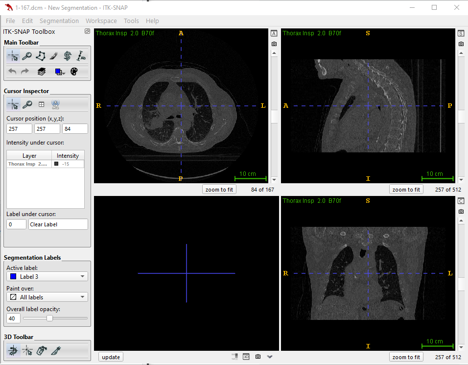

### 1.3. Navigating around 3D images
* To navigate around the image, you can left-click in any of the three orthogonal slices to reposition the cursor to where you clicked. This will also change the slices displayed in the other two panes so that they show the slices that pass through the cursor (as indicated by the two dotted blue lines).
    * If you left-click and drag the cursor the other panes will scroll through the slices as you move the mouse.
    * If you use the mouse wheel (or two fingers on the touchpad) you will scroll through the slices in the pane where the mouse pointer currently is. You can also use the slider next to the displayed slice.
    * As you move the cursor around or scroll through the slices you should notice that the information displayed in the 'Cursor Inspector' is updated accordingly. Note, the cursor position displayed here is in voxel coordinates.
    
    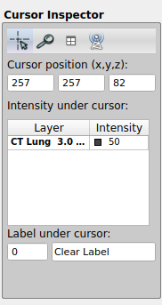
    
* To zoom in , you can use the right click and drag the cursor upwards (to zoom out, drag the cursor downwards).
* You can pan, or move the entire image, by clicking and dragging the mouse centre button (or alt + left click on Windows, option key + left click on Mac OS).

### 1.4. Loading and displaying multiple images
If you open a new main image in ITK-SNAP it will replace the current image, making it difficult to directly compare the images. However, it is possible to load multiple images into ITK-SNAP so that they can be easily compared. The additional images can either be loaded as separate images, enabling you to quickly switch the displayed image from one to another, or as semi-transparent overlay images, enabling you to see one image overlaid on the other.

* Load an additional image as a separate image
    * Click 'File -> Add Another Image...'
    * This will open a similar window to the one for opening the main image, where you can enter the name of the file you want to open or use the 'Browse...' button to locate it.
    * This time select the first slice from the `exhale_BH_CT` folder, which is also called `1-001.dcm`. As before, make sure the 'File Format:' is set to 'DICOM Image Series' and click 'Next >'.
    
    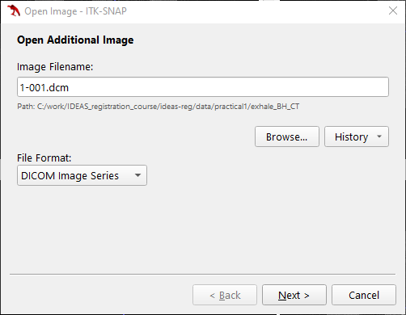
    
    * As before you will be asked to select the DICOM series to open, but there is only one series in this folder, so just click 'Next >'.
    * A window will then be displayed asking 'How should the image be displayed?'
        * Select 'As a separate image (shown beside other images)' and then click 'Next >'.
    
    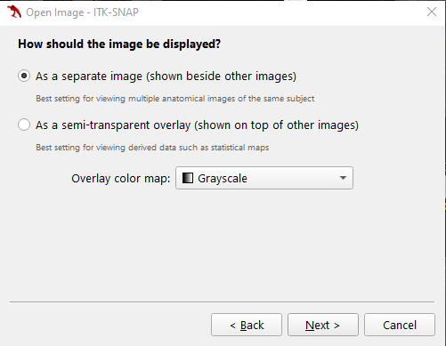

    * Once the second image is loaded, you will see two thumbnails in the top corner of each slice display.
        * Click on these to swap the displayed slices from one image to the other, allowing you to easily see the similarities and differences between the images.
    * You can also swap quickly by using the square bracket shortcut keys '[' and ']'.
    * You will also see that both images now appear in the 'Cursor Inspector', where you can see the intensity value at the cursor for both images. 
        * You can also change the displayed image by clicking on it in the 'Cursor Inspector'.
    * If you compare the inhale and exhale image you will see they are very similar, although the patient's chest is further out in the inhale scan, and the rest of the anatomy has shifted accordingly.
    
    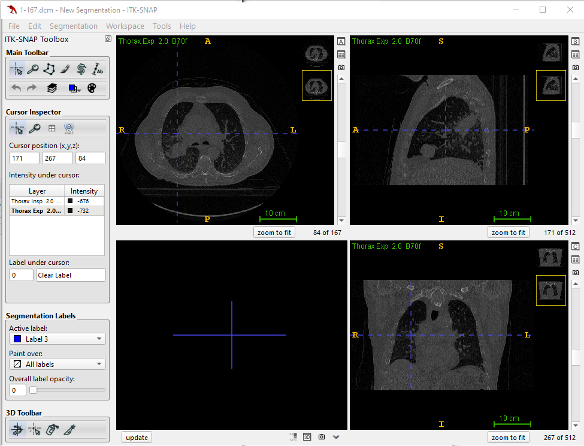
    
* Load an additional image as a colour overlay
    * To demonstrate the use of colour overlays we are going to load the PET scan as a colour overlay on top of the corresponding CT scan. You should first load the CT scan as the main image (which will close any other images that are currently open, e.g. the inhale and exhale scans).
        * Click 'File -> Open Main Image...'.
        * Select the first slice from the `CT_for_PET` folder (also called `1-001.dcm`) and again make sure the 'File Format:' is set to 'DICOM Image Series' before clicking 'Next >'.
        
        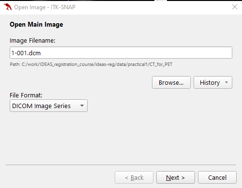
        
        * As before you will be asked to select the DICOM series to open, but there is only one series in this folder, so just click 'Next >'.
        * And then the summary information about the image will be displayed, which can be reviewed before closing the window by clicking 'Finish'.
    * Now click 'File -> Add Another Image...'
    * Select the first slice from the `PET` folder (also called `1-001.dcm`) and check the 'File Format:' is set to 'DICOM Image Series' before clicking 'Next >'.
    
    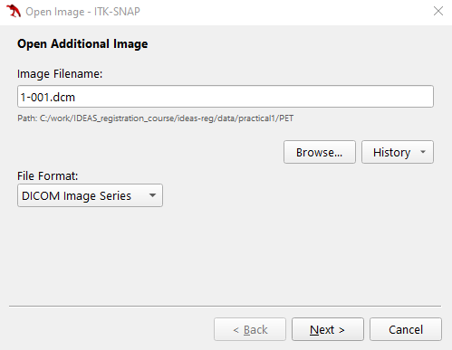
        
    * Once again there is only one DICOM series in the folder so just click 'Next >'.
    * The window will now be displayed asking 'How should the image be displayed?'
        * This time select 'As a semi-transparent overlay (shown op top of other images)'.
        * Use the dropdown menu to set the 'Overlay color map:' to 'Hot'.
        * Click 'Next >'.
        
        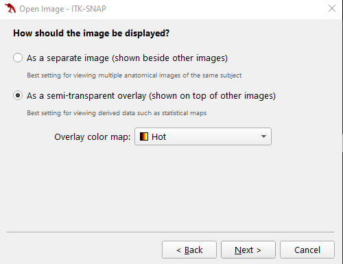
        
    * The 'Image Summary' will now be displayed. This time it will include a warning about loss of precision, but this can be ignored. Click 'Finish' to close the window.
    
    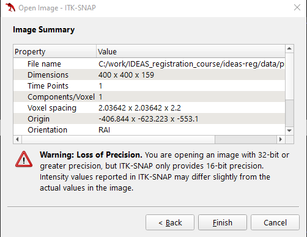
    
    * The PET scan will now be displayed in ITK-SNAP using the hot colourmap (so the lungs mostly appear in red). Depending on the version of ITK-SNAP used, the opacity of the PET scan may initially be set to 0% (so all you will see is the CT scan), 100% (so all you will see is the PET scan), or some other value (so you will see both the CT scan and the PET scan overlaid on it).
    * The opacity of the PET scan can be adjusted by right-clicking on the PET scan in the 'Cursor Inspector' (where it is called *Galligas Lung*) and dragging the 'Opacity:' slider.
    
    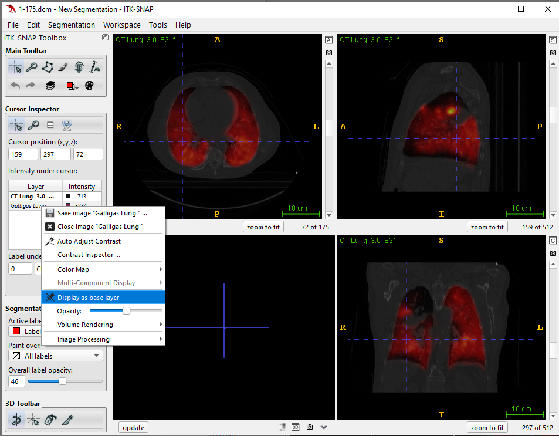

### 1.5. Image Layer Inspector tool
The 'Image Layer Inspector' tool displays further information about the images and allows you to modify and control how they are displayed. We will now briefly look at some of the functionality provided by the 'Image Layer Inspector'.

* Click 'Tools -> Layer Inspector...' in the top ribbon. This will open the 'Image Layer Inspector' in a separate window.

You will see the open images listed on the left, and five tabs across the top: 'General', 'Contrast', 'Color Map', 'Info', and 'Metadata'. You can click on the images listed on the left to select a different image.

#### General tab
The 'General' tab displays the filename and the nickname for the selected image. For any 'Additional Images' the 'General' tab also enables you to select if the image is displayed as a 'Separate image' or a 'Semi-transparent overlay', and to change the 'Overlay opacity' if the image is being displayed as an overlay.

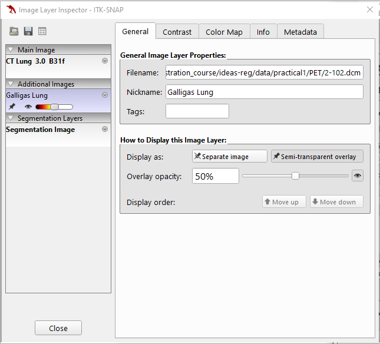

#### Contrast tab
The 'Contrast' tab enables you to adjust how the image intensities are displayed for the different images. You can use the text boxes in the 'Linear Image Contrast Adjustment:' panel to modify the range of intensity values displayed, e.g.:

* Select the CT image (called 'CT Lung 3.0 B31f' and listed as the 'Main Image') from the list on the left.
* Use the text box to set the 'Maximum:' value to '1000' (push enter after typing the number). The CT image should now appear brighter than it previously did.

The 'Reset' button can be used to return the intensity range to the original values. The 'Auto' button can be used to automatically set the intensity range based on the distribution of the intensity values in the image.
The 'Curve-Based Image Contrast Adjustment:' panel can also be used to provide more fine grained control of how the image intensities are mapped to displayed intensities. The details of how this works are beyond the scope of this practical, but feel free to have a play with it in your own time (and remember the 'Reset' button resets the curve as well).

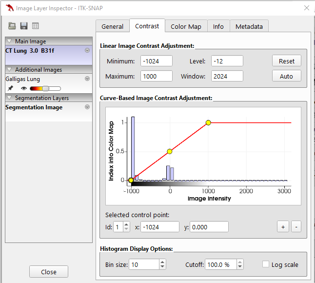

#### Color Map tab
The 'Color Map' tab can be used to select and manipulate the colour map used for each image. The colour map can be changed for any of the images, not just those displayed as semi-transparent overlays. You can select from predefined colour maps using the dropdown menu in the 'Presets:' panel. 
The 'Color Map Editor:' panel can be used to modify the colour maps, which can then be saved as new presets (using the '+' button in the 'Presets:' panel). The details of how this works are beyond the scope of this practical, but feel free to have a play with it in your own time. You can always restore the original colour map by reselecting it from the dropdown menu in the 'Presets:' panel.

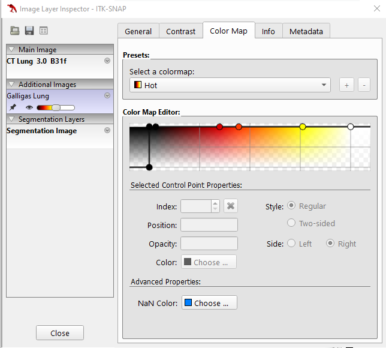

#### Info tab
The 'Info' tab displays some of the important information about the selected image under 'Image Header'. It also displays the 'Cursor Coordinates' in both voxel and world units (ITK-SNAP uses the same world coordinate system as NIfTI images - see section 4.3 below for more information on NIfTI and DICOM world coordinate systems) as well as the intensity at the cursor for the selected image.

* First select the CT image. Then select the PET image. Notice how the values change for both the 'Image Header' and 'Cursor Coordinates'.
    * The resolution ('Spacing') of the images is different, with the PET image having coarser voxels (larger spacing) than the CT.
    * The voxel coordinates are always integers for the main image (here the CT image) but may be non-integer for any additional images.
    * The world coordinates are the same for all images.
    
In ITK-SNAP the cursor can be located at the centre of any voxel in the main image. However, the voxel locations in the additional images may not be aligned with the voxels in the main image, e.g. if they have a different resolution, as for the CT and PET images here. In this case the cursor will not be located at the centre of a voxel in the additional images, hence the non-integer voxel coorindates.

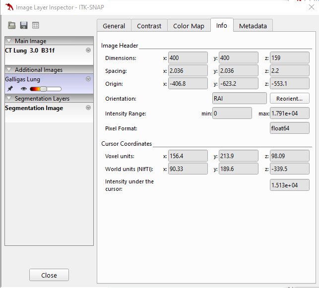

#### Metadata tab
The 'Metadata' tab contains information stored in the headers of the image files, so in this case (some of) the DICOM header information for these images. As can be seen, a lot of the information stored in the DICOM headers is not required or useful for processing the images.

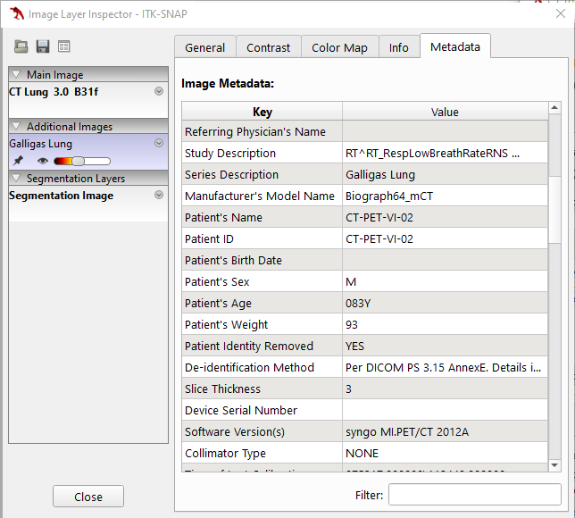

### 1.6 Converting DICOM images to NIfTI
As mentioned earlier, converting DICOM images to another format, such as NIfTI, is often one of the first steps when processing and analysing medical image data. ITK-SNAP can save images in NIfTI format (and a few others), so can be used to convert the DICOM images to NIfTI. To save the images in NIfTI format:

* Open the 'General' tab in the 'Image Layer Inspector'.
* Select the image you want to save from the list on the left, in this case select the CT image. Then click on the disk icon just above the list of images on the left. This will open the 'Save Image' window.
    * Click 'Browse...' and navigate up one folder to the `practical1` folder and enter the 'File name:' as `CT_for_PET.nii.gz`.
        * Note, using the `.nii.gz` extension saves the image as a compressed NIfTI file. Many softwares and libraries, including ITK-SNAP, NiBabel, and NiftyReg, can work directly with the compressed `.nii.gz` files, so these are often used to save storage space, and will be used in these exercises.
    * Check the 'File Format:' is set to 'NiFTI' and click 'Finish'.
    
    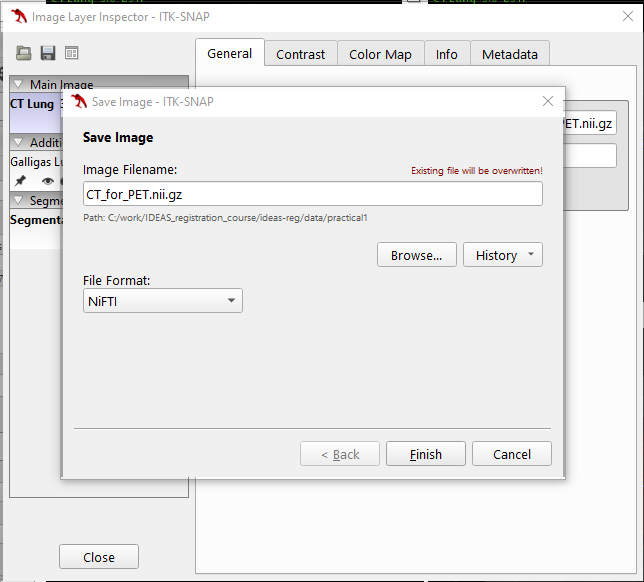

* If you look in the `practical1` folder you should now see a file called `CT_for_PET.nii.gz`.
* If you load this file as an additional image in ITK-SNAP you should see that the new NIfTI image looks exactly the same as the original DICOM image, and the 'Info' tab in the 'Image Layer Inspector' has exactly the same information for both images, as we would expect.
* However, the information in the 'Metadata' tab for the two images is different, with the information from the NIfTI file header being displayed for the NIfTI image and the DICOM header information being displayed for the DICOM image.

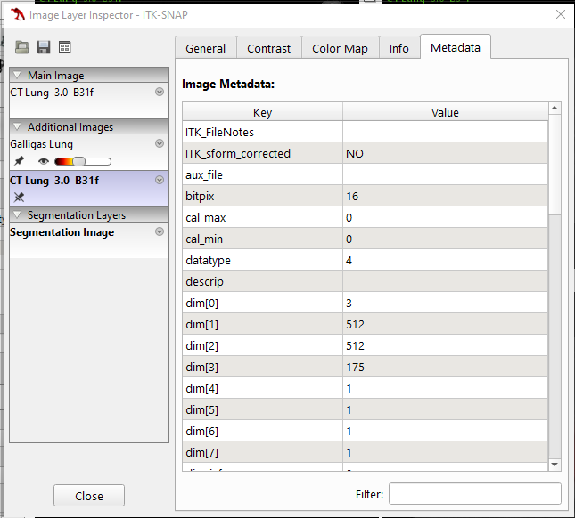

:::::::::::::::::::::::::::::::::::::: spoiler

### Converting large numbers of DICOM images to NIfTI
While ITK-SNAP provides a convenient way to convert DICOM images to NIfTI format, it is not very practical to use if you need to convert more than a few images. There are many free tools available that can be used to convert large numbers of images from DICOM to NIfTI, such as:

* [dicom2nifti](https://dicom2nifti.readthedocs.io/en/latest/)
* [dcm2niix](https://www.nitrc.org/plugins/mwiki/index.php/dcm2nii:MainPage)
* [Scikit-rt](https://scikit-rt.github.io/scikit-rt/index.html)

::::::::::::::::::::::::::::::::::::::

## 2. Viewing and understanding the NIfTI header with NiBabel

:::::::::::::::::::::::::::::::::::::: callout

#### NiBabel

We will use the Python package [NiBabel](https://nipy.org/nibabel/) for viewing and manipulating NIfTI images and their headers.
We will demonstrate some of the functionality of NiBabel, but recommend checking the [documentation](https://nipy.org/nibabel/#documentation) for further details on using the NiBabel library. This also contains some useful information and tutorials on [working with NIfTI images](https://nipy.org/nibabel/nifti_images.html), [understanding world coordinate systems](https://nipy.org/nibabel/coordinate_systems.html), and  [neurological vs radiological views](https://nipy.org/nibabel/neuro_radio_conventions.html).

::::::::::::::::::::::::::::::::::::::

### 2.1. Reading and displaying the NIfTI header
The NIfTI header can be read using NiBabel’s `load` function.

* Run the first two cells from `practical1_exercises.ipynb` to import the required libraries and `load` the NIfTI image saved in the previous section, `CT_for_PET.nii.gz`.

This creates a Nifti1Image object. This has a number of useful attributes and functions for accessing and manipulating the NIfTI header and image data. E.g.:

* Run the next cell to display size/shape of the image, the data types used to store the image data, and the affine transform that maps from voxel space to world space.
```output
(512, 512, 175)
int16
[[  -0.9765625     0.            0.          249.51171875]
 [   0.           -0.9765625     0.          466.01171875]
 [   0.            0.            2.         -553.5       ]
 [   0.            0.            0.            1.        ]]
 ```

:::::::::::::::::::::::::::::::::::::: callout

#### Note

The `load` function does not read the image data itself from disk, it just reads and interprets the header, but the Nifti1Image object it returns provides functions for accessing the image data, e.g. `get_fdata` (as we'll see in the next section).

::::::::::::::::::::::::::::::::::::::


* You can also display the full header information, as seen by running the next cell.
```output
<class 'nibabel.nifti1.Nifti1Header'> object, endian='<'
sizeof_hdr      : 348
data_type       : np.bytes_(b'')
db_name         : np.bytes_(b'')
extents         : 0
session_error   : 0
regular         : np.bytes_(b'r')
dim_info        : 0
dim             : [  3 512 512 175   1   1   1   1]
intent_p1       : 0.0
intent_p2       : 0.0
intent_p3       : 0.0
intent_code     : none
datatype        : int16
bitpix          : 16
slice_start     : 0
pixdim          : [1.        0.9765625 0.9765625 2.        0.        0.        0.
 0.       ]
vox_offset      : 0.0
scl_slope       : nan
scl_inter       : nan
slice_end       : 0
slice_code      : unknown
xyzt_units      : 10
cal_max         : 0.0
cal_min         : 0.0
slice_duration  : 0.0
toffset         : 0.0
glmax           : 0
glmin           : 0
descrip         : np.bytes_(b'')
aux_file        : np.bytes_(b'')
qform_code      : scanner
sform_code      : scanner
quatern_b       : 0.0
quatern_c       : 0.0
quatern_d       : 1.0
qoffset_x       : 249.51172
qoffset_y       : 466.01172
qoffset_z       : -553.5
srow_x          : [ -0.9765625   0.          0.        249.51172  ]
srow_y          : [  0.         -0.9765625   0.        466.01172  ]
srow_z          : [   0.     0.     2.  -553.5]
intent_name     : np.bytes_(b'')
magic           : np.bytes_(b'n+1')
```

### 2.2 Specifying the affine transform

There are two common ways of specifying the affine transformation mapping from voxel coordinates to world coordinates in the NIfTI header, called the *sform* and the *qform*. 
The sform directly stores the affine matrix in the header, whereas the qform stores the affine transformation using [quaternions](https://en.wikipedia.org/wiki/Quaternion).

You can see that the sform is stored in the `srow_x`, `srow_y`, and `srow_z` fields in the header. These specify the top three rows of a 4x4 matrix representing the affine transformation using [homogeneous coordinates](https://en.wikipedia.org/wiki/Homogeneous_coordinates). The fourth row is not stored as it is always `[0 0 0 1]`. You can see that the sform matrix matches the affine transformation from the Nifti1Image object.

The qform is stored in the `quartern_b`, `quartern_c`, and `quartern_d` fields, which represent 3D rotations, and in the `qoffset_x`, `qoffset_y`, and `qoffset_z` fields, which give the offset between the first voxel in the image, i.e. voxel coordinates (0,0,0), and the origin in world coordinate space, i.e. world coordinates (0,0,0).

The `sform_code` and `qform_code` fields indicate whether the sform and/or qform have been used to specify the affine transformation in the NIfTI header. There are five different sform/qform codes defined:

Table: Sform/qform codes.

| Code | Label     | Meaning                         |
| ---- | --------- | ------------------------------- |
| 0    | unknown   | not defined                     |
| 1    | scanner   | RAS+ in scanner coordinates     |
| 2    | aligned   | RAS+ aligned to some other scan |
| 3    | talairach | RAS+ in Talairach atlas space   |
| 4    | mni       | RAS+ in MNI atlas space         |

The different codes are meant to indicate which space the affine transform aligns the image to, but they are not always used/set correctly, and for most purposes all that matters is whether the code is 0 (unknown), in which case the sform/qform should not be used to specify the affine transformation, or the code is set to any of the other values, in which case the sform/qform should be used to specify the affine transformation.

You will see that when ITK-SNAP saved the NIfTI image it set both the sform and qform code to 1 (scanner). It also set the values of the sform and qform fields in the header so that they represent the same affine transformation. You can see this using the `get_qform` function, which returns the affine matrix specified by the qform.

* Run the next cell of the Juypter notebook to display the affine matrix represented by the qform.
```output
[[  -0.9765625     0.            0.          249.51171875]
 [   0.           -0.9765625     0.          466.01171875]
 [   0.            0.            2.         -553.5       ]
 [   0.            0.            0.            1.        ]]
 ```

:warning: **Warning**, the NIfTI format does not require that the sform and qform specify the same transformation, and in general it is not well defined what should be done when they both have a non-zero code and specify different transformations. Therefore, **we recommend only using one of the sform or qform to specify the affine transformation**, and setting the code for the other to 0  (as we will do later). And **we recommend using the sform rather than the qform** for various reasons:

* It is easier to interpret as it directly provides the affine matrix.
* The qform cannot represent shears but the sform can represent any arbitrary affine transformation.
* NiBabel (and many other libraries and software tools) gives precedence to the sform and if both the sform and qform are provided it will ignore the qform.

:::::::::::::::::::::::::::::::::::::: callout

#### Using the sform to align images

As the sform can store any arbitrary affine transformation it can be used to store the result of an affine registration between two images, effectively aligning the images without needing to resample either of them.

::::::::::::::::::::::::::::::::::::::

### 2.3. World coordinate systems assumed by the DICOM and NIfTI formats
#### NIfTI - RAS  
In the above affine matrix, you will notice that the diagonal elements of the matrix match the voxel dimensions (stored in the `pix_dim` field in the NIfTI header), but the values for the X and Y dimensions are negative. This is because the voxel indices increase as you move to the left and posterior of the image/patient, but the NIfTI format assumes a RAS world coordinate system (i.e. the values increase as you move to the **Right**,  **Anterior**, and **Superior** of the patient). Therefore, the world coordinates decrease as the voxel indices increase.

#### DICOM - LPS   
On the other hand, the original DICOM images assume the world coordinate system is LPS (i.e. values increase when moving to the **Left**, **Posterior**, and **Superior**). So if you calculated the affine transform from the DICOM headers (see [here](https://nipy.org/nibabel/dicom/dicom_orientation.html) if you want to know how to do this) you would obtain the following affine matrix:
```output
[[   0.9765625     0.            0.         -249.51171875]
 [   0.            0.9765625     0.         -466.01171875]
 [   0.            0.            2.         -553.5       ]
 [   0.            0.            0.            1.        ]]
```
As you can see, the values in the first two rows corresponding to the X and Y dimensions are the negative of those in the NIfTI header.

It should be noted that neither format assumes the voxels are stored in a particular order/orientation on disk. It is quite common that images originally saved as DICOMs are written to disk with the voxels also stored in LPS orientation, as is the case here, but there are many times when this is not the case.

:::::::::::::::::::::::::::::::::::::: callout

#### What about ITK-SNAP?

ITK-SNAP uses a RAS coordinate system, like NIfTI images. However, it knows that DICOM images use a LPS coordinate system, so when a DICOM image is loaded into ITK-SNAP it calculates the affine transformation from the DICOM header, and then takes the negative of the X and Y rows, so that the image is displayed correctly.

* Look at the 'Info' tab in the 'Image Layer Inspector' for the DICOM CT image while you drag the cursor around the image. You will see that the coordinates in 'Voxel units' increase as you move the cursor to the left and posterior of the image, but the coordinates in 'World units (NIfTI)' increase as you move to the right and anterior of the image. Both the voxel and world coordinates increase as you move superior in the images - at least DICOM and NIfTI can agree on up and down! :smile:

However, it gets even more confusing! :weary:

While ITK-SNAP uses a RAS coordinate system, it calls it a LPI coordinate system as it names coordinate systems according to where they start, not the direction in which they increase. Naming coordinate systems by the direction they increase is more common, but it is not universal, as we have seen with ITK-SNAP. Therefore, sometimes it will be written RAS+ (as in the table above), to be clear that this means the axis increase in the specified direction.

You will see that the 'Info' tab lists the 'Orientation:' of the images used in these exercises as RAI. This corresponds to the orientation of the voxels (as determined from the affine transformation), and means that the voxel coordinates start on the right, anterior, and inferior of the patient, and increase as you move to the left, posterior, and superior of the patient (i.e. LPS+).

::::::::::::::::::::::::::::::::::::::

## 3. Modifying NIfTI images and headers with NiBabel

### 3.1. Changing the data type and qform code
The image data for a Nifti1Image object can be accessed using the `get_fdata` function.
This will load the data from the disk and cast it to float64 type before returning it as a numpy array.

* Run the next cell in the Juypter notebook to read the image data and check it is returned as a numpy array.

Casting it to float64 prevents any integer-related errors and problems in downstream processing when using the data read by NiBabel. 
However, this does not change the type of the image stored on disk, which we have previously seen is int16 for this image. We are going to save a new image to disk where the image is stored as 32-bit floating point numbers. We are also going to set the qform code to 0, as suggested above.

* Run the next cell to change the data type and qform code of the Nifti1Image object using its `set_data_dtype` and `set_qform` functions. This also updates the corresponding values in the header. The image is then written to disk using the `save` function.

We do not need to manually modify the type of the image data. Setting the data type for the Nifti1Image object tells it which type to use when writing the image data to disk.

The new file `CT_for_PET_float32.nii.gz` is larger than `CT_for_PET.nii.gz` (62 MB and 46 MB, respectively) as the image is stored as 32-bit floats instead of 16-bit integers. However, it is not twice the size, as may be expected (a 32-bit floating point number is twice the size of a 16-bit integer). This is because both images are compressed, but the compression is more efficient for the floating point image.

#### Check data types with NiBabel
* Run the next cell in the Juypter notebook to load `CT_for_PET_float32.nii.gz` and check that the data type is `float32`, and to reload `CT_for_PET.nii.gz` and check that the data type is still `int16`.

#### Check the data types with ITK-SNAP
* Load `CT_for_PET_float32.nii.gz` as an additional image in ITK-SNAP. You should see that the new NIfTI image looks exactly the same as the previous NIfTI image (and the original DICOM image) and has the same intensity values.
* However, if you look at the 'Info' tab in the 'Image Layer Inspector' you will see that the 'Pixel Format:' for the new image is float32, but is int16 for the previous image.

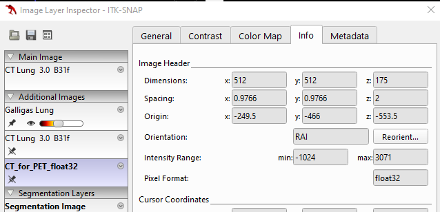

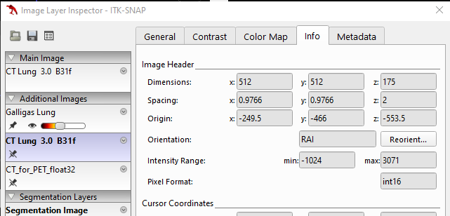

* And if you look at he 'Metadata' tab you will see that the 'bitpix' value is 32 for the new image and 16 for the previous image, and the 'datatype' is 16 for the new image and 4 for the previous image.

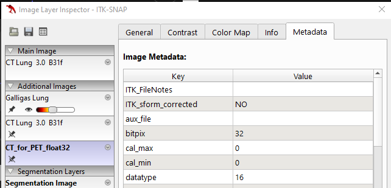
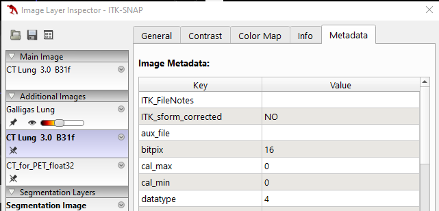


### 3.2. Cropping images
We are going to crop the CT image to remove slices that do not contain the region of interest, in this case is the lungs. This can make downstream processing of the images more efficient. However, there are a few considerations to pay careful attention to when cropping to ensure it is performed correctly and to preserve the mapping of the image to world coordinates. 

You usually want to leave 5-10 slices on each side of the region of interest when cropping. Therefore, we are going to crop the image so that we keep slices 91 to 390 in the x dimension (sagittal slices), slices 131 to 375 in the y dimension (coronal slices), and slices 21 to 155 in the z dimension (axial slices).

* Use ITK-SNAP to confirm that cropping the image to these slices will only remove slices that do not contain the lungs.

Changing the image data of a Nifti1Image object is impossible, e.g., to set it to a smaller array corresponding to a cropped image. 
Therefore, if you want to modify the image data, you need to create a new array containing the modified data and then create a new Nifti1Image object using this new array, which is used to save the modified image to disk.

* Run the next cell of the Juypter notebook to create a new array containing a copy of the desired slices.

It is important to create a copy of the data, otherwise, the new image will reference the data in the original image, and if you make any changes to the values in the new image, they will also be changed in the original image.

When creating a new Nifti1Image object, you can provide an affine transform and/or a Nifti1Header object (e.g. `ct_for_pet_nii.header`) as well as the image data. The affine transform and the header for the new Nifti1Image object will be based on those provided, but may be updated so that they are consistent with the image data and each other, e.g. the `dim` field in the new header will be updated based on the image data provided.

* Run the next cell to create a new Nifti1Image object using the header and affine from the uncropped image, and check the shape and header are as expected. It then saves the cropped image using NiBabel’s save function.
* Load the uncropped CT image (`CT_for_PET.nii.gz`) into ITK-SNAP as the main image. Now load the cropped image as an additional image. 
You will see that the cropped image has been cropped in all three dimensions so that it just contains the lungs, but it is shifted relative to the uncropped image.

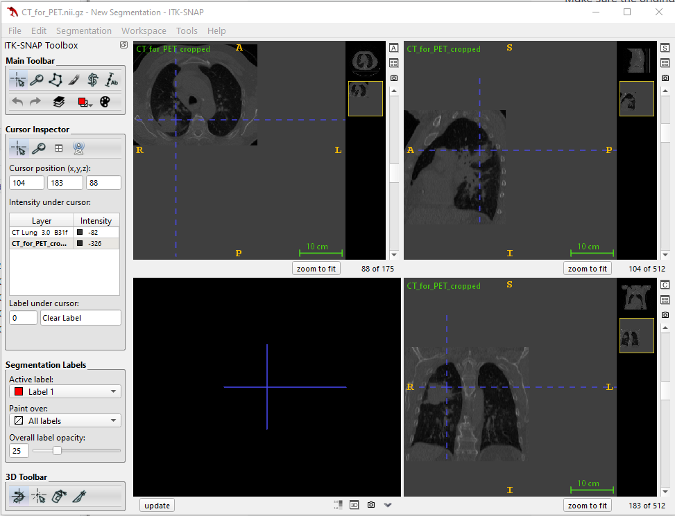

:::::::::::::::::::::::::::::::::::::: callout

#### Why are voxels outside the image grey?

ITK-SNAP sets voxels outside the image to have a value of 0. For CT images in Hounsfield Units (HU) this corresponds to soft tissue, so the voxels outside the image have a similar intensity to soft tissue. Unfortunately, it does not appear to be possible to change the value that ITK-SNAP assigns to the voxels outside the image.

::::::::::::::::::::::::::::::::::::::

The cropped image is shifted relative to the original image because we did not update the image origin in the NIfTI header to account for the slices we removed. 
The image origin gives the world coordinates of the voxel (0, 0, 0). 
As we did not update the image origin, voxel (0,0,0) in the cropped image is aligned with voxel (0,0,0) in the uncropped image. However, it should be aligned with voxel (91, 131, 21) in the uncropped image. So, we need to set the image origin for the cropped image to be the same as the world coordinates of the voxel (91, 131, 21) in the uncropped image. 

* Run the next cell in the Juypter notebook. This does the following:
    * Uses the affine from the uncropped image to calculate the cropped image origin, i.e. the world coordinates of voxel (91, 131, 21).
    * Uses the cropped image origin to update the corresponding values affine matrix for the cropped image.
    * Saves the cropped image.
        * This updates the sform in the header of the cropped image to be the same as the affine before saving the image.

:::::::::::::::::::::::::::::::::::::: callout

#### NiBabel's `slicer` attribute

NiBabel provides handy functionality for cropping NIfTI images and updating the affine transforma and header accordingly using the `slicer` attribute. Using the `slicer` attribute you can do the same thing we did above with a single line of code:

```python
ct_for_pet_slicer_nii = ct_for_pet_nii.slicer[x_first:x_last+1, y_first:y_last+1, z_first:z_last+1]
```

But you wouldn’t have learnt so much if we’d simply done that to start with! :smile:

::::::::::::::::::::::::::::::::::::::

If you load the new image into ITK-SNAP you will see that it is now aligned with the original image. 

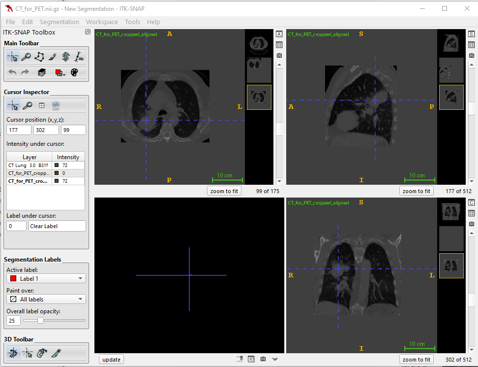

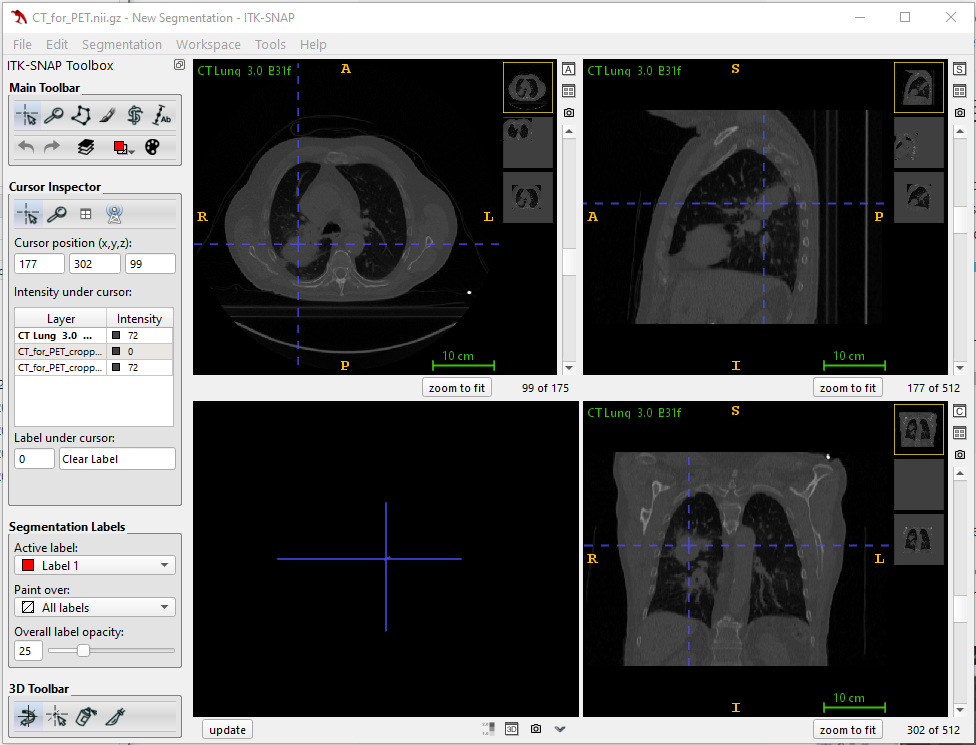

### 3.3. Aligning images
If you load `CT_for_PET.nii.gz` and the DICOM image in the inhale_BH_CT` folder in to ITK-SNAP, you can see that there is a large misalignment between the images. 


If we perform a registration between these images as they are, it may have difficulties as the images are so far out of alignment to start with. One way to roughly align the images before performing a registration is to align the centres of the images.

:::::::::::::::::::::::::::::::::::::: challenge

#### Align the centre of the `inhale_BH_CT` image with the centre of `CT_for_PET.nii.gz`

This can be achieved by following these steps:

* Save the `inhale_BH_CT` DICOM image as a NIfTI image, `inhale_BH_CT.nii.gz`.
* Calculate the centre of `CT_for_PET.nii.gz` in voxel coordinates.
* Calculate the centre of `CT_for_PET.nii.gz` in world coordinates.
* Calculate the centre of `inhale_BH_CT.nii.gz` in voxel coordinates.
* Calculate the centre of `inhale_BH_CT.nii.gz` in world coordinates.
* Calculate the translation (in world coordinates) required to align the images.
* Use this translation to modify the affine transform for `inhale_BH_CT.nii.gz`.
* Save the aligned image as `inhale_BH_CT_aligned.nii.gz`

Try writing code to implement these steps yourself, based on what you have learned from this practical.

:::::::::::::::::::::::::::::::::: hint

The centre of the image in voxel coordinates can be calculated as $\frac{NumVox - 1}{2}$

You can use the affine transform to transform the voxel coordinates to world coordinates, as seen earlier in the practical. Don't forget that you must use homogeneous coordinates, i.e. the coordinates are stored in a 4x1 vector, with the last element set to 1.

The translation should not replace the image origin values in the affine header - it should be added to (or subtracted from) from them.

::::::::::::::::::::::::::::::::::

::::::::::::::::::::::::::::::::::::::

Use ITK-SNAP to verify that you have correctly aligned the centres of the images.


## 4. References 
#### Data
* [The Cancer Imaging Archive (TCIA)](https://www.cancerimagingarchive.net/collection/ct-vs-pet-ventilation-imaging/)
* [DICOM (Digital Imaging and Communications in Medicine)](https://www.dicomstandard.org/) 
* [NIfTI (Neuroimaging Informatics Technology Initiative)](https://nifti.nimh.nih.gov/) 
* [Anderson Winkler's blog on the NIfTI file format]( https://brainder.org/2012/09/23/the-nifti-file-format/)

#### ITK-SNAP
* [ITK-SNAP website](http://www.itksnap.org/pmwiki/pmwiki.php?n=Main.HomePage).
* [Tutorial: Getting Started with ITK-SNAP](http://www.itksnap.org/docs/viewtutorial.php)
* [ITK-SNAP 3.x Training Class Final Program](http://itksnap.org/files/handout_201409.pdf)

#### NiBabel
* [NiBabel website](https://nipy.org/nibabel/)
* [Documentation](https://nipy.org/nibabel/#documentation)
* [Working with NIfTI images](https://nipy.org/nibabel/nifti_images.html)
* [Understanding world coordinate systems](https://nipy.org/nibabel/coordinate_systems.html)
* [Neurological vs radiological views](https://nipy.org/nibabel/neuro_radio_conventions.html)
* [How to calculate the affine for DICOM images](https://nipy.org/nibabel/dicom/dicom_orientation.html)

#### Misc.
* [Quaternions](https://en.wikipedia.org/wiki/Quaternion)
* [Homogeneous coordinates](https://en.wikipedia.org/wiki/Homogeneous_coordinates)
	


