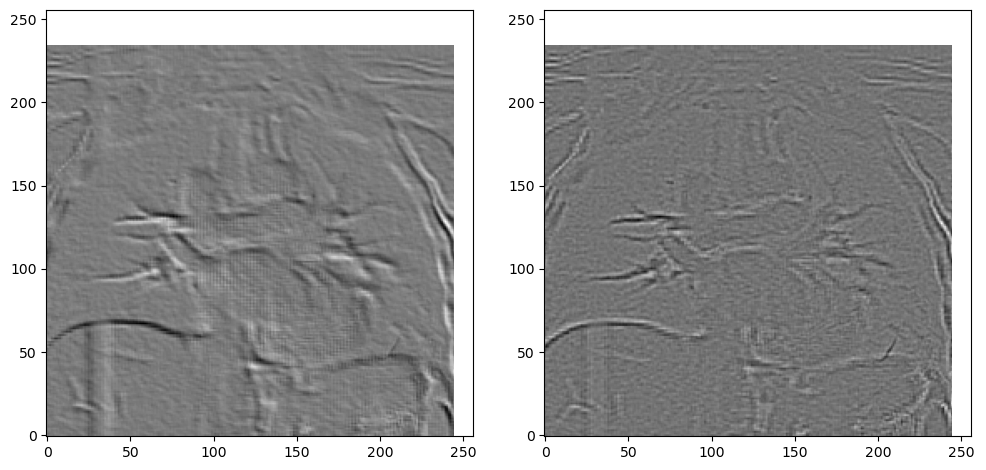
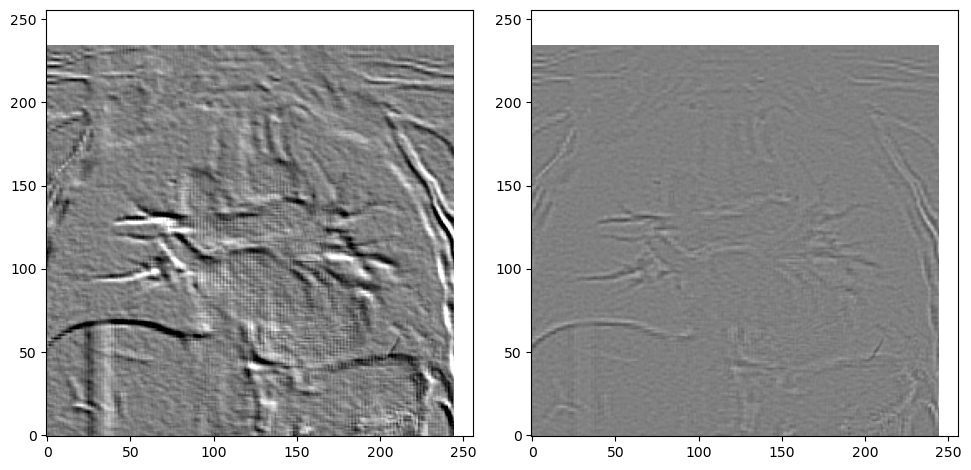
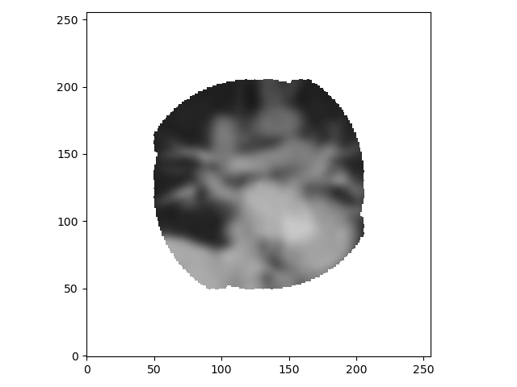
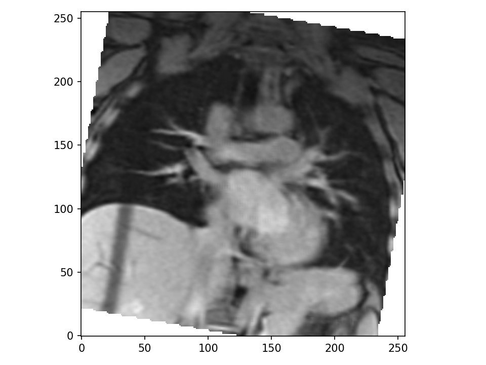
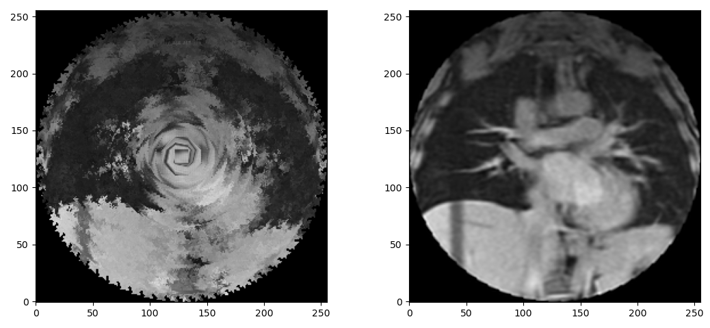
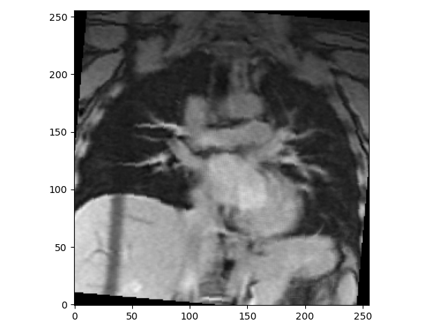
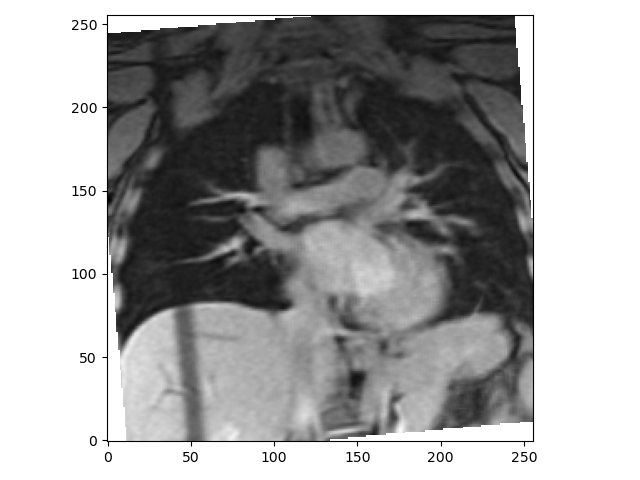

:::::::::::::::::::::::::::::::::::::: questions 

* What are the steps for applying affine transformations to medical images?
* What is the effect of using different interpolation methods when resampling images?
* How can multiple affine transformations be combined and applied to the same image?
* What are the differences between pull and push interpolation?

::::::::::::::::::::::::::::::::::::::::::::::::

::::::::::::::::::::::::::::::::::::: objectives

* Learn how to apply affine transformations, such as translations and rotations, to medical images.
* Observe how different interpolation methods, such as nearest neighbour and linear, give different results when resampling images.
* Use the process of composing multiple transformations to avoid artefacts caused multiple resamplings.
* Understand the differences between push and pull interpolations.

::::::::::::::::::::::::::::::::::::::::::::::::

:::::::::::::::::::::::::::::::::::::: prereq

You should have followed the instructions from [the Setup page](../learners/setup.md) to access the data and code for these exercises, and setup Python.

::::::::::::::::::::::::::::::::::::::

This practical is based in Python, and uses this template Jupyter notebook: [`practical2_notebook.ipynb`](files/practical2_notebook.ipynb).You have also been provided with some utility functions in [`utils.py`](files/utils.py). When using a function from this file, you should read it and make sure you understand what it does.

In these exercises, we will use a 2D slice from a lung MRI image, *lung_MRI_slice.png*, which you can find in the unzipped data folder under `practical2`.

* Run the first cell of the Juypter notebook. This imports the required libraries, and sets the *matplotlib* library to display figures in separate windows. This is required for the animations in these exercises to run correctly.

## 1. Loading and displaying images
You can load the 2D lung MRI image using the `imread` function from the *scikit-image* python library. If you check the data type of the image you will see it is stored as 8-bit integers. As you know, you should convert the image to double precision so that errors do not occur when processing the image due to the limited precision.

* Run the next cell of the notebook to load the image and convert it to double precision.

The *scikit-image* and *matplotlib* libraries used in these exercises index images using matrix coordinates. The first coordinate is the row number (i.e. the y coordinate of the image) and the second coordinate is the column number (i.e. the x coordinate of the image). The rows are also numbered from top to bottom.

It is possible to do image processing using matrix coordinates, but it can get confusing, especially when working with deformation fields or in 3D. Therefore, the approach used in these exercises is to store the image memory in 'standard orientation', so that the first coordinate indexes the x (horizontal) dimension and the second coordinate indexes the y (vertical) dimension, and the first pixel (0,0) is at the bottom-left of the image. Then, when displaying the image a wrapper function such as the `dispImage` function provided in *utils.py* can be used to reorientate the image into matrix coordinates as required for the `imshow` function from *matplotlib*.

Therefore, before proceeding you should reorientate the image into ‘standard orientation’. This can be done by first taking the transpose of the matrix (switching x and y dimensions) and then flipping along the second dimension (moving the first pixel from the top to the bottom of the image).

* Write your own code in the next cell of the Juypter notebook to reorientate the image. It will then display the image using the `dispImage` function from *utils.py*.
    * If you have done this correctly, the image should look like this:

## 2. Translating and resampling images
* Edit the code in the next cell of the notebook to create an affine matrix representing a translation by 10 pixels in the x direction and 20 pixels in the y direction. The cell already contains the code to create a 3 x 3 identity matrix, which can be edited as required. 

:::::::::::: discussion

#### Question

* Can you remember Why we use a 3 x 3 matrix for a 2D affine transformation?

If you are not sure of the answer to this question (or any of the others in the practicals) look back at the lecture material or ask one of the assistants to explain.

::::::::::::

:::::::::::: callout

#### Note

*numpy* has a [matrix class](https://numpy.org/doc/stable/reference/generated/numpy.matrix.html), but the documentation recommends not using it. We are using *numpy* arrays for this exercise.
Matrix multiplication can be performed between two arrays using the @ operator or the `numpy.matmul` function

::::::::::::

* Edit the next cell to create a deformation field from the affine matrix, and resample the image with the deformation field.
    * You should use the provided `defFieldFromAffineMatrix` and `resampImageWithDefField function` for this. The function definitions in *utils.py* include comments explaining what the inputs and outputs of the functions should be.

* Now run the next cell to display the transformed image. 
    * If you have done this correctly it should appear like this:

:::::::::::: discussion

#### Question

* Does the image appear as expected? 
* Has the image been translated in the direction you expected? 

The `resampImageWithDefField` function uses pull-interpolation, so the image will appear to have been transformed by the inverse of the transformation in the affine matrix (i.e. it has been translated by -10 and -20 pixels in the x and y directions respectively). We will try using push-interpolation instead of pull-interpolation later in the exercises to see the difference.

::::::::::::

* Run the next cell to check what value has been assigned to pixels that were originally outside the image by printing the value of the top right pixel (255,255).

This is known as the ‘padding value’ or ‘extrapolation value’. A value of NaN (not a number) is often used to indicate that the true value for these pixels is unknown, and therefore they should be ignored when calculating similarity measures during image registration.

The `resampImageWithDefField` function uses linear interpolation by default. It is implemented using *scipy*’s `interpn` function, so can also use the other interpolation methods available for this function. These include *nearest neighbour* and *splinef2d*, which is an efficient implementation of cubic interpolation using splines (note – it also has an interpolation method called *cubic*, which gives very similar results, but is much slower). 

* Write code to resample the image using *nearest neighbour* and *splinef2d* interpolations, and display the results in separate figures.

The results should look the same as the result from using *linear* interpolation. However, the effects of different interpolation methods can be subtle and difficult to spot. To make any differences between the results clear we can display difference images, i.e. one image minus another, between the original result with *linear* interpolation and the results using *nearest neighbour* and *splinef2d* interpolations.

* Write the code to display the difference images. 
    * They should appear like this:

(the difference image for *nearest neighbour* is on the left, and *splinef2d* on the right)

:::::::::::: discussion

#### Question

The values in the difference image for *splinef2d* are very small, in the order of 10-14, and can be attributed to numerical errors. So, the different interpolation all give (very almost) the same results.

* Do you understand why this is the case?

::::::::::::

* Now write code that repeats the steps above using a translation of 10.5 pixels in the x direction and 20.5 pixels in the y direction. 
    * The difference images should look like this:

(the difference image for nearest neighbour is on the left, and splinef2d on the right)

By default, the `dispImage` function displays images by scaling the values so that they use the full intensity range, i.e. the lowest value in the image is set to black and the highest to white. However, this can be misleading when comparing images, as the grey values seen in the images will not correspond to the same intensity values. Therefore, it is often a good idea to ensure exactly the same intensity range is used when displaying and comparing different images by using the `int_lims` input to the `dispImage` function.

* Write code to redisplay the difference images, in both cases using an intensity limits of [-20, 20]. 
    * The difference images should now appear like this:

(the difference image for nearest neighbour is on the left, and splinef2d on the right)

::::::::::::::::::: discussion

#### Question 

* Why do the different interpolation methods now give different results?

* And why is the difference larger for the nearest neighbour interpolation?

:::::::::::::::::::

## 3. Rotating images
* Add code to the next cell of the notebook to implement a function to calculate the affine matrix corresponding to a rotation about a point, P.
    * The inputs to the function should be the angle of rotation (in degrees) and the coordinates of the point and the output should be the affine matrix.
    
::::::::::::::::::: spoiler

#### Hints

You will need to convert the angle from degrees to radians, as *numpy* `sin` and `cos` functions expect the input in radians.

You will need to create 3 affine matrices - one representing the rotation, and two representing the translations from the origin to the point p and from p to the origin.

You will then need to compose the transformations (using matrix multiplication) in the correct order and return the result.

:::::::::::::::::::

* Now write code that uses the function to calculate the affine matrix representing an anticlockwise rotation of 5 degrees about the centre of the image. Then transforms the original image using the rotation you just created and display the result.
    * Linear interpolation should be used when resampling the image, and the intensity limits from the original image used when displaying the results.
    * The result should look like this:

* Apply the same transformation again to the resampled image and display the result. This should be repeated 71 times, so that the image appears to rotate a full 360 degrees.
    * It is necessary to add a short pause (i.e. 0.05 seconds) using `plt.pause(0.05)` so that the figure updates each time the new image is displayed.
    * The final image should look this this:

    * Here is the animation:

You will notice that the image gets smaller and smaller as it rotates. This is because of the NaN padding values – when a pixel value is interpolated from one or more NaN values it also gets set to NaN, so the pixels at the edge of the image keep getting set to NaN, and the image gets smaller after each rotation.

* To prevent this, repeat your code so that it uses a padding value of 0 rather than NaN and run your new code.
    * Before the for loop You will need to first resample the original image (also using a padding value of 0), display it, and add a short pause so that the displayed image is updated.
    * This time the final image should look like this:

    * Here is the animation:

::::::::::::::::::: discussion

#### Question 

You will notice that the corners of the image still get ‘rounded off’ as it rotates so that it has become a circle after rotating 90 degrees.

* Do you understand why this happens?

* How else does the final image differ from the original image?

:::::::::::::::::::

* Now add code to the template script to repeat the above, but first using *nearest neighbour* interpolation, and then using *splinef2d*.
    * The final images should look like this:

    * Here is the animation for *nearest neighbour* interpolation:

    * And for *splinef2d*:

The blurring artefacts and the ‘rounding off’ of the images seen above are caused by multiple resamplings of the image. Resampling essentially makes a copy of the image, and the interpolation slightly degrades that image. Multiple resamplings are like copies of copies of copies - you start to notice the cumulative degradation of the images. This can be prevented by composing the rotations into a single transformation and then applying the resulting composed transformation to the original image instead of resampling the result image each time. 

## 4. Composing transformations
* Write code that makes an animation of the rotating image as above (using *linear* interpolation), but composes the transformations to avoid multiple resamplings of the image.

::::::::::::::::::: spoiler

#### Hints

You will need to store the current rotation, `R_current` as well as the original rotation.

`R_current` will initially be equal to `R` and should be used to resample the original image and display the result prior to starting the loop.

At each iteration of the loop `R_current` will be updated by composing it with `R`, and then used to resample the original image and display the result.

:::::::::::::::::::

* Repeat the animation using *nearest neighbour* and *splinef2d* interpolation.
    * The resulting animation should look like this for *linear*:

    * And this for *nearest neighbour*:

    * And this for *splinef2d*:

You should notice that the corners of the images do not get ‘rounded off’ during these animations. Furthermore, you should notice that the intermediate images are different for the different interpolation methods (although this is only really noticeable for nearest neighbour interpolation), but the blurring artefacts do not get worse as the animation progresses, and the final image should be the same as the original image.

## 5. Push interpolation
As discussed in the lectures, it is possible to resample an image using push-interpolation, but it is far less computationally efficient than using pull-interpolation.

* Copy your code from above (that composes the transformations and uses *linear* interpolation) and modify it to perform push interpolation instead of pull interpolation by using the `resampImageWithDefFieldPushInterp` function instead of the `resampImageWithDefField` function.
    * Note, you cannot provide a `pad_value` for `resampImageWithDefFieldPushInterp`
    * The resulting animation should look like this:

::::::::::::::::::: discussion

#### Question 

* Other than the animation being much slower, what other difference do you notice?

* If you have time experiment with using different angles (smaller/larger, positive/negative) and rotating about a different point. Try this for both pull and push interpolation, and for different interpolation methods. Make sure you understand all the results you get.

:::::::::::::::::::

