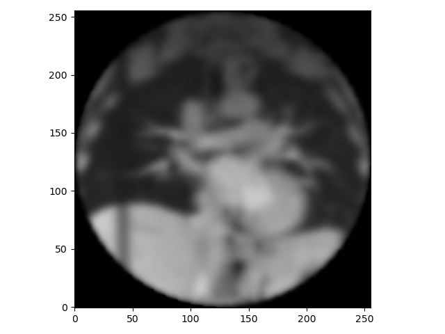

:::::::::::::::::::::::::::::::::::::: questions 

- How to apply transformations to images?

::::::::::::::::::::::::::::::::::::::::::::::::

::::::::::::::::::::::::::::::::::::: objectives

- Understand how to apply transformations to images.
- Learn how to apply translations and rotations.
- Learn how to compose transformations.
- Understand the difference between push and pull interpolations.

::::::::::::::::::::::::::::::::::::::::::::::::

# Introduction to transformations
In this tutorial, we are going to use the following Python libraries:

* *scikit-image*
* *matplotlib*
* *numpy*
* *scipy*

There is a template Jupyter notebook for you to work on *practical1.ipynb*. To make sure the animations display properly, we need the figures to be displayed in a separate window and not in the notebook. Make sure you run the following cell:
```python
import matplotlib
matplotlib.use('TkAgg')
```
You have also been provided with some utility functions in *utils.py* for use in these exercises. 
In the dataset zip file for this practical, you can find a 2D lung MRI image, *lung_MRI_slice.png*.

## Loading and displaying images
Load the 2D lung MRI image using the `imread` function from the *scikit-image* python library. If you check the data type of the image you will see it is stored as 8-bit integers. You should convert the image to double precision so that errors do not occur when processing the image due to the limited precision. 

```python
import numpy as np
import skimage.io
img = skimage.io.imread('lung_MRI_slice.png')
print(img.dtype)
img = np.double(img)
print(img.dtype)
```

The *scikit-image* and *matplotlib* libraries used in these exercises index images using matrix coordinates. The first cooridnate is the row number (i.e. the y coordinate of the image) and the second coordinate is the column number (i.e. the x coordinate of the image). The rows are also numbered from top to bottom.

It is possible to do image processing using matrix coordinates, but it can get confusing, especially when working with deformation fields or in 3D. Therefore, the approach used in these exercises is to store the image memory in 'standard orientation', so that the first coordinate indexes the x (horizontal) dimension and the second coordinate indexes the y (vertical) dimension, and the first pixel (0,0) is at the bottom-left of the image. Then, when displaying the image a wrapper function such as the `dispImage` function provided in *utils.py* can be used to reorientate the image into matrix coordinates as required for the `imshow` function from *matplotlib*.

Therefore, before proceeding you should reorientate the image into ‘standard orientation’. This can be done by first taking the transpose of the matrix (switching x and y dimensions) and then flipping along the second dimension (moving the first pixel from the top to the bottom of the image). Write code to do this and display the image using the `dispImage` function from *utils.py*.

```python
img = img.T
img = np.flip(img, 1)

from utils import dispImage
dispImage(img)
```

If you have done this correctly, the image should look like this:


## Translating and resampling images
Create an affine matrix representing a translation by 10 pixels in the x direction and 20 pixels in the y direction. 

```python
T = np.array([[1,0,10], [0,1,20], [0,0,1]])
print(T)
```

Note that *numpy* as a [matrix class](https://numpy.org/doc/stable/reference/generated/numpy.matrix.html) but the documentation recommends not using it. we are using *numpy* arrays for this exercise.
Matrix multiplication can be performed between two arrays using the @ operator or the `numpy.matmul` function

Use the provided `defFieldFromAffineMatrix` function to create a deformation field from the affine matrix, and resample the image with the deformation field using the provided `resampImageWithDefField function`. The functions include comments explaining what the inputs and outputs of the functions should be. Now display the transformed image. 

```python
from utils import defFieldFromAffineMatrix, resampImageWithDefField

num_pix_x, num_pix_y = img.shape
def_field = defFieldFromAffineMatrix(T, num_pix_x, num_pix_y)
img_resampled = resampImageWithDefField(img, def_field)
dispImage(img_resampled)
```

If you have done this correctly it should appear like this:


Does this appear as expected? Has the image been translated in the direction you expected? The `resampImageWithDefField` function uses pull-interpolation, so the image will appear to have been transformed by the inverse of the transformation in the affine matrix.

Check what value has been assigned to pixels that were originally outside the image by printing the value of the top right pixel (255,255). This is known as the ‘padding value’ or ‘extrapolation value’. A value of NaN (not a number) is often used to indicate that the true value for these pixels is unknown, and therefore they should be ignored when calculating similarity measures during image registration.

```python
print(img_resampled[255,255])
```

The `resampImageWithDefField` function uses linear interpolation by default. It is implemented using *scipy*’s `interpn` function, so can also use the other interpolation methods available for this function. These include *nearest neighbour* and *splinef2d*, which is an efficient implementation of cubic interpolation using splines (note – it also has an interpolation method called *cubic*, which gives very similar results, but is much slower). 

```python
img_resampled_nn = resampImageWithDefField(img,def_field,interp_method="nearest")
img_resampled_spline = resampImageWithDefField(img,def_field,interp_method="splinef2d")
```

Write code to resample the image using *nearest neighbour* and *splinef2d* interpolations, and display the results in separate figures.

```python
img_resampled_nn = resampImageWithDefField(img, def_field, interp_method='nearest')
img_resampled_sp = resampImageWithDefField(img, def_field, interp_method='splinef2d')

plt.figure()
dispImage(img_resampled_nn)

plt.figure()
dispImage(img_resampled_sp)
```

Do the different interpolation methods give different results?
This will be easier to see if you display difference images, i.e. one image minus another, between the original result with *linear* interpolation and the results using *nearest neighbour* and *splinef2d* interpolations. Write the code to display the difference images. 

```python
plt.figure()
dispImage(img_resampled - img_resampled_nn)

plt.figure()
dispImage(img_resampled - img_resampled_sp)
```

They should appear like this:


(the difference image for *nearest neighbour* is on the left, and *splinef2d* on the right)

Note – the values in the difference image for *splinef2d* are very small, in the order of 10-14, and can be attributed to numerical errors. So, the different interpolation all give (very almost) the same results. Do you understand why this is the case?

Now write code that repeats the steps above using a translation of 10.5 pixels in the x direction and 20.5 pixels in the y direction. 

```python
T = np.matrix([[1, 0, 10.5],[0,1,20.5],[0,0,1]])
def_field = defFieldFromAffineMatrix(T, num_pix_x, num_pix_y)
img_resampled = resampImageWithDefField(img, def_field)
img_resampled_nn = resampImageWithDefField(img, def_field, interp_method='nearest')
img_resampled_sp = resampImageWithDefField(img, def_field, interp_method='splinef2d')
plt.figure()
dispImage(img_resampled - img_resampled_nn)
plt.figure()
dispImage(img_resampled - img_resampled_sp)
```

The difference images should look like this:


(the difference image for nearest neighbour is on the left, and splinef2d on the right)

Make sure you understand why you get these results. If you are not sure check back over the lecture notes or ask. 

By default, the `dispImage` function displays images by scaling the values so that they use the full intensity range, i.e. the lowest value in the image is set to black and the highest to white. However, this can lead to unintentional differences in appearance when comparing images. Therefore, it is often a good idea to ensure exactly the same intensity range is used when displaying and comparing different images by using the `int_lims` input to the `dispImage` function. For example, if you check the intensity ranges of the difference images above you will notice that the range of values is larger for the nearest neighbour difference image. Write code to redisplay the difference images, in both cases using an intensity limits of [-20, 20]. 

```python
plt.figure()
dispImage(img_resampled - img_resampled_nn, int_lims=[-20, 20])
plt.figure()
dispImage(img_resampled - img_resampled_sp, int_lims=[-20, 20])
```

The difference images should now appear like this:


(the difference image for nearest neighbour is on the left, and splinef2d on the right)

## Rotating images and composing transformations
Implement a function to calculate the affine matrix corresponding to a rotation about a point, P. The inputs to the function should be the angle of rotation (in degrees) and the coordinates of the point and the output should be the affine matrix.

```python
def affineMatrixForRotationAboutPoint(theta, p_coords):
    """
    function to calculate the affine matrix corresponding to an anticlockwise
    rotation about a point

    SYNTAX:
      aff_mat = affineMatrixForRotationAboutPoint(theta, p_coords)
    
    INPUTS:
      theta - the angle of the rotation, specified in degrees
      p_coords - the 2D coordinates of the point that is the centre of rotation.
          p_coords[0] is the x coordinate,
          p_coords[1] is the y coordinate
    
    OUTPUTS:
      aff_mat - a numpy array representing the 3 x 3 affine matrix
    """
    # ***************
    # ADD CODE HERE TO IMPLEMENT THE ABOVE FUNCTION
    
    #convert theta to radians
    theta = np.pi * theta / 180

    #form matrices for translation and rotation
    T1 = np.array([[1, 0, -p_coords[0]],
                    [0, 1, -p_coords[1]],
                    [0,0,1]])
    T2 = np.array([[1, 0, p_coords[0]],
                    [0, 1, p_coords[1]],
                    [0,0,1]])
    R = np.array([[np.cos(theta), -np.sin(theta), 0],
                  [np.sin(theta), np.cos(theta), 0],
                  [0, 0, 1]])
    
    #compose matrices using matrix multiplication
    aff_mat = T2 @ R @ T1
    # ***************
    return aff_mat
```

Now use the function to calculate the affine matrix representing an anticlockwise rotation of 5 degrees about the centre of the image. Add code to transform the original image using the rotation you just created and display the result. Linear interpolation should be used when resampling the image, and the intensity limits from the original image when displaying the results. 

```python
R = affineMatrixForRotationAboutPoint(5, [(num_pix_x - 1)/2, (num_pix_y - 1)/2])
print(R)

def_field = defFieldFromAffineMatrix(R, num_pix_x, num_pix_y)
img_resampled = resampImageWithDefField(img, def_field)
int_lims_img = [np.min(img), np.max(img)]
dispImage(img_resampled, int_lims=int_lims_img)
```
The result should look like this:


Apply the same transformation again to the resampled image and display the result. This should be repeated 71 times, so that the image appears to rotate a full 360 degrees. The figure gets updated every 0.05 seconds using `plt.pause(0.05)`.

```python
for n in range(71):
    img_resampled = resampImageWithDefField(img_resampled, def_field)  # Your custom function
    dispImage(img_resampled, int_lims=int_lims_img)  # Call dispImage to update the image
    plt.pause(0.05)
```

Note: make sure you run `plt.close('all')` before to avoid issues.

The final image displayed should look like this:


You will notice that the image gets smaller and smaller as it rotates. This is because of the NaN padding values – when a pixel value is interpolated from one or more NaN values it also gets set to NaN, so the pixels at the edge of the image keep getting set to NaN, and the image gets smaller after each rotation. To prevent this, edit your code so that it uses a padding value of 0 rather than NaN and rerun your code. 

```python
img_resampled = resampImageWithDefField(img, def_field, pad_value=0)
dispImage(img_resampled, int_lims=int_lims_img)
plt.pause(0.05)
for n in range(71):
    img_resampled = resampImageWithDefField(img_resampled, def_field, pad_value=0)
    dispImage(img_resampled, int_lims=int_lims_img)
    plt.pause(0.05)
```

This time the final image should look like this:


You will notice that the corners of the image still get ‘rounded off’ as it rotates so that it has become a circle after rotating 90 degrees. Do you understand why this happens?

Now add code to the template script to repeat the above, but first using *nearest neighbour* interpolation, and then using *splinef2d*.

```python
img_resampled = resampImageWithDefField(img, def_field, pad_value=0, interp_method='nearest')
dispImage(img_resampled, int_lims=int_lims_img)
plt.pause(0.05)
for n in range(71):
    img_resampled = resampImageWithDefField(img_resampled, def_field, pad_value=0, interp_method='nearest')
    dispImage(img_resampled, int_lims=int_lims_img)
    plt.pause(0.05)
    
img_resampled = resampImageWithDefField(img, def_field, pad_value=0, interp_method='splinef2d')
dispImage(img_resampled, int_lims=int_lims_img)
plt.pause(0.05)
for n in range(71):
    img_resampled = resampImageWithDefField(img_resampled, def_field, pad_value=0, interp_method='splinef2d')
    dispImage(img_resampled, int_lims=int_lims_img)
    plt.pause(0.05)
```

The final images should look like this:


Now edit your code to experiment with using different angles (both smaller and larger) and rotating about a different point. Make sure you understand all the results you get.

```python
angle = -2
point = [100, 100]
num_reps = np.round(360 / np.abs(angle)) - 1
R = affineMatrixForRotationAboutPoint(angle, point)
def_field = defFieldFromAffineMatrix(R, num_pix_x, num_pix_y)

# linear interpolation
img_resampled = resampImageWithDefField(img, def_field, pad_value=0)
dispImage(img_resampled, int_lims=int_lims_img)
plt.pause(0.05)
for n in np.arange(num_reps):
    img_resampled = resampImageWithDefField(img_resampled, def_field, pad_value=0)
    dispImage(img_resampled, int_lims=int_lims_img)
    plt.pause(0.05)

# nearest neighbour interpolation
img_resampled = resampImageWithDefField(img, def_field, pad_value=0, interp_method='nearest')
dispImage(img_resampled, int_lims=int_lims_img)
plt.pause(0.05)
for n in np.arange(num_reps):
    img_resampled = resampImageWithDefField(img_resampled, def_field, pad_value=0, interp_method='nearest')
    dispImage(img_resampled, int_lims=int_lims_img)
    plt.pause(0.05)

# splinef2d interpolation
img_resampled = resampImageWithDefField(img, def_field, pad_value=0, interp_method='splinef2d')
dispImage(img_resampled, int_lims=int_lims_img)
plt.pause(0.05)
for n in np.arange(num_reps):
    img_resampled = resampImageWithDefField(img_resampled, def_field, pad_value=0, interp_method='splinef2d')
    dispImage(img_resampled, int_lims=int_lims_img)
    plt.pause(0.05)
```

The blurring artefacts and the ‘rounding off’ of the images seen above are caused by multiple re-samplings of the image. This can be prevented by composing the rotations and applying the resulting transformation to the original image instead of the transformed image. Add/edit the template script to create animations of the rotating image as above, but at each step the initial rotation is composed with the current rotation, and the current rotation is used to resample the original image. Try this using *nearest neighbour*, *linear*, and *splinef2d* interpolation. You should notice that the corners of the images do not get ‘rounded off’ during these animations. Furthermore, you should notice that the intermediate images are different for the different interpolation methods (although this is only really noticeable for nearest neighbour interpolation), but the blurring artefacts do not get worse as the animation progresses, and the final image should be the same as the original image.

```python
R = affineMatrixForRotationAboutPoint(5, [(num_pix_x - 1)/2, (num_pix_y - 1)/2])
  
# linear interpolation
def_field = defFieldFromAffineMatrix(R, num_pix_x, num_pix_y)
img_resampled = resampImageWithDefField(img, def_field)
dispImage(img_resampled, int_lims=int_lims_img)
plt.pause(0.05)

# create current matrix as copy of rotation matrix
R_current = R

for n in range(71):    
    # COMPOSE CURRENT MATRIX AND ROTATION MATRIX
    R_current = np.matmul(R, R_current)
    
    # CREATE DEFORMATION FIELD FOR CURRENT MATRIX, RESAMPLE ORIGINAL IMAGE, AND DISPLAY RESULT
    def_field = defFieldFromAffineMatrix(R_current, num_pix_x, num_pix_y)
    img_resampled = resampImageWithDefField(img, def_field)
    dispImage(img_resampled, int_lims=int_lims_img)
    
    #add a short pause after displaying the image so the figure display updates
    plt.pause(0.05)
    
# nearest neighbour interpolation
def_field = defFieldFromAffineMatrix(R, num_pix_x, num_pix_y)
img_resampled = resampImageWithDefField(img, def_field, interp_method='nearest')
dispImage(img_resampled, int_lims=int_lims_img)
plt.pause(0.05)

# create current matrix as copy of rotation matrix
R_current = R

for n in range(71):  
    # COMPOSE CURRENT MATRIX AND ROTATION MATRIX
    R_current = np.matmul(R, R_current)
    
    # CREATE DEFORMATION FIELD FOR CURRENT MATRIX, RESAMPLE ORIGINAL IMAGE, AND DISPLAY RESULT
    def_field = defFieldFromAffineMatrix(R_current, num_pix_x, num_pix_y)
    img_resampled = resampImageWithDefField(img, def_field, interp_method='nearest')
    dispImage(img_resampled, int_lims=int_lims_img)
    
    #add a short pause after displaying the image so the figure display updates
    plt.pause(0.05)
    
# splinef2d interpolation
def_field = defFieldFromAffineMatrix(R, num_pix_x, num_pix_y)
img_resampled = resampImageWithDefField(img, def_field, interp_method='splinef2d')
dispImage(img_resampled, int_lims=int_lims_img)
plt.pause(0.05)

# create current matrix as copy of rotation matrix
R_current = R

for n in range(71):  
    # COMPOSE CURRENT MATRIX AND ROTATION MATRIX
    R_current = np.matmul(R, R_current)
    
    # CREATE DEFORMATION FIELD FOR CURRENT MATRIX, RESAMPLE ORIGINAL IMAGE, AND DISPLAY RESULT
    def_field = defFieldFromAffineMatrix(R_current, num_pix_x, num_pix_y)
    img_resampled = resampImageWithDefField(img, def_field, interp_method='splinef2d')
    dispImage(img_resampled, int_lims=int_lims_img)
    
    #add a short pause after displaying the image so the figure display updates
    plt.pause(0.05)
```

As discussed in the lectures, it is possible to resample an image using push-interpolation, but it is far less computationally efficient than using pull-interpolation. Copy your code from above and modify it to perform push interpolation instead of pull interpolation by using the `resampImageWithDefFieldPushInterp` function instead of the `resampImageWithDefField` function. Other than the animation being much slower, what other difference do you notice?

```python
from utils import resampImageWithDefFieldPushInterp

# create deformation field, resample original image using push interpolation, and display result
def_field = defFieldFromAffineMatrix(R, num_pix_x, num_pix_y)
img_resampled = resampImageWithDefFieldPushInterp(img, def_field)
dispImage(img_resampled, int_lims=int_lims_img)
plt.pause(0.05)
R_current = R

for n in range(71):
    # COMPOSE CURRENT MATRIX AND ROTATION MATRIX
    R_current = np.matmul(R, R_current)
    
    # CREATE DEFORMATION FIELD FOR CURRENT MATRIX, RESAMPLE ORIGINAL IMAGE, AND DISPLAY RESULT
    def_field = defFieldFromAffineMatrix(R_current, num_pix_x, num_pix_y)
    img_resampled = resampImageWithDefFieldPushInterp(img, def_field)
    dispImage(img_resampled, int_lims=int_lims_img)
    
    plt.pause(0.05)
```
