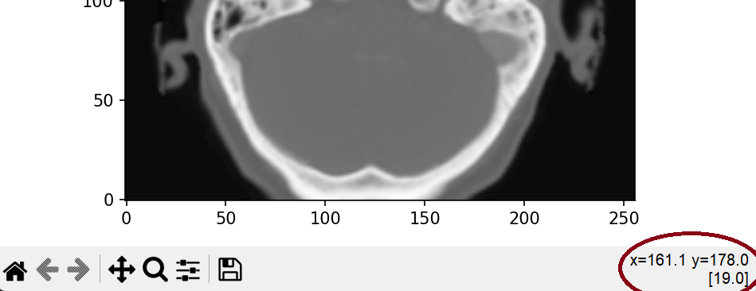
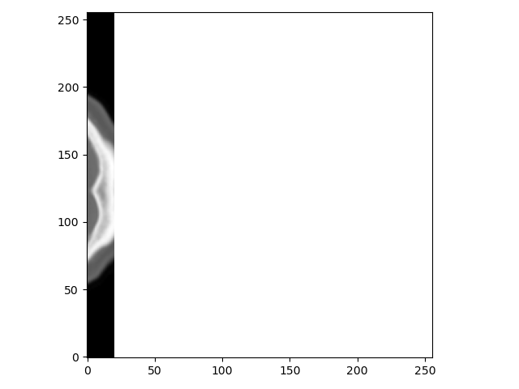
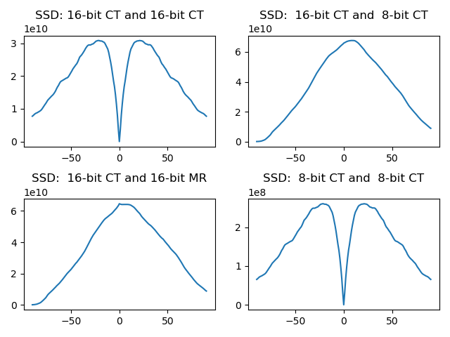
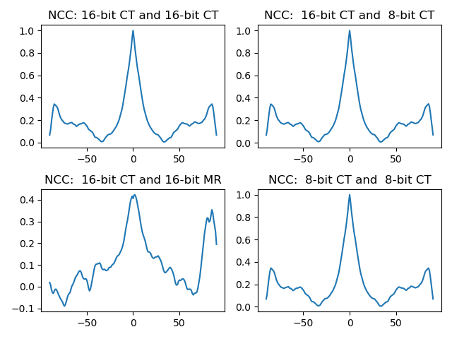
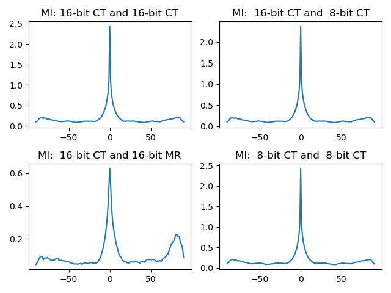

:::::::::::::::::::::::::::::::::::::: questions 

* How do different similarity measures change as images move into and out of alignment?
* How do different similarity measures perform with different images (same/different modality)?
* How are different similarity measure implemented?

::::::::::::::::::::::::::::::::::::::::::::::::

::::::::::::::::::::::::::::::::::::: objectives

* Understand how different similarity measures are implemented and used.
* Learn about the advantages and disadvantages of the different similarity measures.

::::::::::::::::::::::::::::::::::::::::::::::::

:::::::::::::::::::::::::::::::::::::: prereq

You should have followed the instructions from [the Setup page](../learners/setup.md) to access the data and code for these exercises, and setup Python.

::::::::::::::::::::::::::::::::::::::

This practical is based in Python, and uses this template Jupyter notebook: [`practical3_notebook.ipynb`](files/practical3_notebook.ipynb).You have also been provided with some utility functions in [`utils.py`](files/utils.py). When using a function from this file, you should read it and make sure you understand what it does.

In these exercises, we use a three 2D images:

* `ct_slice_int8.png`: an axial CT slice of a head, pixels are stored as unsigned 8-bit integers.
* `ct_slice_int16.png`: the same axial slice CT slice, pixels are stored as unsigned 16-bit integers.
* `mr_slice_int16.png`: the corresponding axial MR slice, pixels are stored as unsigned 16-bit integers.

You can find in the unzipped data folder under `practical3`.

* Run the first cell of the Juypter notebook. This imports the required libraries, and sets the *matplotlib* library to display figures in separate windows. This is required for the animations in these exercises to run correctly.

## 1. Inspect the images

* Run the next cell of the notebook to load the 3 images.
* Add code to the next cell to display the data type for each of the images, run it, and check they match the expected data types.
* Add code to the next cells to convert all the images to double data type, reorient them into cartesian orientation, and display each image in a separate figure using the `dispImage` function from *utils2.py*.

The images should appear like this:

The left and middle images are the CT images, while the image on the right is an MRI.
You should notice that the two CT images appear exactly the same, but if you examine the actual values in the images you will see that the images use different intensity ranges. If you move your cursor over the image the intensity values can be seen next to the figure (it is the value in [], so 19.0 in the figure below):

In the 16 bit version, the intensity values correspond to Hounsfield Units (or rather Hounsfield Units + 1000, since air has a value of -1000, but the image cannot contain negative values as it is stored as unsigned integers), but in the 8 bit image the values have been scaled as the image can only contain values from 0 to 255.

## 2. Moving images in and out of alignment

In order to explore the performance of the different similarity measures we are going to write some code to rotate the images from -90 degrees to 90 degrees so they first move into, and then out of, alignment with the original (unrotated) images.
The Juypter notebook contains the outline of some code to rotate each of the images between -90 degrees and 90 degrees, in steps of 1 degree, but you need to complete the code.

* Edit the code so that on each iteration of the loop it:
    * uses the `affineMatrixFromRotationAboutPoint` function from *utils2.py* to create an affine matrix representing an anti-clockwise rotation by theta degrees about the point (10,10),
    * uses the `defFieldFromAffineMatrix` function to create the corresponding deformation field,
    * then resamples each of the 3 images using the `resampImageWithDefField` function with the default interpolation (linear) and padding value (NaN),
    * and uses the `dispImage` function to display the resampled 8-bit CT image. 

If this has been implemented correctly the image should appear to rotate clockwise, starting with a rotation of -90 degrees (so mostly being ‘off to the left’ of the original image) and finishing with a rotation of +90 degrees (so mostly being ‘off the bottom’ of the original image), as shown in the animation below:

:::::::::::: discussion

#### Question

Why does the image appear to rotate clockwise when the function produces an affine matrix representing an anti-clockwise rotation?

* Why should the default padding value of NaN be used when resampling the images? 

::::::::::::

## 3. Sum of Squared DIfferences (SSD) and Mean of Squared Differences (MSD)

We are now going to observe how the Sum of Squared Differences (SSD) and Mean of Squared Differences (MSD) similarity measures changes as the rotated images and original images come in and out of alignment.

* Copy your code from the previous cell to create the affine matrix and corresponding deformation field, and to resample the images.
    * You do not need to copy the code to display the rotated 8-bit CT image as this was just to check the code was working as expected, and it makes the loop a lot slower to run.
* Add new code so that on each iteration of the loop it calculates and stores the SSD between:
    * 1) The original 16-bit CT image and the resampled 16-bit CT image
    * 2) The original 16-bit CT image and the resampled 8-bit CT image
    * 3) The original 16-bit CT image and the resampled MR image
    * 4) The original 8-bit CT image and the resampled 8-bit CT image
* Run the cell. Then run the following cell so that it plots the SSD values on the y-axis against the theta on the x-axis for each of the four cases above.

The plots should look like this:

:::::::::::: discussion

#### Question

* Why does the SSD reach a minimum (of 0) for cases 1 and 4 when the images are in alignment?
* Why does the SSD not reach a minimum value when the images are aligned for cases 2 and 3?
* Why does the SSD decrease as the overlap between the images decreases?
* Why is the shape of the SSD curve for cases 1 and 4 the same, but the values of the SSD are different by 2 orders of magnitude?

::::::::::::

* Now edit and run the next two cells so that they do the same as above but calculate and plot the MSD values instead of the SSD values.

The plots should look like this:

:::::::::::: discussion

#### Question

Note that for cases 1 and 4, unlike the SSD, the MSD does not decrease as the amount of overlap decreases. And the shape of the MSD curves for cases 1 and 4 are the same but the values are larger for case 1. Make sure you understand why you get these results.

* Why are the MSD values for cases 2 and 3 lower for negative values of theta and higher for positive values (this one is a bit tricky!)?

::::::::::::

## 4. Normalized Cross Correlation (NCC) and Normalized Mutual Information (NMI)

* Edit the next cell of the notebook to implement the `calcNCC` function so that it calculates the Normalised Cross Correlation (NCC) between two images.

::::::::::::::::::: spoiler

#### Hints

When calculating the NCC you need to ignore any pixels that are NaN in either of the input images. The *numpy* `nanmean` and `nanstd` functions can calculate the mean and standard deviation of an array (image) while ignoring the NaN values, but they will only ignore pixels that are NaN in the images passed as input to the function, not the pixels that are NaN in the other image.

Therefore, you will first need to remove any pixels that contain NaN in either of the input images. The *numpy* `isnan` function can find the NaN pixels in each individual image, and logical operations and boolean indexing can then be used to keep just the pixels that are not NaN in both images. If you are not sure how to do this ask me or one of the PGTAs to help you work it out.

You can then calculate the mean and standard deviation of each image using the *numpy* `mean` and `std` functions. And then calculate the NCC using the equation from the lectures.

:::::::::::::::::::

* Edit the code in the next cell so that it uses your `calcNCC` function and the `calcEntropies` function from `utils.py` to calculate the (NCC) and the joint and marginal entropies ($H_{AB}$, $H_A$, and $H_B$) instead of the MSD/SSD at each iteration.
* Also add code after the loop to calculate the Mutual Information (MI) and Normalised Mutual Information (NMI) from the entropy values.
* Now run the cell and the next cell to plot the results for the NCC, the joint entropy ($H_{AB}$), the MI and the NMI.

The plots should look like this:

:::::::::::: discussion

#### Question

* Do the different measures perform as expected for the different cases?
* Based on these results, which measures are suitable for registering the different pairs of images?
* Does this agree with what you were taught in the lecture?

::::::::::::
