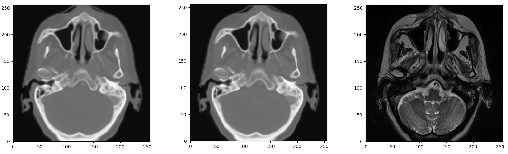
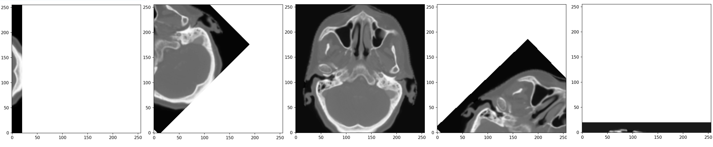
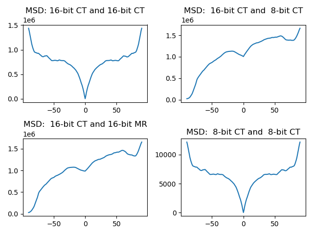
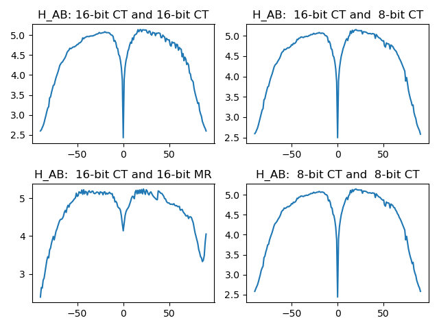
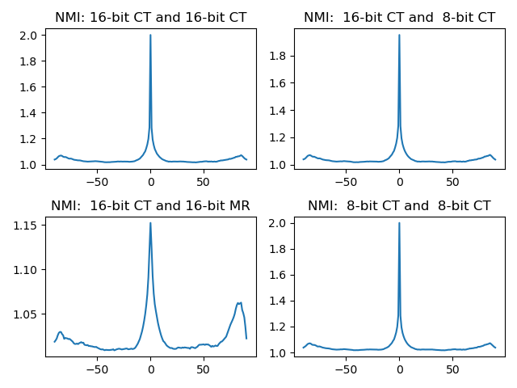

:::::::::::::::::::::::::::::::::::::: questions 

- What are the differences between similarity measures such as the SSD, MSD, NCC and NMI?

::::::::::::::::::::::::::::::::::::::::::::::::

::::::::::::::::::::::::::::::::::::: objectives

- Understand the use of the SSD, MSD, NCC and NMI as similarity measures.

::::::::::::::::::::::::::::::::::::::::::::::::

In this tutorial, we are going to use the following Python libraries:

* *scikit-image*
* *matplotlib*
* *numpy*
* *scipy*

There is a template Jupyter notebook for you to work on *practical3.ipynb*. To make sure the animations display properly, we need the figures to be displayed in a separate window and not in the notebook. Make sure you run the following cell:
```python
import matplotlib
matplotlib.use('TkAgg')
```
You have also been provided with some utility functions in *utils.py* for use in these exercises. 
In the dataset zip file for this practical, you can find three 2D images:

* *ct_slice_int8.png*: an axial CT slice of a head, stored as unsigned 8-bit integers.
* *ct_slice_int16.png*: the same axial slice CT slice, stored as unsigned 16-bit integers.
* *mr_slice_int16.png*: the corresponding axial MR slice, stored as unsigned 16-bit integers.

## 1. Loading and displaying the images
Load the three 2D images. Display their data type and check these match the expected data types.

Convert these images to double, reorient them into 'standard orientation' and display each image in a separate figure using the `dispImage` function from *utils2.py*.

The images should appear like this:



You should notice that the two CT images appear exactly the same, but if you examine the actual values in the images you will see that the images use different intensity ranges. If you move your cursor over the image the intensity values can be seen next to the figure:


In the 16 bit version, the intensity values correspond to Hounsfield Units (or rather Hounsfield Units + 1000, since air has a value of -1000, but the image cannot contain negative values as it is stored as unsigned integers), but in the 8 bit image the values have been scaled as the image can only contain values from 0 to 255.

## 2. Rotations

The template script contains some code to rotate each of the images between -90 degrees and 90 degrees, in steps of 1 degree. Edit the code so that on each iteration of the loop it uses the `affineMatrixFromRotationAboutPoint` function from *utils2.py* to create an affine matrix representing an anti-clockwise rotation by theta degrees about the point 10,10, and uses the `defFieldFromAffineMatrix` function to create the corresponding deformation field. Then resample each of the 3 images using the `resampImageWithDefField` function and display the transformed 8-bit CT image using the `dispImage` function. 

If this has been implemented correctly the image should appear to rotate clockwise, starting with a rotation of -90 degrees (so mostly being ‘off to the left’ of the original image) and finishing with a rotation of +90 degrees (so mostly being ‘off the bottom’ of the original image), as shown in the intermediate images below:



Make sure you understand why the image appears to rotate clockwise when the function produces an affine matrix representing an anti-clockwise rotation.

Note, the default padding value of NaN should be used when resampling the image so that pixels from outside the original images are ignored when calculating the similarity measures
below.

### 2.1. SSD

Edit the code so that on each iteration of the loop it calculates and stores the SSD between:

* 1) The original 16-bit CT image and the transformed 16-bit CT image
* 2) The original 16-bit CT image and the transformed 8-bit CT image
* 3) The original 16-bit CT image and the transformed MR image
* 4) The original 8-bit CT image and the transformed 8-bit CT image

Now rerun the cell with the for loop (you may want to comment out the lines that display the image and pause so that the code runs faster).

Plot the SSD values on the y-axis against the theta on the x-axis for each of the four cases above.

The plots should look like this:


Note that:
* The SSD reaches a minimum (of 0) for cases 1 and 4 when the images are in alignment.
* For cases 2 and 3 SSD does not have a minimum when the images are aligned.
* For all cases the SSD decreases as the overlap between the images decreases.
* Although the shape of the SSD curve for cases 1 and 4 is the same, the values of the SSD are different by 2 orders of magnitude.

Make sure you understand why you get these results.

### 2.2. MSD
Now edit the code so that it rotates the images as above but calculates the MSD instead of the SSD at each iteration, and then plots the MSD values. 

The plots should look like this:



Note that:
* The MSD for cases 1 and 4 does not decrease as the amount of overlap decreases.
* The shape of the MSD curves for cases 1 and 4 are the same but the values are larger for case 1.
* The MSD values for cases 2 and 3 are lower for negative values of theta and higher for positive values (this one is a bit tricky!).

Make sure you understand why you get these results.

### 2.3. NCC and NMI
Implement the `calcNCC` function so that it calculates the Normalised Cross Correlation (NCC) between two images.

Edit the code so that it uses your `calcNCC` function and the `calcEntropies` function from *utils2.py* to calculate the (NCC) and the joint and marginal entropies (H_AB, H_A, and H_B) instead of the MSD/SSD at each iteration. Also calculate the Mutual Information (MI) and Normalised Mutual Information (NMI) from the entropy values, and plot the results for NCC, H_AB, MI, and NMI.

The plots should look like this:






Do the different measures perform as expected for the different cases? Based on these results, which measures are suitable for registering the different pairs of images? Does this agree with what you were taught in the lecture?

Make sure you understand all the results you get.
