:::::::::::::::::::::::::::::::::::::: questions 

- How to use the Demons algorithm to register two images?

::::::::::::::::::::::::::::::::::::::::::::::::

::::::::::::::::::::::::::::::::::::: objectives

- Understanding how the Demons algorithm works.

::::::::::::::::::::::::::::::::::::::::::::::::

In this tutorial, we are going to use the following Python libraries:

* *scikit-image*
* *matplotlib*
* *numpy*
* *scipy*

There is a template Jupyter notebook for you to work on *practical4.ipynb*. To make sure the animations display properly, we need the figures to be displayed in a separate window and not in the notebook. Make sure you run the following cell:
```python
import matplotlib
matplotlib.use('TkAgg')
```
You have also been provided with some utility functions in *utils.py* for use in these exercises. There is also a function that implements the Demons registration algorithm in *demonsReg.py*. You should look at the code for the utility functions and make sure you understand what they do and how they work. You should also look at the code in *demonsReg.py* and check you can follow what it is doing. You should be able to understand what each section of code is doing, even if you don’t fully understand every line

In the dataset zip file for this practical, you can find a three images to use for these exercises: *cine_MR_1.png*, *cine_MR_2.png*, and *cine_MR_3.png*. These images contain a 2D sagittal MR slice showing the lung, liver, and surrounding anatomy, at different points in time during free-breathing. Image 1 is at end-exhalation, image 2 at the end-inhalation for a normal breath, and image 3 at end-inhalation for a deep breath.

## Loading and displaying images
Load and display the three images. Convert the images to doubles and reorientate them as in the previous exercises.

```python
cine_MR_img_1 = skimage.io.imread('data/practical4/cine_MR_1.png') 
cine_MR_img_2 = skimage.io.imread('data/practical4/cine_MR_2.png')
cine_MR_img_3 = skimage.io.imread('data/practical4/cine_MR_3.png')

cine_MR_img_1 = np.double(cine_MR_img_1)
cine_MR_img_2 = np.double(cine_MR_img_2)
cine_MR_img_3 = np.double(cine_MR_img_3)

cine_MR_img_1 = np.flip(cine_MR_img_1.T, 1)
cine_MR_img_2 = np.flip(cine_MR_img_2.T, 1)
cine_MR_img_3 = np.flip(cine_MR_img_3.T, 1)

dispImage(cine_MR_img_1)
plt.show()
dispImage(cine_MR_img_2)
plt.show()
dispImage(cine_MR_img_3)
plt.show()
```

The images should look like this:

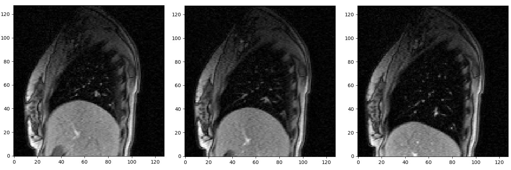

Compare the images to each other and observe the motion that occurs between the images. Difference images (one image minus another, e.g. as shown below) are a good way seeing where there are differences between the images, but it can be difficult to tell how things have moved between the images from the difference image.

```python
dispImage(cine_MR_img_1 - cine_MR_img_2)
plt.show()
dispImage(cine_MR_img_1 - cine_MR_img_3)
plt.show()
```

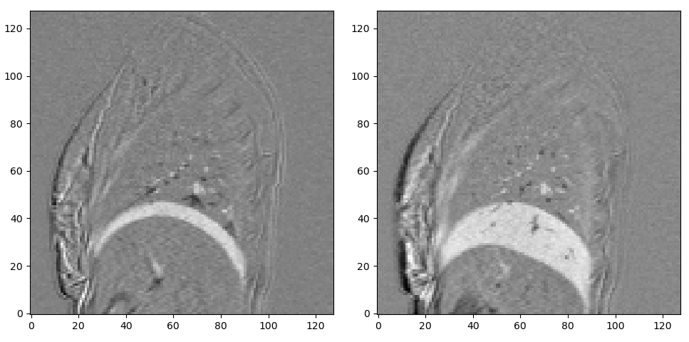

It is often easier to appreciate how things have moved/changed between images if you 'flip' between the images. To achieve this, we can use the `dispImageFlip` function. This function takes in the two images you want to look at as arguments, and you can flip between the two using the arrow keys on your keyboard. Implement the function.

```python
from utils import dispImageFlip
dispImageFlip(cine_MR_img_1, cine_MR_img_2)

dispImageFlip(cine_MR_img_1, cine_MR_img_3)
```

See how the images differ from each other. Pay particular attention to motion that you think could be challenging for the demons algorithm to recover, such as very large motion and deformation, or sliding motion that can occur between the lung/liver and surrounding anatomy.

## Demons algorithm
If you look at the comments at the start of `demonsReg` function in *demonsReg.py* (which are also displayed as the help info for the function) you will see that there are two required input parameters, the source and target images for the registration. There are also a number of optional input parameters, which have default values assigned to them that will be used if an alternative value is not specified. We will explore the effects of these parameters as we go through these exercises. The outputs of the function are the final warped image and the corresponding deformation field.

Start by running a registration with `cine_MR_1` as the source image and `cine_MR_2` as the target image and using default values for all the other parameters.
When you start the registration, a figure appears with 3 subplots. The first subplot on the left shows the warped image (transformed source image), the second subplot in the middle shows the current deformation field and the third subplot on the right shows the update to the deformation field for the current iteration. The deformation field (middle plot) is displayed as a deformed grid whereas the update is displayed as a vector field. All three images update during the registration.

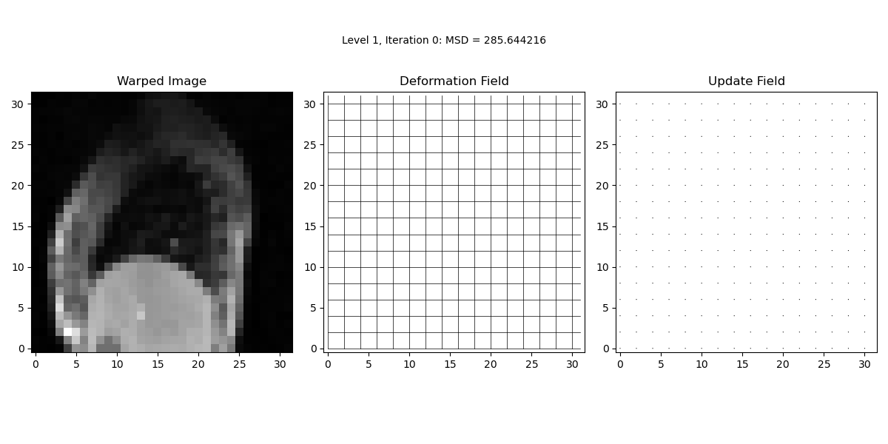

While the registration is running, you will notice that the figures are updated and that text is outputted in the notebook stating the current resolution level, iteration number, and value of the Mean Squared Difference (MSD) between the target image and the current warped image. At the end of the registration, the figure should look like this:

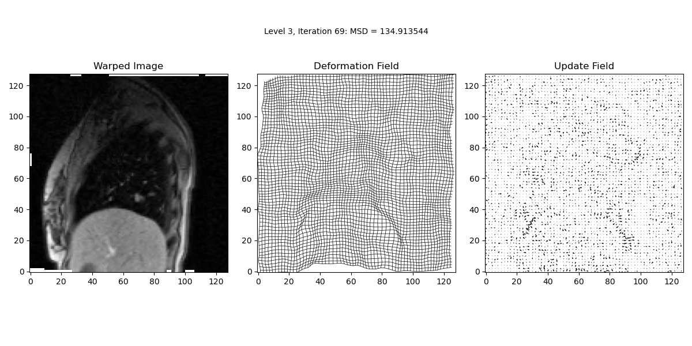

At the end of the registration, a second figure appears. The figure allows us to flip between the source, target and warped image and shows the deformation field and difference image. We can also display the Jacobian (more details later).

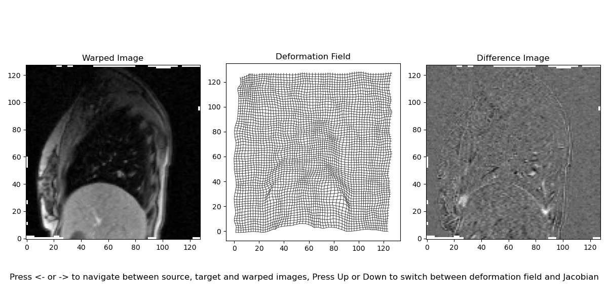

If you look at the text output you will see that the final MSD value is 80.20 (rounded to 2 decimal places – more are shown in the console), and that 74 iterations were performed at the final (3rd) resolution level. If you scroll up in the console you will see that 24 iterations were also performed at the 2nd resolution level, and 17 iterations at the 1st level. If you look at the MSD value you will notice it decrease as the registration progresses, as would be expected, but that it increases between resolution levels. Do you know why it does this? Hint – it’s not just because there are more pixels in the higher resolution images, as using the mean rather than sum of squared differences should account for different numbers of pixels in the images.

Compare the final warped image with the target and source images. How well do you think the registration did at aligning the images? Which parts of the images are well aligned, and which parts are less well aligned?

If you look at the deformation field you will see that it corresponds to the deformation that would be applied to the warped image to get back to the source image (rather than the deformation that would be applied to the source image to get to the warped image). Make sure you understand why this is the case (hint – pull-interpolation).

### Regularisation

You can specify the values of the optional input parameters when calling the function, e.g.
```python
demonsReg(cine_MR_1, cine_MR_2, sigma_elastic=0)
```
will run the registration with sigma_elastic set to 0, i.e. with no elastic like regularisation applied. Try running this registration. At the end of the registration, the figures should look like this:

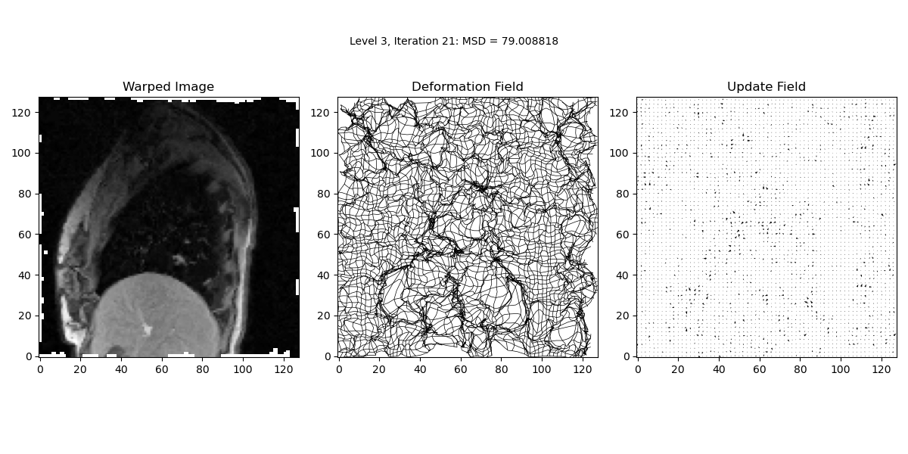
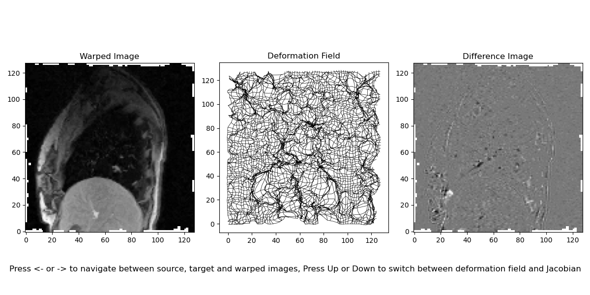

You will see that parts of the final warped image looks very similar to the target image, and the final MSD is 79.01, which is a little lower than for the default parameters. However, you can see that the final deformation field is very ‘crumpled’ and does not look very physically plausible. Therefore, for most applications this would not be considered a good registration result. The reason that the result is like this is that without any elastic-like regularisation applied to the deformation field it is free to ‘evolve’ in any way that better aligns the intensities, even if this results in implausible transformations, and highlights the need for using suitable regularisation.

Now rerun the registration with sigma_elastic at its default value again but this time setting sigma_fluid to 0. At the end of the registration, the figures should look like this:

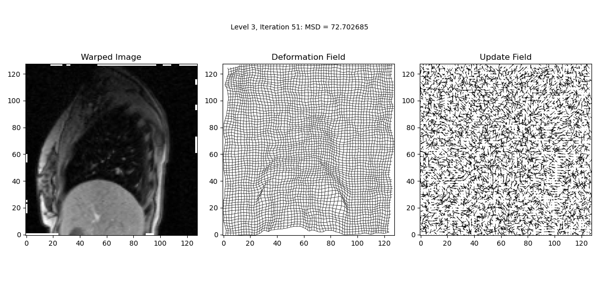
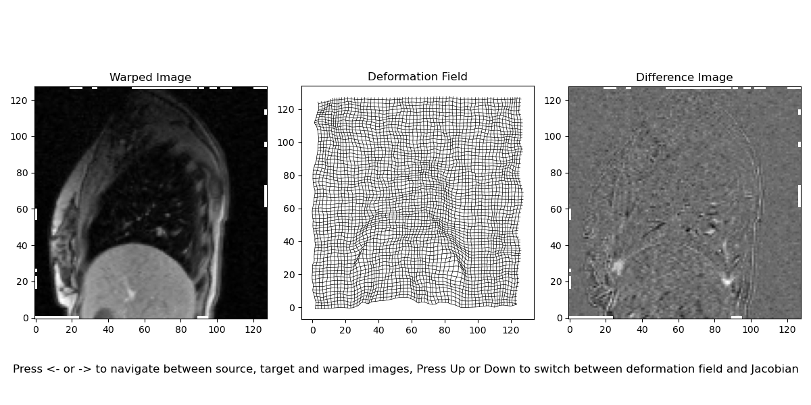

You will now see that the updates are much larger and noisier as no regularisation is being applied to them, but the deformation field is still relatively smooth as it does have regularisation applied. If you compare the result from this registration to the result obtained with the default parameters (remember, you can store the outputs of the function so that you can directly compare the results from different registrations) you will see that the results are very similar. However, the final MSD value is lower (72.73), but some regions of the deformation field are slightly less smooth. Which of the results should be considered ‘best’ will depend on exactly what the application is. But it should be clear that the elastic-like regularisation usually has a larger effect on the result than the fluid-like regularisation does. Now try running several more registrations with different levels of elastic-like and fluid-like regularisation to get a good feel for how the combination of these parameters affects the results, and which ranges of values produce good/bad results.

Note – you can control how often the images update by setting the value of the `disp_freq` input parameter. The registrations themselves run relatively quickly, but updating the images takes some time. This makes the registrations run considerably slower but allows you to see how the deformation field and warped image change during the course of the registration, which can be very useful for understanding why the registration produces the result it does. If you set `disp_freq` to 0 then the images will only update at the start of each level and to show the final result. If you do this you will notice that the registration runs much quicker, but you miss all the details of how the registration produces the result. For most of these exercises I recommend keeping the `disp_freq` value relatively low, e.g. at the default value of 5 or less, so that you can see how the deformation field and warped image change as the registration is progressing.

### Resolution levels
You should have noticed that the registration is using a multi-resolution approach, with 3 resolution levels by default. You can specify the number of resolution levels to use with the `num_lev` input parameter. Try running a registration with `num_lev` set to 1, i.e. so that only a single resolution level is used, and the multi-resolution approach is not applied. At the end of the registration, the figures should look like this:

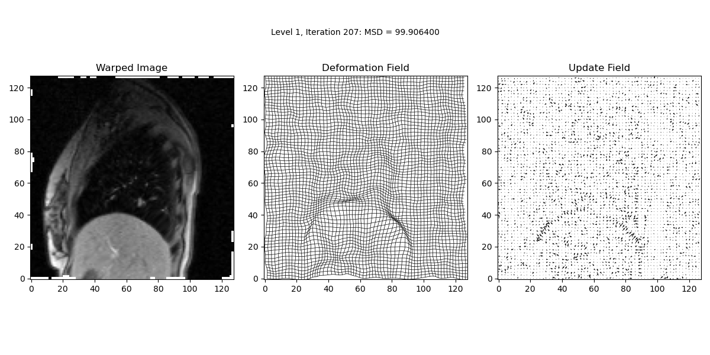


Do you think using a multi-resolution approach helps? Why?

Now try running the registration with 6 resolution levels (if you use 7 levels the 1st level only contains 4 pixels and spends several iterations not really doing anything before moving on to the next level, and if you try and use more than 7 levels you will get an error as there are not enough pixels to down-sample the images that many times). You will notice that the final MSD = 86.24 is worse than when using the default 3 resolution levels (MSD = 80.20). However, if you compare the results of both registrations to the target image you will see that the registration with 6 levels appears to align the structures within the lung better than the result with 3 levels, but the structures outside the lung, e.g. the ribs, are not aligned as well. Again, which results should be considered best will depend on the exact application.

Now experiment with varying the values for the regularisation parameters as well as the number of resolution levels, and see how the results are affected.

### Jacobian determinant

When investigating the effects of the regularisation parameters you should have noticed that some parameters will result in deformation fields do not look very plausible. In particular, sometimes the deformation field will appear to fold over itself, indicating that folding has occurred, which is often undesirable when performing registrations.

For example, if you perform a registration with the following parameters:

`sigma_elastic = 0.5, sigma_fluid = 1, num_lev = 3`

the result is the deformation field shown below, and as can be seen in the zoomed-in image on the right, the grid has folded over itself in some regions.

```python
dispDefField(def_field_def, spacing=2)
plt.show()
dispDefField(def_field_def[65:85,35:55,:], spacing=1)
plt.show()
```

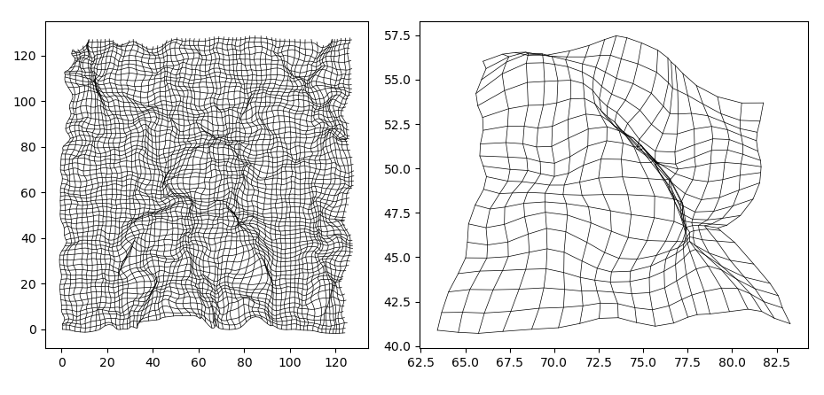
You have been provided with a function, `calcJacobian`, to calculate the Jacobian determinant (and optionally the full Jacobian matrix) at each pixel in the deformation field, and return a map (image) of the Jacobian determinants. Have a look at this function and make sure you understand how it works.

You can display the Jacobian by using the up and down arrows on the second output figure at the end of the registration. 

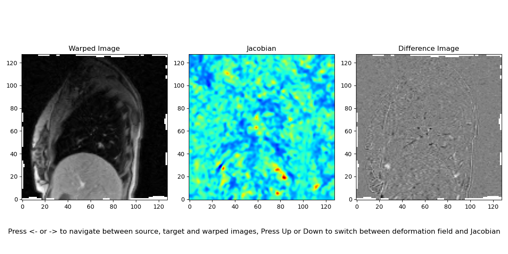

You can also plot the Jacobian yourself by calling the `calcJacobian` and `dispImage` functions. It is useful to add a colourbar and to use the `jet` colourmap. You can also plot a binary mask of the Jacobian by setting all values <= 0 to 1s.

```python
jacobian, _ = calcJacobian(def_field_def)
dispImage(jacobian, title='Jacobian')
plt.set_cmap('jet')
plt.colorbar()
plt.show()
dispImage(jacobian<=0)
plt.show()
```

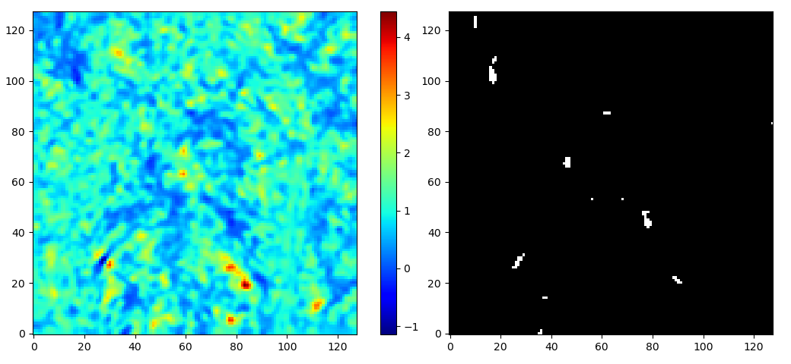

You can notice that the image is very ‘patchy’, and does not show smooth expansions/contractions as would be expected during breathing. The colourbar shows us that the Jacobian contains some very large values (>4) as well as negative values, indicating that folding has occurred. 

If you compare the location of the pixels with folding in the binary image to the deformation field you will notice that they do not align with where you can see folding occurring in the grid. This is because the grid shows the deformation in the source image space whereas the binary image corresponds to the pixels in the warped image space.

### Compositions
With the `demonsReg` function it is possible to compose the updates rather than add them, so that the deformation field will always represent a diffeomorphic transformation (as the updates are themselves always diffeomorphic), and hence will not contain any folding. If you look at lines 150-157 of the `demonsReg` function and you will see that the composition of two deformation fields can be implemented by treating the current deformation field as an image, and resampling it with (a deformation field derived from) the update to the transformation. To see why, we can write the equation for resampling an image as:

$I_{resamp}(\vec{x})=I_{orig}(T(\vec{x}))$

i.e. the intensity in $I_{resamp}$ at $\vec{x}$ is the intensity in $I_{orig}$ at $T(\vec{x})$ ($\vec{x}$ transformed by $T$). As $T(\vec{x})$) will typically not be the centre of a pixel in $I_{orig}$, the intensities in $I_{orig}$ must be interpolated to calculate $I_{resamp}$.

The equation for composing the update, $T_{up}$, with the current transformation, $T_t$, is:

$T_{t+1}(\vec{x}) = T_t(T_{up}(\vec{x}))$

i.e. to calculate the composed transformation, $T_{t+1}$, we first apply the update and then the current transformation (make sure you understand why they are applied in this order – remember order matters for composition!).

You can see that the equation for composing the transformation is the same as the equation for resampling the image, with the current transformation, $T_t$, replacing the image, $I_{orig}$, and $T_{up}$ used as the transformation to resample the image/transformation.

Now perform a registration using the same parameters as above but use composition rather than addition to update the transformation, i.e. use the following parameters:

`sigma_elastic = 0.5, sigma_fluid = 1, num_lev = 3, use_composition = True`

You will notice that the deformation field no longer contains any folding:

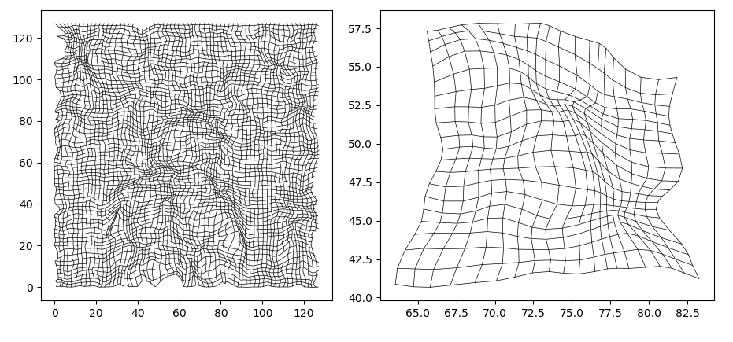

but the Jacobian determinant map is still very patchy

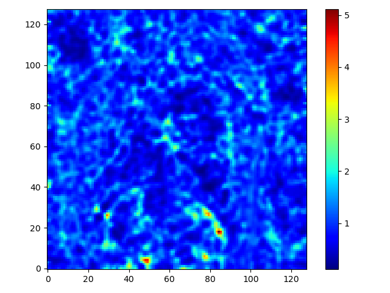

and the max value is larger (note – a different intensity scale is used compared to the Jacobian determinant image on the previous page to show there is a different range of values).

This indicates that the deformation is still not very physically plausible. And if you look at the warped image you will see that some of the features in the lungs are better aligned when addition was used for updating the transformation, although the MSD value is lower when composition is used (63.10) than when addition is used (64.07). But there is no folding when using composition and there is folding when using addition.

So which registration do you think is best?

### Other parameters
As you will have seen, there are a number of other optional parameters that can be set. The parameters `disp_spacing`, `scale_update_for_display`, `disp_method_df`, and `disp_method_up` all effect how the deformation field and update are displayed but have no effect on the actual registration itself. The comments/help should explain how these parameters work.

The `max_it` parameter sets the maximum number of iterations to be performed. The default value is 1000, but you should have noticed that usually the registration stops well before reaching this number of iterations. This is because the registration checks for an improvement in the MSD at each iteration, and if there has not been an improvement it will move on to the next resolution level or finish if it is already on the last level. This behaviour can be disabled by setting the `check_MSD` parameter to false. In this case the registration will run for the full max_it number of iterations at each level.

Try running a registration with the default parameters and `check_MSD=False`. I suggest also setting `disp_freq=50` so that the registration does not take too long to run. By looking at the MSD values output to the console you will notice that some iterations now cause (small) increases to the MSD. You will also notice that the registration reaches a stage at each level where the result starts to ‘oscillate’, with a few iterations making minor increases to the MSD and then a few making minor decreases to the MSD, and barely any noticeable changes to the warped image or deformation field. The final MSD value is lower than when `check_MSD` was set to true (74.53 compared to 80.20), but at the expense of running many more iterations. We get a similar result (MSD = 75.21) by setting `max_it` to 500 and only running half as many iterations, indicating that for at least the last 500 iterations the result was mostly oscillating and not improving, but the problem is it is difficult to know how many iterations will be required before the results start to ‘oscillate’ as this will depend on both the images being registered and the other parameters.

The last parameter that can be set is `use_target_grad`. This is false by default, and setting it to true will cause the registration to use the spatial gradient of the target image when calculating the demons forces rather than the spatial gradient of the source image, i.e. it will use the original demons forces rather than the common demons forces. If you run a registration with the default parameters and `use_target_grad` set to true and compare it to the results when `use_target_grad` is false, you will see there are differences in the results. However, each result aligns some regions/structures better than the other, and neither of the results are clearly the best overall (the final MSC is lower when `use_target_grad` is false, but this is not always the case when different parameters are used).

### Deeper breath image

Now try registering `cine_MR_1.png` to `cine_MR_3.png`, which is a more challenging registration due to the deep breath taken when `cine_MR_3.png` was acquired.

Experiment with different parameters – can you find some that give a good result?

Try swapping the source and target image over. Do you think you get better results with `cine_MR_3.png` as the source or target image (or are they equally bad for both!)?


