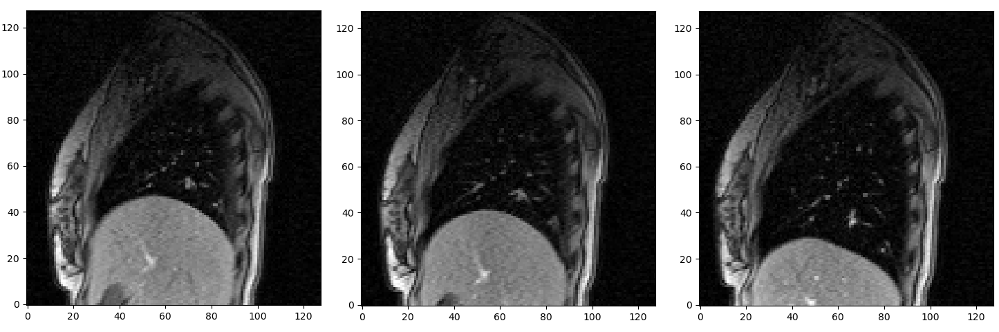
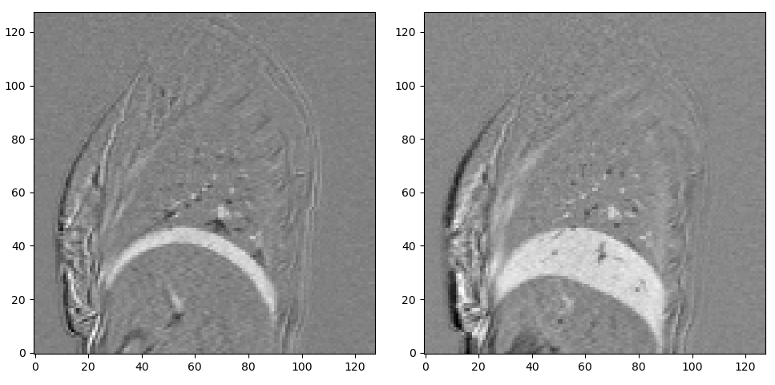
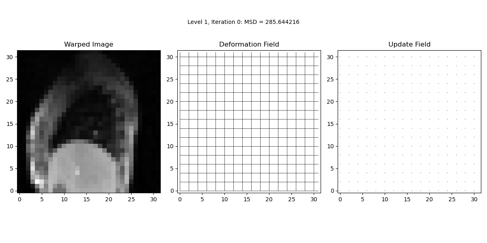
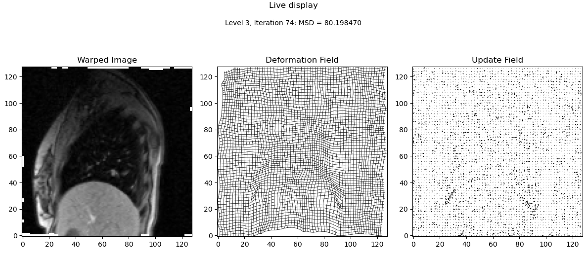
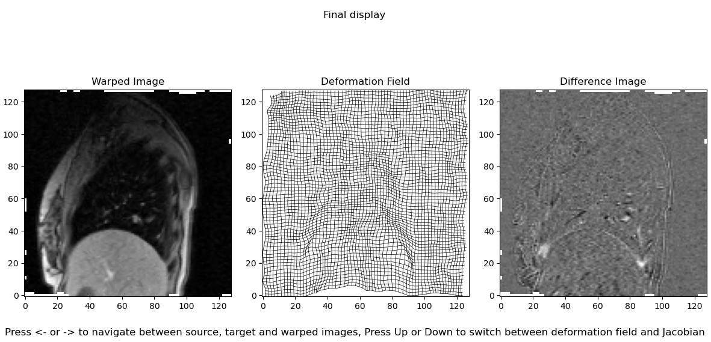
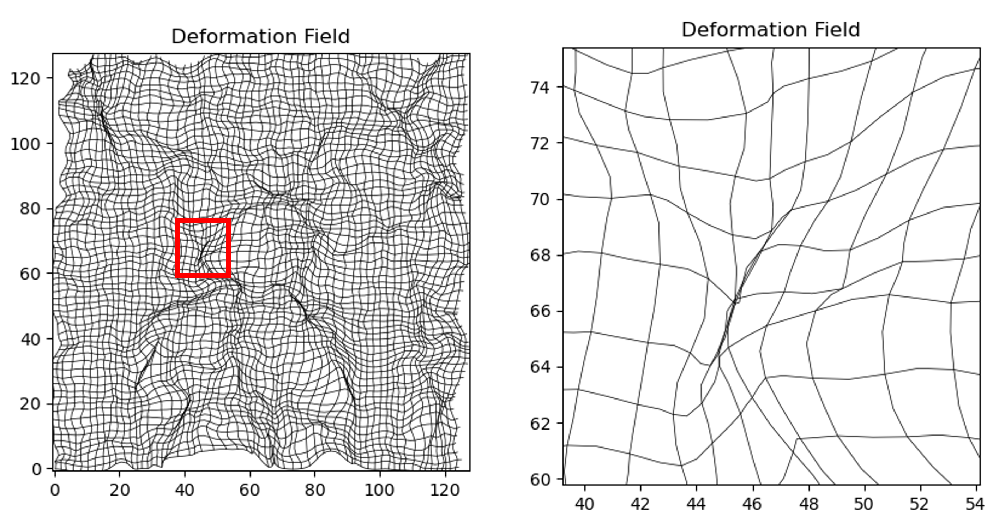
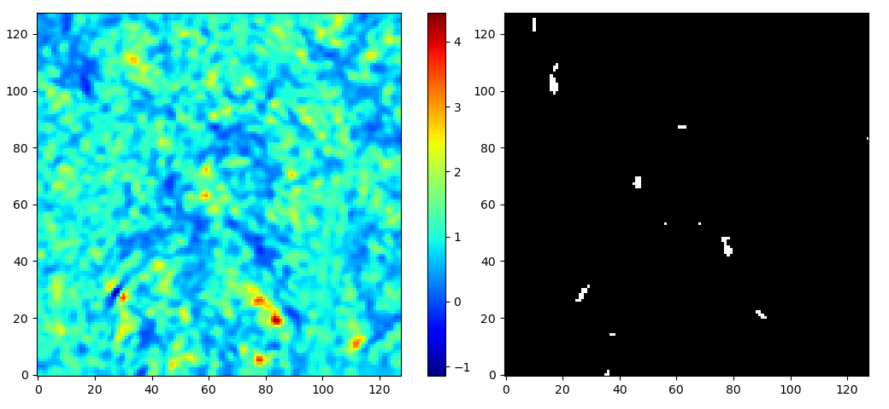
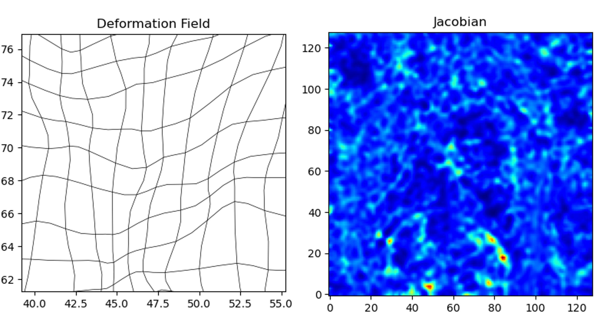

:::::::::::::::::::::::::::::::::::::: questions 

* How does the Demons registration algorithm attempt to align images?
* How do the different parameters affect the performance of the Demons registration algorithm?

::::::::::::::::::::::::::::::::::::::::::::::::

::::::::::::::::::::::::::::::::::::: objectives

* Understand how the demons registration algorithm works and how it attempts to align images.
* Investigate the influence of the different parameters on the performance of the registration.
* Visualise the execution of the algorithm by displaying the images and deformation fields while it is running.
* Interpret the results by inspecting the images, deformation fields, and Jacobian determinant maps.

::::::::::::::::::::::::::::::::::::::::::::::::

:::::::::::::::::::::::::::::::::::::: prereq

You should have followed the instructions from [the Setup page](../learners/setup.md) to access the data and code for these exercises, and setup Python.

::::::::::::::::::::::::::::::::::::::

This practical is based in Python, and uses this template Jupyter notebook: [`practical4_notebook.ipynb`](files/practical4_notebook.ipynb).You have  been provided with some utility functions in [`utils.py`](files/utils.py). When using a function from this file, you should read it and make sure you understand what it does. There is also a function that implements the Demons registration algorithm in [`demonsReg.py`](files/demonsReg.py). You should look at the `demonsReg` function and check you can follow what it is doing. You should be able to understand what each section of code is doing, even if you don’t fully understand every line.

In these exercises, we use three 2D sagittal MR slices showing the lung, liver, and surrounding anatomy, at different points in time during free-breathing:

* `cine_MR_1.png` is at end-exhalation,
* `cine_MR_2.png` is at the end-inhalation for a normal breath,
* `cine_MR_3.png` is at end-inhalation for a deep breath.

You can find them in the unzipped data folder under `practical4`.

* Run the first cell of the Juypter notebook. This imports the required libraries, and sets the *matplotlib* library to display figures in separate windows. This is required for the animations in these exercises to run correctly.

## 1. Compare the images

* Edit and run the next cell so that it loads the three images and then coverts them to doubles and reorients them as in the previous exercises.
* Add code to the following cell to display the images in separate figures.

The images should look like this:

When displaying the images next to each other you should be able to see that the images are different and some of the structures have moved (especially in `cine_MR_3`), but it can be difficult to see exactly what has moved, and by how much. Difference images (one image minus another, e.g. as shown below) are a good way seeing where there are differences between the images, but it can still be difficult to tell exactly what has moved where from the difference images.

* Add code to the next cell to display the difference image between `cine_MR_1` and `cine_MR_2` in one figure, and the difference image between `cine_MR_1` and `cine_MR_3` in another figure.

The difference images should look like this:

It is often easier to appreciate how things have moved/changed between images if you 'flip' between the images. The `dispImageFlip` function in `utils.py` makes it easy to do this by taking two images as inputs, and allowing you to flip between the two using the arrow keys on your keyboard.

* Add code to the next cell to use the `dispImageFlip` function to compare `cine_MR_1` and `cine_MR_2` and to compare `cine_MR_1` and `cine_MR_3`. Observe how the images differ from each other. Pay particular attention to motion that you think could be challenging for the demons algorithm to recover, such as very large motion and deformation, or sliding motion that can occur between the lung/liver and surrounding anatomy.

## 2. The `demonsReg` function

Have a look at the comments at the start of `demonsReg` function in `demonsReg.py` (which are also displayed as the help info for the function). There are two required input parameters: the **source** and **target** images for the registration. There are also a number of optional input parameters, which have default values assigned to them that will be used if an alternative value is not specified. We will explore the effects of these parameters as we go through these exercises. The outputs of the function are the final warped image and the corresponding deformation field.

When you start the registration, a 'live display' figure appears with 3 subplots. The first subplot on the left shows the warped image (resampled source image), the second subplot in the middle shows the current deformation field and the third subplot on the right shows the update to the deformation field for the current iteration. The deformation field (middle plot) is displayed as a deformed grid whereas the update is displayed as a vector field. All three images update during the registration.

:::::::::::: callout

#### Note

Most other registration softwares (i.e. all that I am aware of!) do not display the intermediate results while the registration is running, and just output the final result. I think it can be very informative to visualise the intermediate results, and watch how the registration algorithm gets to its final answer - which is why we have implemented it for these exercises! :smirk:

Although, to be fair, this is much easier in 2D than in 3D!

::::::::::::

* Run `demonsReg` with `cine_MR_1` as the source image and `cine_MR_2` as the target image and using default values for all the other parameters.

While the registration is running, you will notice that the figure is updated and that text is outputted in the notebook stating the current resolution level, iteration number, and value of the Mean Squared Difference (MSD) between the target image and the current warped image. At the end of the registration, the figure should look like this:

Once the registration has finished another figure appears. This 'final display' figure allows us to flip between the source, target and warped image in the left subplot. The middle subplot shows the deformation field (or Jacobian determinant map, more details later), and the right subplot shows a difference image between the target image and the image shown in the subplot. 

If you look at the text output you will see that the final MSD value is 80.20 (rounded to 2 decimal places – more are shown in the figure and notebook), and that 74 iterations were performed at the final (3rd) resolution level. If you scroll up in the notebook (you may need to click on 'View as scollable element' at the bottom of the text output if the output has been truncated) you will see that 24 iterations were also performed at the 2nd resolution level, and 17 iterations at the 1st level.

:::::::::::: discussion

#### Questions

Within each resolution level, the MSD value decreases with each iteration. However, the MSD increases between resolution levels.

* Do you know why it does this? 

Hint, it’s not just because there are more pixels in the higher resolution images, as using the mean rather than sum of squared differences should account for different numbers of pixels in the images.

Compare the final warped image with the target and source images.

* How well do you think the registration did at aligning the images?
* Which parts of the images are well aligned, and which parts are less well aligned?

If you look at the deformation field you should see that it corresponds to the deformation that would be applied to the warped image to get back to the source image (rather than the deformation that would be applied to the source image to get to the warped image). Make sure you understand why this is the case.

::::::::::::

## 3. Regularisation

You can specify the values of the optional input parameters when calling the function, e.g.

`warped_image, def_field = demonsReg(cine_MR_1, cine_MR_2, sigma_elastic=0)`

will run the registration with sigma_elastic set to 0, i.e. with no elastic like regularisation applied.

* Try running this registration.

At the end of the registration, the 'final display' figure should look like this:

You will see that parts of the final warped image looks very similar to the target image, and the final MSD is 79.01, which is a little lower than for the default parameters. However, you can see that the final deformation field is very ‘crumpled’ and does not look very physically plausible. Therefore, for most applications this would not be considered a good registration result. The reason that the result is like this is that without any elastic-like regularisation applied the registration is free to deform each part of the image independently in any way that better aligns the intensities. This results in structures being overly-deformed to resemble different structures, rather than being aligned with the correct corresponding structure in the other image, and highlights the need for using suitable regularisation.

* Now rerun the registration with sigma_elastic at its default value again but this time setting sigma_fluid to 0.

At the end of the registration, the figures should look like this:

You will now see that the updates are much larger and noisier as no regularisation is being applied to them, but the deformation field is still relatively smooth as it does have regularisation applied. If you compare the result from this registration to the result obtained with the default parameters you will see that the results are very similar. However, the final MSD value is lower (72.73), but some regions of the deformation field are slightly less smooth. Which of the results should be considered ‘best’ will depend on exactly what the application is. But it should be clear that the elastic-like regularisation usually has a larger effect on the result than the fluid-like regularisation does.

* Now try running several more registrations with different values for the elastic-like and fluid-like regularisation to get a good feel for how the combination of these parameters affects the results, and which ranges of values produce good/bad results.

## 4. Resolution levels
You should have noticed that the registration is using a multi-resolution approach, with 3 resolution levels by default. You can specify the number of resolution levels to use with the `num_lev` input parameter.

* Try running a registration with `num_lev` set to 1, i.e. so that only a single resolution level is used, and the multi-resolution approach is not applied.

At the end of the registration, the final display should look like this:

:::::::::::::::: discussion

#### Questions

* Do you think using a multi-resolution approach helps?
* Why?

::::::::::::::::

* Now try running the registration with 6 resolution levels (if you use 7 levels then the first level only contains 4 pixels, so there is not very much to change and improve. Anything greater than 7 levels will result in an error, since no further down-sampling can be done).

The final MSD with six levels is worse (MSD = 86.24 ) then with the default 3 resolution levels (MSD = 80.20). However, visually the results from six resolution levels appears to align the structures within the lung better than the result from using three levels. It is the structures outside the lung, e.g. the ribs, that are not aligned as well. Again, assessing the "best" registration will be dependent on the exact application.

* Now experiment with varying the values for the regularisation parameters as well as the number of resolution levels, and see how the results are affected.

## 5. Folding and the determinant of the Jacobian matrix

When investigating the effects of the regularisation parameters you should have noticed that some parameters will result in deformation fields do not look physically plausible. In particular, sometimes the deformation field will appear to fold over itself, indicating that folding has occurred, which is generally undesirable when performing registrations. E.g.:

* Run a registration with `sigma_elastic=0.5` (and all other parameters set to default values)

At the end of the registration, the final display should look like this:

You can use the magnifying glass icon at the bottom-left of the figure to zoom in on different regions of the deformation field. To zoom back out you can click on the left facing (back) arrow icon, which will go back to the previous view/zoom (you can also right click and drag a rectangle to zoom out, but I found it very difficult to get this to behave how I wanted it to).

* Zoom in on the deformation field to the region shown in red in the figure on the left, below. You should see that the deformation field has folded in on itself, as shown in the figure on the right, below. 

The final display can also display a map of the determinant of the Jacobian matrix (often called the Jacobian determinant, or simply the Jacobian) instead of the deformation field.

* Use the up or down arrows to switch from displaying the deformation field to the Jacobian map, and back again.

:::::::::::::::: discussion

#### Question

You should notice that the regions where the deformation field expands correspond to the yellow and red regions of the Jacobian determinant map, and the regions where the deformation field compresses are blue in the Jacobian determinant map, with the regions where there is folding the darkest blue. However, the deformation field and Jacobian map are not well aligned with each other in some regions.

* Why?

::::::::::::::::

It can be useful to display a colour bar with the Jacobian map so you see which values the different colours correspond to. Unfortunately adding a colour bar to the final display disrupts the layout of the figure, and is not recommended. However, if you have stored the deformation field output by the registration in a variable, e.g.:

`warped_image, def_field = demonsReg(cine_MR_1, cine_MR_2, sigma_elastic=0.5)`

you can use the `calcJacobian` function from `utils.py` to calculate the Jacobian map (and optionally the full Jacobian matrix at each pixel) from the deformation field. Have a look at this function and make sure you understand how it works.

* Calculate the Jacobian map using `calcJacobian` and display it in a separate figure.
    * You can use the `dispImage` function to display the Jacobian map with the correct orientation.
    * You should change the colourmap to better visualise the Jacobian map. We have used 'Jet' but you can try different colourmaps if you prefer.
    * You should then add a colourbar to the figure.

The result should look like the left side of the figure below.

With the colourbar you can see which colours correspond to values <= 0, i.e. where folding has occurred. However, due to the continuous nature of most colourmaps it can be difficult to see exactly which pixels have Jacobian values <= 0, and which are just above 0.

* Create a binary image (boolean array) of the pixels where folding has occurred and display it in a separate figure.

The result should look like the right side of the figure below

## 6. Composing the updates

With the `demonsReg` function it is possible to compose the updates rather than add them, so that the deformation field will always represent a diffeomorphic transformation (as the updates are themselves always diffeomorphic), and hence will not contain any folding. If you look at lines 170-183 of the `demonsReg` function and you will see that the composition of two deformation fields can be implemented by treating the current deformation field as an image, and resampling it with (a deformation field derived from) the update to the transformation. To see why, we can write the equation for resampling an image as:

$I_{resamp}(\vec{x})=I_{orig}(T(\vec{x}))$

i.e. the intensity in $I_{resamp}$ at $\vec{x}$ is the intensity in $I_{orig}$ at $T(\vec{x})$ ($\vec{x}$ transformed by $T$). As $T(\vec{x})$) will typically not be the centre of a pixel in $I_{orig}$, the intensities in $I_{orig}$ must be interpolated to calculate $I_{resamp}$.

The equation for composing the update, $T_{up}$, with the current transformation, $T_t$, is:

$T_{t+1}(\vec{x}) = T_t(T_{up}(\vec{x}))$

i.e. to calculate the composed transformation, $T_{t+1}$, we first apply the update and then the current transformation (make sure you understand why they are applied in this order – remember order matters for composition!).

You can see that the equation for composing the transformation is the same as the equation for resampling the image, with the current transformation, $T_t$, replacing the image, $I_{orig}$, and $T_{up}$ used as the transformation to resample the image/transformation.

* Now perform a registration using the same parameters as above (i.e. `sigma_elastic=0.5`) but use composition rather than addition to update the transformation by setting `use_composition=True`. 

The final display should look like:

If you zoom in on the deformation field you will notice that the deformation field no longer contains any folding, but the Jacobian determinant map is still very patchy (note, the intensity-colour scale is different in the image below compared to the previous image as the min and max values are different):

This indicates that the deformation is still not very physically plausible. And if you look at the warped image you will see that some of the features in the lungs are better aligned when addition was used for updating the transformation, although the MSD value is lower when composition is used (63.01) than when addition is used (64.07). But there is no folding when using composition and there is folding when using addition. Which registration should be considered the 'best' will depend on the specific application (although neither would be considered very good for most applications!).

* Run another registration using a set of parameters that you previously found gave a good result when adding the updates, but now use `use_composition=True`. How do the results compare to the previous ones?

## 7. Other parameters

As you will have seen, there are a number of other optional parameters that can be set. The parameters `disp_spacing`, `scale_update_for_display`, `disp_method_df`, and `disp_method_up` all effect how the deformation field and update are displayed but have no effect on the actual registration itself. The comments/help should explain what these parameters do.

The `disp_freq` parameter controls how often the plots are updated. The registrations themselves run relatively quickly, but updating the images takes some time. This makes the registrations run considerably slower but allows you to see how the deformation field and warped image change during the course of the registration, which can be very useful for understanding why the registration produces the result it does. If you set `disp_freq` to 0 then the images will only update at the start of each level and to show the final result. If you do this you will notice that the registration runs much quicker, but you miss all the details of how the registration produces the result.

The `max_it` parameter sets the maximum number of iterations to be performed. The default value is 1000, but you should have noticed that usually the registration stops well before reaching this number of iterations. This is because the registration checks for an improvement in the MSD at each iteration, and if there has not been an improvement it will move on to the next resolution level or finish if it is already on the last level. This behaviour can be disabled by setting the `check_MSD` parameter to false. In this case the registration will run for the full max_it number of iterations at each level.

* Try running a registration with the default parameters and `check_MSD = False`. It is also recommended to set `disp_freq = 50` so that the registration does not take too long to run.

By looking at the MSD values output to the notebook you will notice that some iterations now cause (small) increases to the MSD. You will also notice that the registration reaches a stage at each level where the result starts to ‘oscillate’, with a few iterations making minor increases to the MSD and then a few making minor decreases to the MSD, and barely any noticeable changes to the warped image or deformation field. The final MSD value is lower than when `check_MSD` was set to true (74.52 compared to 80.20), but at the expense of running many more iterations.

* Now try running the same registration but with `max_it` set to 500

We get a similar result (MSD = 75.21) wuth `max_it` set to 500 and only running half as many iterations, indicating that for at least the last 500 iterations the result was mostly oscillating and not improving, but the problem is it is difficult to know how many iterations will be required before the results start to ‘oscillate’ as this will depend on both the images being registered and the other parameters.

The last parameter that can be set is `use_target_grad`. This is false by default, and setting it to true will cause the registration to use the spatial gradient of the target image when calculating the demons forces rather than the spatial gradient of the source image, i.e. it will use the original demons forces rather than the common demons forces.

* Run a registration with the default parameters and `use_target_grad` set to true.

If you compare the results to the results obtained when `use_target_grad` is false, you will see there are differences in the results. However, each result aligns some regions/structures better than the other, and neither of the results are clearly the best overall (the final MSC is lower when `use_target_grad` is false, but this is not always the case when different parameters are used).

## 8. Registering the deep-breath image

* Now try registering `cine_MR_1.png` to `cine_MR_3.png`.
    * It is much more difficult to get a good result for this registration due to the deep breath taken when `cine_MR_3.png` was acquired. Experiment with different parameters – can you find some that give a good result?
    * Try swapping the source and target image over. Do you think you get better results with `cine_MR_3.png` as the source or target image (or are they equally bad for both!)?

